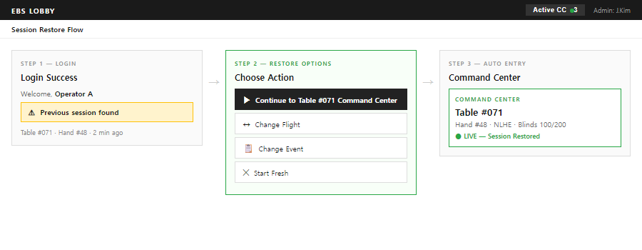

# BS-02-01 Lobby — 로그인 + 세션

| 날짜 | 항목 | 내용 |
|------|------|------|
| 2026-04-14 | 분리 신설 | `BS-02-00-overview.md` 의 §화면 0: 로그인, §세션 상태 보존 및 네비게이션, §K. 세션 복원(user story)을 본 파일로 분리. H2/H3 슬러그(`§세션 저장 데이터`, `§화면 0: 로그인`)는 모두 보존하여 외부 anchor 호환. CCR-DRAFT-team1-20260414-bs02-overview-rename.md 가 API-06 redirect 위임. |

---

## 개요

Lobby 의 **인증 진입**(Login)과 **세션 상태 보존·복원**을 정의한다. BS-01-auth (글로벌 인증 계약)와 cross-link 관계이며, 본 문서는 **Lobby 화면 관점**에서의 로그인 UI/플로우 + 세션 데이터 모델을 기술한다.

> **참조**:
> - 글로벌 인증 계약: `../../../contracts/specs/BS-01-auth/BS-01-auth.md`
> - Session Restore 서버 응답·복원 조건·fallback ladder: `../../ui-design/UI-01-lobby.md §9.6`
> - 세션 저장 DB 스키마: `../../../contracts/data/DATA-04-db-schema.md` (`user_sessions` 테이블)

---

## 화면 0: 로그인 (Login)

> **근거**: WSOP LIVE와 동일한 계정 체계를 사용. 로그인 성공 시 이전 세션 컨텍스트 복원.

**EBS 목업:**

| 요소 | EBS 적용 |
|------|:-------:|
| Email / Password | O — 그대로 사용 |
| Forgot your Password? | O — 그대로 사용 |
| Login 버튼 | O — 그대로 사용 |
| Sign In With Entra ID | TBD — 아래 인증 방식 매트릭스 참조 |

**인증 방식 매트릭스:**

| 방식 | 설명 | 2FA | 장점 | 단점 | Phase 권장 |
|------|------|:---:|------|------|:----------:|
| **Email + 2FA** | 이메일/비밀번호 + TOTP 또는 SMS | O | 구현 단순, 외부 의존 없음 | 비밀번호 관리 부담 | **Phase 1** |
| **Google OAuth** | Google 계정 SSO | Google 자체 | 빠른 로그인, 비밀번호 불필요 | Google 계정 필수 | Phase 2 |
| **Entra ID (Azure AD)** | Microsoft SSO | Entra 자체 | 기업 통합, WSOP 조직과 연동 가능 | Azure 구독 필요 | Phase 3 |
| **Hybrid** | Email + Google + Entra 중 선택 | 방식별 | 유연성 최대 | 구현 복잡도 최대 | Phase 3+ |

> 참고: Phase 1에서는 Email + 2FA를 기본으로 구현한다. Google OAuth와 Entra ID는 Phase 2~3에서 점진 추가한다.

> 로그인 성공 → 역할(Admin/Operator/Viewer) 자동 할당 → 이전 세션 컨텍스트 복원 → 마지막 선택 화면으로 이동. 상세는 `../../../contracts/specs/BS-01-auth/BS-01-auth.md` 참조.

---

## 세션 상태 보존 및 네비게이션

### 핵심 동작

Command Center에 진입하면 해당 테이블의 전체 경로(Series/Event/Table)가 **마지막 세션 상태**로 저장된다. 이후 로그인 시 저장된 Command Center로 바로 진입한다.

- Command Center가 호출된 적이 **있으면** → 다음 로그인 시 **바로 Command Center 호출** (마지막 테이블)
- Command Center가 호출된 적이 **없으면** → Lobby 3계층 탐색부터 시작 (최초 Setup)

> **가드 조건 (GAP-L-001)**: 세션 복원은 반드시 **토큰 유효성 검증 이후**에만 실행한다. `GET /auth/session` 응답이 200 OK일 때만 세션 복원 다이얼로그를 표시한다. 401/403 응답 시 세션 복원을 건너뛰고 로그인 화면으로 리다이렉트한다. localStorage에 토큰이 존재하더라도 서버 검증 없이 세션 복원을 진행해서는 안 된다.

> 참고: WSOP LIVE API 연동 전에는 Series/Event를 수동 생성한다. API 연동 후에는 자동 동기화되며, 수동 레코드와 API 레코드가 공존한다.

### Breadcrumb 네비게이션

Command Center 또는 Lobby 어디에서든 상단 breadcrumb로 **언제든 Setup 변경 가능**하다. 별도 모드 전환 없이 breadcrumb 클릭만으로 해당 레벨로 이동한다.

| 클릭 위치 | 이동 결과 | 세션 영향 |
|----------|----------|----------|
| Series 이름 | Series 선택 화면 | 하위 전부 초기화 |
| Event 이름 | Event 목록 화면 | Flight/Table 초기화 |
| Flight 이름 | Flight 선택 + Table 목록 | Table 초기화 |
| Table 이름 | Lobby Table 관리 화면 | Command Center 종료, Lobby 복귀 |

> 참고: breadcrumb에서 설정을 변경하고 새 테이블의 CC에 진입하면, 해당 경로가 새 세션 상태로 덮어쓴다.

### 세션 저장 데이터

| 필드 | 저장 시점 | 용도 |
|------|----------|------|
| `last_series_id` | Command Center 진입 시 | 로그인 시 Series 복원 |
| `last_event_id` | Command Center 진입 시 | 로그인 시 Event 복원 |
| `last_flight_id` | Command Center 진입 시 | 로그인 시 Flight 복원 |
| `last_table_id` | Command Center 진입 시 | 로그인 시 Table 복원 → Command Center 바로 진입 |

> 참고: 비정상 종료(앱 크래시, 네트워크 단절) 시에도 `user_sessions` 테이블에 마지막 상태가 영구 보존되어 있으므로 동일하게 복원된다. DB 스키마 상세는 `../../../contracts/data/DATA-04-db-schema.md` `user_sessions` 테이블.

---

## 유저 스토리 — K. 세션 복원

> 정상/비정상 종료 후 재접속 시 이전 상태 복원. (BS-02-00-overview.md 의 유저 스토리 A~K 시리즈 중 K. 세션 복원 부분만 본 파일로 이관됨.)

| # | As a | When | Then | Edge Case |
|:-:|------|------|------|-----------|
| K-1 | 모든 역할 | 정상 로그아웃 후 재로그인하면 | 마지막 선택 (Series/Event/Table) 복원 다이얼로그 표시. Continue/Change Event/Change Series 옵션 | 마지막 선택 항목이 Completed 상태: 해당 항목 건너뛰고 상위 레벨로 이동 |
| K-2 | 모든 역할 | 비정상 종료(앱 크래시) 후 재접속하면 | `user_sessions` 테이블에서 마지막 상태 로드. K-1과 동일한 복원 다이얼로그 | `user_sessions` 레코드 없음: 첫 접속과 동일 (Series 선택부터) |
| K-3 | Operator | 세션 복원 시 할당 테이블이 변경됨 | 새 할당 테이블 목록으로 갱신. 이전 테이블이 할당 해제됨: "할당 해제된 테이블입니다" 안내 후 현재 할당 목록 표시 | — |
| K-4 | 모든 역할 | Continue 선택 시 이전 테이블이 삭제됨 | "테이블이 더 이상 존재하지 않습니다" 안내 후 Flight 목록으로 이동 | — |

---

## 외부 참조 호환

본 파일의 H2/H3 슬러그는 분리 전 BS-02-00-overview.md 와 동일하게 보존되었다. 외부 contracts/api/API-06-auth-session.md 가 다음 anchor 를 참조한다:

| 외부 출처 | anchor | 본 파일 위치 |
|-----------|--------|--------------|
| `contracts/api/API-06-auth-session.md:260` | `§세션 저장 데이터` | 본 파일 §세션 상태 보존 및 네비게이션 → 세션 저장 데이터 |
| `contracts/api/API-06-auth-session.md:393` | `§화면 0: 로그인` | 본 파일 §화면 0: 로그인 |

CCR-DRAFT 위임: `docs/05-plans/ccr-inbox/CCR-DRAFT-team1-20260414-bs02-overview-rename.md` 에 두 라인의 redirect 추가됨.
