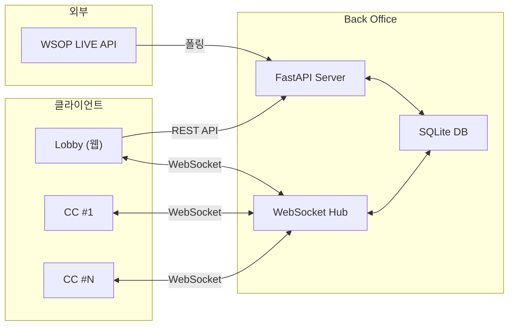

# BO-01 Architecture — Back Office 아키텍처

| 날짜 | 항목 | 내용 |
|------|------|------|
| 2026-04-08 | 신규 작성 | BO 전체 범위, 3-앱 관계, 데이터 흐름, 기술 스택 정의 |
| 2026-04-09 | 구조 축소 | BS/API/DATA 중복 제거, 고유 콘텐츠만 잔류 |
| 2026-04-14 | PRD 중복 정리 | PRD-EBS_BackOffice의 §개요와 겹치던 "중앙 데이터 계층" 단락을 BO-01에서만 유지 (아키텍처 관점 전담) |

---

## 개요

Back Office(BO)는 EBS의 **중앙 데이터 계층**이다. Lobby(웹)와 Command Center(Flutter)는 직접 연동되지 않으며, BO의 REST API + WebSocket + DB를 통해 간접으로 데이터를 공유한다.

---

## 1. 3-앱 아키텍처

### 1.1 앱 구성

| 앱 | 기술 | 역할 | 데이터 방향 |
|----|------|------|------------|
| **Lobby** | 웹 (브라우저) | 테이블 관리/설정 허브 | REST API로 BO에 쓰기, WebSocket으로 BO에서 읽기 |
| **Command Center (CC)** | Flutter 앱 | 테이블당 1개, 게임 진행 | WebSocket으로 BO에 쓰기/읽기 |
| **Back Office (BO)** | FastAPI + SQLite | 데이터 허브, API 서버 | REST + WebSocket 제공, DB 영구 저장 |

### 1.2 관계도

### 1.3 핵심 원칙

- Lobby ↔ CC **직접 연동 없음** — 모든 데이터는 BO DB를 경유
- CC는 테이블당 1개 인스턴스 (1 Lobby : N CC)
- BO는 단일 서버 (Phase 1~2), 수평 확장은 Phase 3+
- DB 연결 끊김 시에도 CC는 로컬 버퍼로 계속 동작

---

## 2. 기술 스택

| 계층 | 기술 | 비고 |
|------|------|------|
| **API Server** | FastAPI (Python 3.11+) | 비동기, 자동 OpenAPI 문서 |
| **WebSocket** | FastAPI WebSocket | 실시간 양방향 통신 |
| **DB** | SQLite (Phase 1~2) → PostgreSQL (Phase 3+) | SQLAlchemy ORM |
| **인증** | JWT (Phase 1), OAuth 2.0 (Phase 2+) | 세션 토큰 |
| **배포** | 단일 서버 (Phase 1~2) | Docker 컨테이너화 Phase 3 |

### 2.1 Phase별 기술 진화

| Phase | DB | 인증 | 배포 | 확장 |
|:-----:|:--:|:----:|:----:|:----:|
| 1 | SQLite | JWT (Email + 2FA) | 단일 프로세스 | — |
| 2 | SQLite | + Google OAuth | Docker 단일 | — |
| 3+ | PostgreSQL | + Entra ID | Docker + Load Balancer | 수평 확장 |

---

## 3. 성능 요구사항

| 항목 | 목표 | 비고 |
|------|------|------|
| REST API 응답 | < 200ms (95th percentile) | 목록 조회 포함 |
| WebSocket 지연 | < 100ms | CC → Lobby 실시간 갱신 |
| 동시 CC 연결 | 최소 12개 | Feature Table 12대 기준 |
| DB 쓰기 | 초당 50+ INSERT | 핸드 액션 burst 대응 |
| 가동 시간 | 99.5% (방송 시간 내) | 방송 중 다운타임 0 목표 |

---

## SSOT 참조

> API 엔드포인트: API-01 Backend Endpoints
> WebSocket 이벤트: API-05 WebSocket Events
> 데이터 모델: DATA-04 Entities
> 인증/보안: API-06 Auth & Session
> 동기화 프로토콜: BO-02 Sync Protocol
> 감사/리포팅: BO-03 Operations

---

## 비활성 조건

- BO 서버 미실행 시: Lobby 접근 불가, CC는 로컬 캐시로 제한 동작
- DB 파일 손상 시: 자동 백업 복원 시도, 실패 시 수동 복구 필요
- 네트워크 전체 단절: CC 로컬 모드, Lobby 읽기 전용 캐시

## 영향 받는 요소

| 영향 대상 | 관계 |
|----------|------|
| BS-02 Lobby | BO가 Lobby의 모든 CRUD 데이터를 영구 저장 |
| BS-05 Command Center | CC가 BO WebSocket을 통해 핸드 데이터 송수신 |
| BS-01 Auth | BO가 인증/인가 서비스를 제공 |
| BS-03 Settings | Settings 값이 BO configs 테이블에 저장 |
| WSOP LIVE API | BO가 외부 데이터를 폴링하여 로컬 캐싱 |
