# BS-07-08 Sequences — 트리거 → 렌더링 시퀀스

| 날짜 | 항목 | 내용 |
|------|------|------|
| 2026-04-14 | 신규 작성 | UI-04 승격 이관. 11개 트리거 시퀀스(StartHand/HoleCard/Flop/Turn/River/Action/Equity/Fold/Showdown/HandComplete/Skin) + 파이프라인 + 타이밍 예산 |

---

## 개요

이 문서는 **운영자·RFID 입력이 Overlay 화면에 픽셀로 나타나기까지의 시간축 시퀀스**를 정의한다. 트리거 정의(BS-06-00-triggers), 요소 매핑(BS-07-01), 애니메이션 상태(BS-07-02)는 이미 다른 문서의 SSOT이므로, 본 문서는 그들을 **시간축 상에서 조립**한다.

> **참조**: 트리거 이벤트 정의 `BS-06-00-triggers.md`, 요소별 트리거 매핑 `BS-07-01-elements.md`, AnimationState/transition_type `BS-07-02-animations.md`, 프로세스 모델 `API-04 §1.2`, Security Delay 아키텍처 `BS-07-07-security-delay.md`, 스킨 로드 FSM `BS-07-03-skin-loading.md`.

### 문서 범위

| 소유 | 이관처 |
|------|-------|
| 시간축 시퀀스 다이어그램 | **본 문서 (고유 권위)** |
| 데이터 파이프라인 개요 | API-04 §1 요약 + 본 문서에서 UI 관점 재조립 |
| AnimationState 발동 조건 | BS-07-02 §3 (본 문서는 링크만) |
| 스킨 JSON 좌표/치수 | BS-07-04 scene-schema (본 문서 범위 외) |
| 시각 모드(크로마키 등) | BS-03-01-outputs (본 문서 범위 외) |

---

## 1. 참조 모델

### 1.1 프로세스 모델

```
┌──────────── 단일 Flutter 앱 (in-process) ─────────────┐
│                                                       │
│   CC UI (운영자 입력) ──┐                             │
│                         ▼                             │
│   RFID HAL ──► Game Engine (Dart 순수 계산)           │
│                         │                             │
│                         ├─► Backstage GameState Stream│
│                         │      │                      │
│                         │      ▼                      │
│                         │   CC Preview Widget         │
│                         │                             │
│                         ▼                             │
│                  Security Delay Buffer                │
│                  (delay_seconds, 0~600s)              │
│                         │                             │
│                         ▼                             │
│                  Broadcast GameState Stream           │
│                         │                             │
│                         ▼                             │
│                  Overlay Widget Tree                  │
│                         │                             │
│                         ▼                             │
│                  Rive StateMachine                    │
│                                                       │
└───────────────────────┬───────────────────────────────┘
                        │
                        ▼
             HDMI / NDI / 크로마키 출력
```

**핵심 규칙**:
- CC와 Overlay는 **같은 Flutter 프로세스**에서 실행 (API-04 §1.2). 네트워크 통신 없음.
- GameState 전달은 **Dart Stream/Riverpod Provider**. 직렬화 없음.
- Backstage Stream은 즉시 방출 (운영용), Broadcast Stream은 Security Delay 경과 후 방출.
- Rive StateMachine은 GameState가 아닌 **Input 변수**로 구동 (BS-07-02 §Rive 사운드 경계).

### 1.2 계층별 지연 예산

| 계층 | 전달 방식 | 예산 | 근거 |
|------|----------|:----:|------|
| CC Input → Game Engine | Dart 함수 호출 | < 1ms | API-04 §1.2 |
| Game Engine → Backstage Stream | Stream.add | < 1ms | API-04 §1.2 |
| Backstage → Security Delay Buffer | Queue enqueue | < 1ms | BS-07-07 §4 |
| Buffer → Broadcast Stream | 타이머 기반 방출 | `delay_seconds` (0~600s) | BS-07-07 §3 |
| Broadcast Stream → Widget rebuild | Riverpod `ref.watch` | < 16ms (1 frame) | Flutter 반응형 |
| Widget → Rive Input | `artboard.inputs` 갱신 | < 1ms | BS-07-02 |
| Rive StateMachine → Canvas | GPU 렌더 | < 16ms (1 frame) | Flutter VSync |
| Canvas → HDMI/NDI | OS 디스플레이 출력 | < 1 frame | API-04 §2 |

**총 예산** (Broadcast 경로): `delay_seconds + 34ms` (2 프레임) + 애니메이션 지속.
**총 예산** (Backstage 경로): `34ms + 애니메이션 지속` (운영자는 실시간 화면).

### 1.3 타이밍 표기 규약

각 시퀀스의 타임라인 표는 다음 시간 기준을 사용한다:

| 표기 | 의미 |
|------|------|
| `t=0` | 트리거 이벤트 발생 시각 |
| `t=+Δ` | 트리거로부터 Δms 경과 |
| `t=+D` | `delay_seconds`(Security Delay) 경과 |
| `t=+D+Δ` | Security Delay 경과 후 Δms |

Backstage 경로는 `t=0` 직후 렌더, Broadcast 경로는 `t=+D` 이후 렌더로 표기한다.

---

## 2. 트리거 시퀀스

### 2.1 StartHand

**용도**: 이전 핸드 종료 후 새 핸드 시작. 딜러 버튼 이동, 좌석 Active/Inactive 전환.

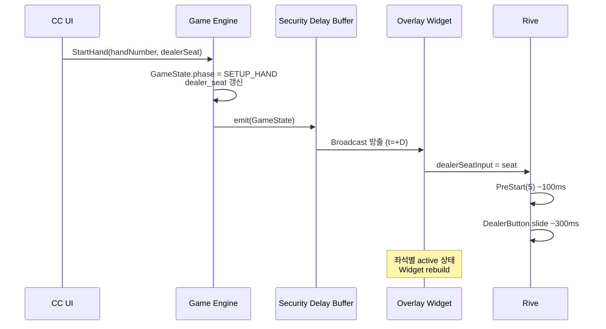

| t | 이벤트 | Backstage | Broadcast |
|---|--------|-----------|-----------|
| 0 | CC StartHand 입력 | GameState 즉시 갱신 | Buffer에 적재 |
| +16ms | CC Preview rebuild | 화면 반영 | — |
| +D | Buffer 방출 | — | Overlay rebuild 시작 |
| +D+100ms | PreStart 완료 | — | 잔여 요소 정리 완료 |
| +D+400ms | DealerButton slide 완료 | — | 딜러 위치 확정 |

**연관**: BS-07-02 §3.1, AnimationState=PreStart(5).

---

### 2.2 HoleCard 공개 (Security Delay 경로)

**용도**: RFID가 홀카드를 감지하면 좌석 슬롯에 카드 이미지 표시. 방송 보안을 위해 0~600초 지연.

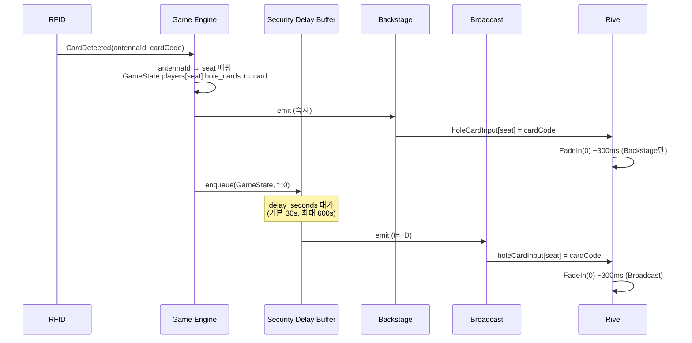

| t | Backstage | Broadcast |
|---|-----------|-----------|
| 0 | CardDetected | Buffer 적재만 |
| +1ms | GameState 갱신 | — |
| +17ms | FadeIn 시작 | — |
| +317ms | FadeIn 완료, 카드 완전 표시 | — |
| +D | — | Buffer 방출 |
| +D+17ms | — | FadeIn 시작 |
| +D+317ms | — | 시청자 카드 완전 표시 |

**핵심**: Backstage는 **즉시** 보이고 Broadcast는 `delay_seconds` 후 보인다. 두 경로가 같은 GameState를 다른 시각에 렌더.

**연관**: BS-07-02 §3.2 PRE_FLOP 1행, AnimationState=FadeIn(0), BS-07-07 Security Delay.

---

### 2.3 Flop (3장 순차 공개)

**용도**: 베팅 라운드 완료 후 커뮤니티 카드 3장을 순차 공개.

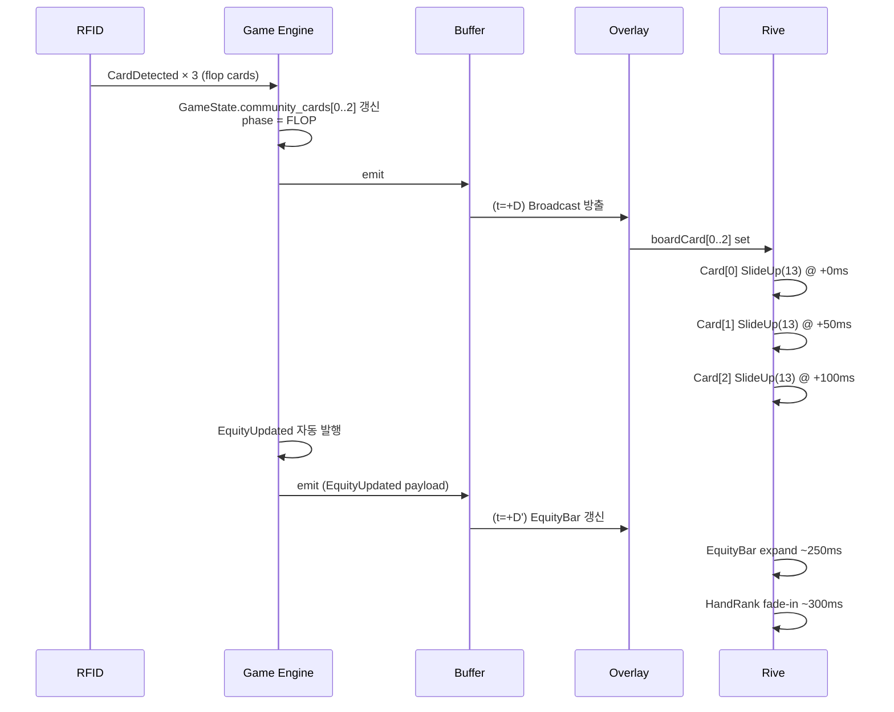

| t (Broadcast 기준, +D 이후) | 이벤트 |
|---|--------|
| +0ms | Card[0] SlideUp 시작 |
| +50ms | Card[1] SlideUp 시작 |
| +100ms | Card[2] SlideUp 시작 |
| +400ms | Card[0] SlideUp 완료 |
| +450ms | Card[1] SlideUp 완료 |
| +500ms | Card[2] SlideUp 완료 |
| +500~800ms | EquityBar expand 완료 |
| +500~800ms | HandRank Label 등장 |

**설정 의존**: `board_stagger_delay` (기본 50ms, 범위 0~200ms, BS-07-02 §5).

**연관**: BS-07-02 §3.3, AnimationState=SlideUp(13).

---

### 2.4 Turn

**용도**: Flop 이후 베팅 라운드 완료 → 4번째 커뮤니티 카드 공개.

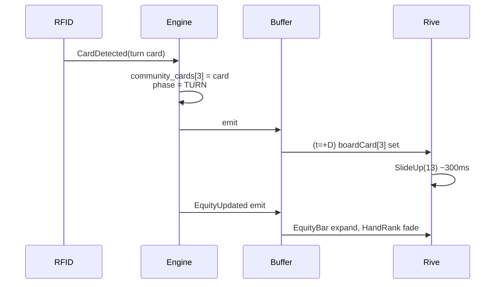

| t (+D 기준) | 이벤트 |
|---|--------|
| +0ms | Card[3] SlideUp 시작 |
| +300ms | Card[3] SlideUp 완료 |
| +300~600ms | EquityBar/HandRank 갱신 |

**연관**: BS-07-02 §3.4.

---

### 2.5 River

**용도**: Turn 이후 베팅 라운드 완료 → 5번째(마지막) 커뮤니티 카드 공개. 쇼다운 직전 상태.

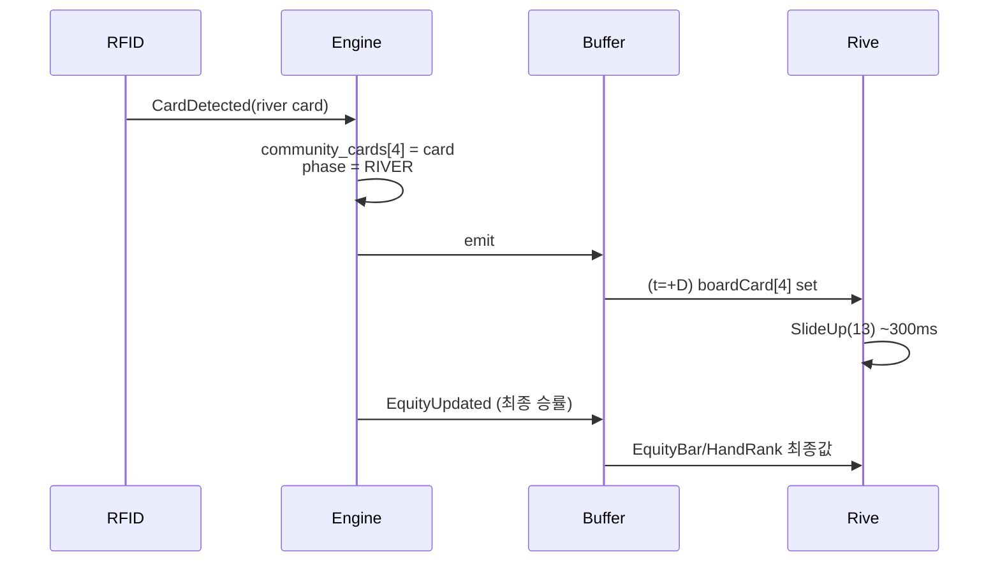

| t (+D 기준) | 이벤트 |
|---|--------|
| +0ms | Card[4] SlideUp 시작 |
| +300ms | Card[4] SlideUp 완료 |
| +300~600ms | 최종 EquityBar/HandRank (쇼다운 전 마지막 갱신) |

**연관**: BS-07-02 §3.4. (Turn/River는 동일 파이프라인.)

---

### 2.6 ActionPerformed (Badge + Stack + Pot 동시 갱신)

**용도**: 운영자가 액션 버튼(CHECK/CALL/BET/RAISE/FOLD/ALL-IN)을 누르면, Action Badge 표시 + 해당 좌석 Chip Stack 감소 + Pot 증가가 **동시에** 반영.

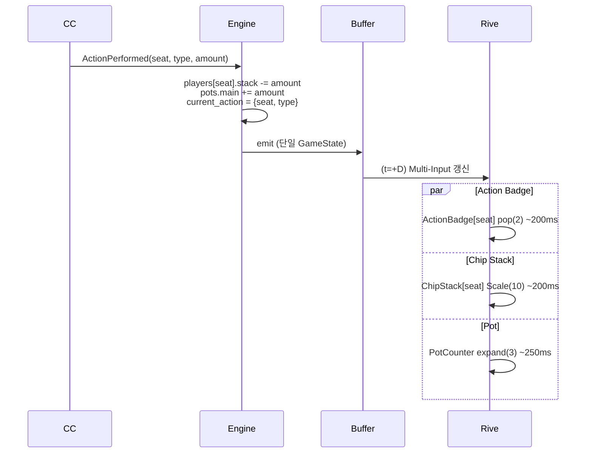

| t (+D 기준) | 이벤트 (병렬) |
|---|--------------|
| +0ms | ActionBadge pop 시작, ChipStack Scale 시작, Pot expand 시작 |
| +200ms | ActionBadge, ChipStack 완료 |
| +250ms | Pot 완료 |

**핵심**: **단일 GameState 방출**로 세 요소가 동시 애니메이션. Widget tree가 하나의 rebuild로 세 Rive Input을 동시 갱신.

**Fold인 경우**: §2.8 참조 (별도 경로).

**연관**: BS-07-02 §3.2 PRE_FLOP 3행, transition_type=pop(2)/expand(3).

---

### 2.7 EquityUpdated (카드 변경 시 자동)

**용도**: 커뮤니티 카드 변경 또는 Fold로 생존 플레이어가 변할 때 승률 재계산 결과 반영.

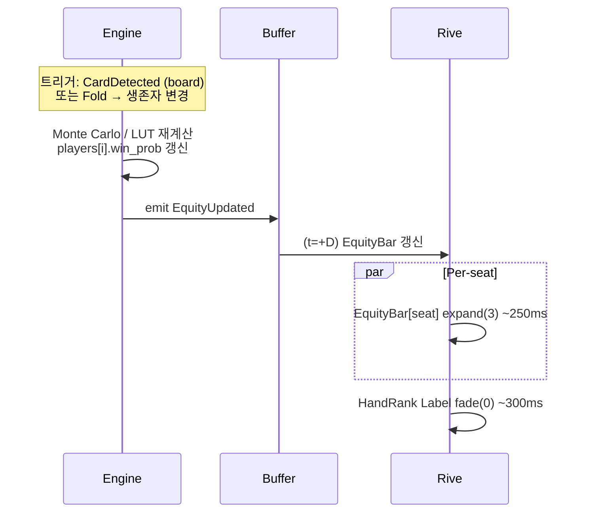

| t (+D 기준) | 이벤트 |
|---|--------|
| +0ms | 전 좌석 EquityBar expand 시작 |
| +250ms | EquityBar 완료 |
| +300ms | HandRank Label fade-in 완료 |

**연관**: BS-07-01 §6 Equity Bar, BS-07-02 §3.3~3.4.

---

### 2.8 Fold (홀카드 SlideAndDarken)

**용도**: 플레이어가 폴드하면 해당 좌석 홀카드가 어두워지며 슬라이드 다운.

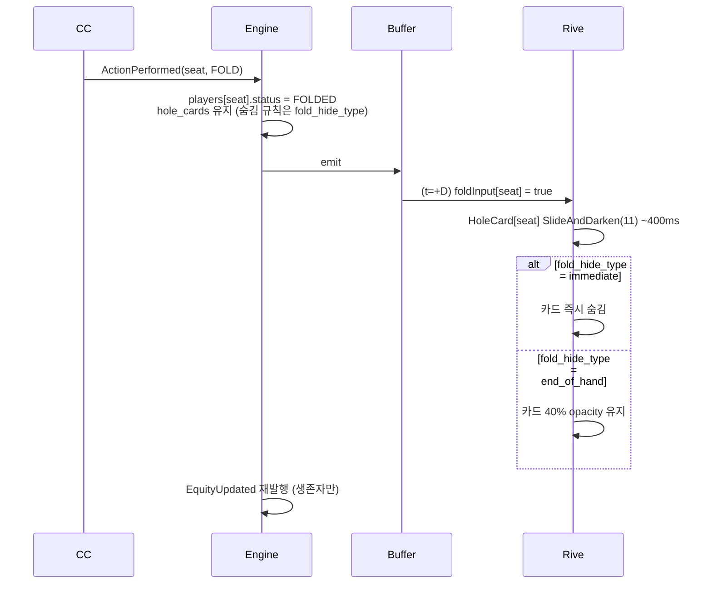

| t (+D 기준) | 이벤트 |
|---|--------|
| +0ms | SlideAndDarken 시작 |
| +400ms | SlideAndDarken 완료 |
| +400ms~ | fold_hide_type 분기 (즉시 숨김 또는 40% opacity) |
| +400~650ms | EquityUpdated 재반영 (§2.7 체인) |

**설정**: `fold_hide_type` enum ∈ {immediate(0), end_of_hand(1)} (BS-07-01 §1 참조).

**연관**: BS-07-02 §3.2 PRE_FLOP 4행, AnimationState=SlideAndDarken(11).

---

### 2.9 Showdown (홀카드 전체 공개 + Winner Glint)

**용도**: River 베팅 종료 후 생존자의 홀카드를 모두 공개하고, 승자 카드를 강조.

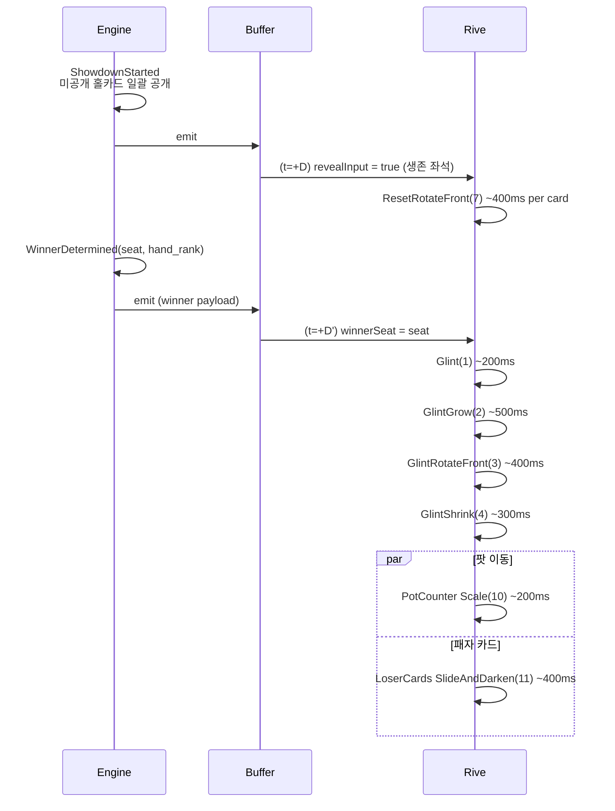

| t (+D 기준, ShowdownStarted) | 이벤트 |
|---|--------|
| +0ms | ResetRotateFront 시작 (전 생존 좌석) |
| +400ms | 홀카드 전체 공개 완료 |
| +D'+0ms | Glint 시작 (승자) |
| +D'+200ms | GlintGrow 시작 |
| +D'+700ms | GlintRotateFront 시작 |
| +D'+1100ms | GlintShrink 시작 |
| +D'+1400ms | Glint 시퀀스 완료 |
| +D'+1400ms | 팟 → 승자 스택 이동, 패자 카드 어두워짐 |

**설정**: `glint_sequence_duration` (기본 1400ms, 범위 500~2000ms, BS-07-02 §5).

**연관**: BS-07-02 §3.5, AnimationState=ResetRotateFront(7)/Glint(1)/GlintGrow(2)/GlintRotateFront(3)/GlintShrink(4).

---

### 2.10 HandComplete (전체 리셋)

**용도**: 팟 수취 완료 후 IDLE 상태로 복귀. 다음 핸드 대기.

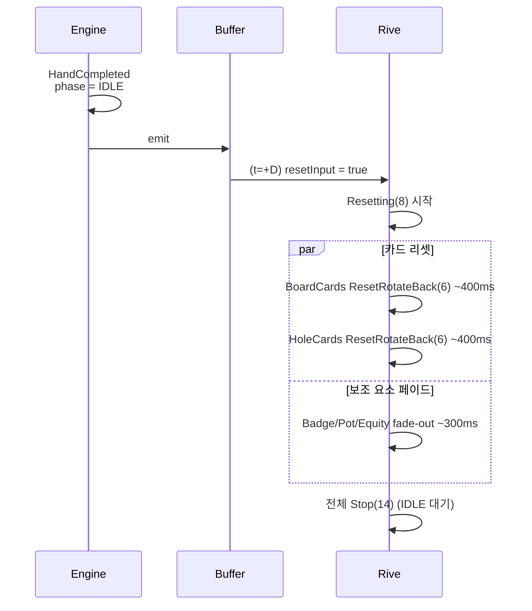

| t (+D 기준) | 이벤트 |
|---|--------|
| +0ms | Resetting 시작, 전 요소 동시 리셋 |
| +300ms | 보조 요소 페이드 아웃 완료 |
| +400ms | 카드 뒷면 회전 완료, 카드 사라짐 |
| +500ms | Stop 상태 진입 (IDLE) |

**설정**: `reset_duration` (기본 500ms, 범위 200~1000ms).

**연관**: BS-07-02 §3.6, AnimationState=Resetting(8)/ResetRotateBack(6)/Stop(14).

---

### 2.11 Skin 교체 (skin_updated WebSocket)

**용도**: BO에서 스킨이 교체되면 Overlay가 새 `.gfskin` ZIP을 로드하고 리렌더. 게임 진행 중에도 안전하게 교체.

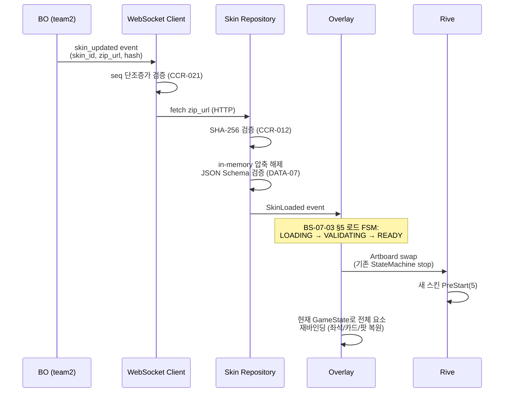

| t | 이벤트 |
|---|--------|
| 0 | skin_updated WS 수신 |
| +ZIP | HTTP 다운로드 (네트워크 의존, 수초) |
| +ZIP+100ms | SHA-256 + Schema 검증 |
| +ZIP+200ms | 압축 해제 + Artboard 생성 |
| +ZIP+500ms | Artboard swap, 새 스킨 렌더 시작 |
| +ZIP+500ms~ | 현재 GameState로 요소 재바인딩 (카드/팟/플레이어 복원) |

**핵심**:
- 스킨 교체는 **GameState를 변경하지 않는다**. 진행 중인 핸드는 유지.
- Broadcast 경로도 동일 교체 시점 (Security Delay와 무관 — 스킨은 시청자 직접 노출 요소 아님).
- Artboard swap 중 1프레임 blank 허용 (BS-07-03 §5).

**연관**: BS-07-03 skin-loading FSM, CCR-012/015/021, DATA-07 .gfskin Schema.

---

## 3. AnimationState 역참조 매트릭스

본 문서의 시퀀스가 사용하는 AnimationState와 발동 시퀀스:

| AnimationState | 값 | 사용 시퀀스 |
|:-------------:|:--:|-----------|
| FadeIn | 0 | 2.2 HoleCard |
| Glint | 1 | 2.9 Showdown |
| GlintGrow | 2 | 2.9 Showdown |
| GlintRotateFront | 3 | 2.9 Showdown |
| GlintShrink | 4 | 2.9 Showdown |
| PreStart | 5 | 2.1 StartHand, 2.11 Skin 교체 |
| ResetRotateBack | 6 | 2.10 HandComplete |
| ResetRotateFront | 7 | 2.9 Showdown |
| Resetting | 8 | 2.10 HandComplete |
| Scale | 10 | 2.1 BlindsPosted, 2.6 Action, 2.9 Pot |
| SlideAndDarken | 11 | 2.8 Fold, 2.9 Showdown 패자 |
| SlideUp | 13 | 2.3 Flop, 2.4 Turn, 2.5 River |
| Stop | 14 | 2.10 HandComplete (IDLE) |
| Waiting | 15 | (action_on 표시, 시퀀스 외 유휴 펄스) |

| transition_type | 값 | 사용 시퀀스 |
|:---------------:|:--:|-----------|
| fade | 0 | 2.3/2.4/2.5 HandRank, 2.10 보조 요소 |
| slide | 1 | (일반 등장) |
| pop | 2 | 2.6 ActionBadge |
| expand | 3 | 2.3~2.7 EquityBar, 2.6 Pot |

---

## 4. 특수 시나리오 시퀀스 요약

본 문서는 표준 Hold'em 11개 시퀀스를 정의한다. 이하 변형은 BS-07-02 §4에 정의된 매핑을 따르며 시간축만 위 시퀀스에 준한다:

| 특수 시나리오 | 기반 시퀀스 | 차이점 |
|--------------|------------|-------|
| All-In Runout | 2.3~2.5 연속 | 스태거 50ms, 각 카드마다 EquityUpdated |
| Run It Twice/Thrice | 2.10 후 2.3 재진입 | 이전 보드 ResetRotateBack → 새 보드 SlideUp, 팟 분할 |
| Misdeal | 2.10 HandComplete 축약 | Resetting(8) 직행, 이후 IDLE |

---

## 5. 검증 체크리스트

본 문서의 각 시퀀스는 구현 시 다음을 만족해야 한다:

- [ ] 모든 트리거가 BS-06-00-triggers 정의와 이름 일치
- [ ] 모든 AnimationState가 BS-07-02 §1과 이름·값 일치
- [ ] Backstage/Broadcast 분기가 BS-07-07 §2와 일치 (두 Stream)
- [ ] Security Delay 적용 시점이 BS-07-07 §4 Buffer 구조와 일치
- [ ] 타이밍 상수(delay, duration)가 BS-07-02 §5 기본값 내 범위
- [ ] 스킨 교체 시퀀스가 BS-07-03 §5 로드 FSM과 일치

---

## 영향 받는 문서

| 문서 | 관계 |
|------|------|
| `BS-07-00-overview.md` | Overlay 앱 정의, 생명주기 (본 문서가 시간축으로 구체화) |
| `BS-07-01-elements.md` | 요소별 트리거 매핑 (본 문서가 시간축 시퀀스로 재구성) |
| `BS-07-02-animations.md` | AnimationState 정의 (본 문서가 발동 순서로 조립) |
| `BS-07-03-skin-loading.md` | 스킨 로드 FSM (§2.11에서 호출) |
| `BS-07-04-scene-schema.md` | 스킨 JSON 좌표/치수 (본 문서 범위 외) |
| `BS-07-05-audio.md` | 오디오 트리거 (시퀀스 병렬 트랙) |
| `BS-07-06-layer-boundary.md` | Layer 1/2/3 경계 (본 문서는 Layer 1만 다룸) |
| `BS-07-07-security-delay.md` | Security Delay 아키텍처 (본 문서 §1~§2 전반의 전제) |
| `contracts/api/API-04-overlay-output.md` | 프로세스 모델 + 데이터 계약 SSOT |
| `contracts/api/API-05-websocket-events.md` | skin_updated 이벤트 (§2.11) |
| `BS-06-00-triggers.md` | 트리거 이벤트 정의 SSOT |
| `BS-06-00-REF-game-engine-spec.md` | AnimationState/transition_type Enum |
