# AT Annotation Reference

PokerGFX Action Tracker UI 요소 3-Layer 참조 문서.

각 화면별 구조: 원본 스크린샷 / Annotation Overlay (배지 제거) / UI 요소 테이블.

> **번호 체계 안내**: 본 문서의 화면 ID는 PRD-AT-002 v8.4.0 기준입니다. 파일 자산(HTML/PNG/JSON)은 원본 캡처 번호(at-01~at-06)를 유지합니다.
>
> | 파일명 | 화면 ID | 화면명 |
> |--------|---------|--------|
> | at-01 | AT-01 | Main Layout |
> | at-02 | AT-02 | Action View (Pre-Flop) |
> | at-03 | AT-03 | Card Selector |
> | at-04 | AT-02 | Action View (Post-Flop) — AT-02에 통합 |
> | at-05 | AT-04 | Statistics |
> | at-06 | AT-05 | RFID Register |

## 목차

- [워크플로우: 요소 활성 매핑](#워크플로우-요소-활성-매핑)
- [AT-01: Main Layout](#at-01-main-layout)
- [AT-02: Action View — Pre-Flop](#at-02-action-view--pre-flop)
- [AT-02: Action View — Post-Flop](#at-02-action-view--post-flop)
- [AT-03: Card Selector](#at-03-card-selector)
- [AT-04: Statistics](#at-04-statistics)
- [AT-05: RFID Register](#at-05-rfid-register)
- [AT-00: Login](#at-00-login)
- [AT-07: Player Edit](#at-07-player-edit)

---

## 워크플로우: 요소 활성 매핑

> **관점 차별화**: AT-Workflow-Screen-Mapping.md는 "어떤 **화면**으로 전환?"을 다루고, 본 섹션은 "이 **UI 요소**는 언제 활성/비활성?"을 다룬다.

### Console→AT 인증 — 요소 활성 흐름

Console에서 AT를 Process IPC로 실행하고, 인증 완료 후 게임 상태 동기화까지의 요소 활성 흐름.

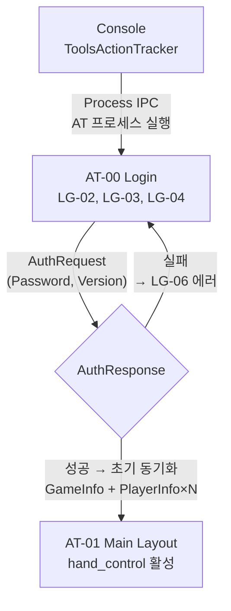

#### Console→AT 인증 요소 활성 테이블

| 단계 | 활성 요소 | 비활성 요소 | 프로토콜 |
|------|----------|-----------|----------|
| Console에서 AT 실행 | — | 전체 (AT 미시작) | Process IPC 시작 |
| AT-00 표시 | LG-01(타이틀), LG-02(계정), LG-03(빈), LG-04(LOGIN), LG-05(Disconnected) | LG-06(에러) | ConnectResponse, IdtxResponse 수신 |
| Password 입력 | LG-03(Console 설정 비밀번호 입력) | — | — |
| LOGIN 클릭 | LG-05(Connecting 노란 펄스) | LG-02~LG-04 비활성 | AuthRequest(Password, Version) 전송 |
| 인증 성공 | AT-01 전체 활성 | AT-00 비활성 | GameStateResponse → GameInfoResponse(75+필드) → PlayerInfoResponse×N |
| 인증 실패 | LG-06(에러), LG-02~LG-04 재활성 | — | AuthResponse 실패 |

### 핸드 라이프사이클 — 활성 요소 category

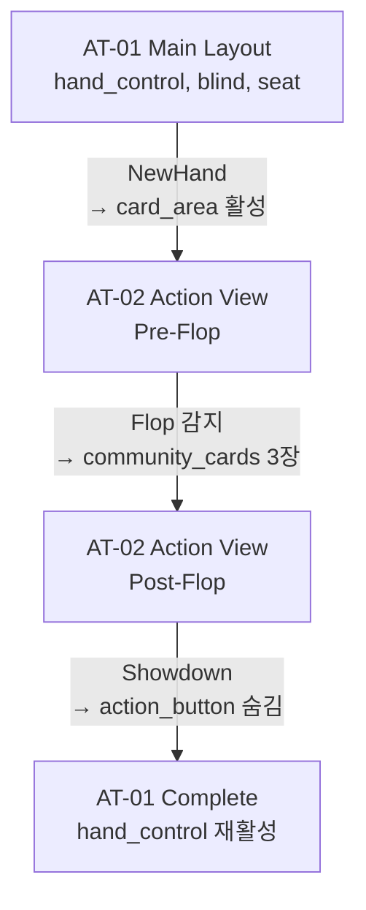

### 게임 상태별 요소 활성 매트릭스

<!-- AUTO:ELEMENT_MATRIX:START -->
| Category | IDLE | SETUP_HAND | PRE_FLOP | FLOP~RIVER | SHOWDOWN | COMPLETE |
|----------|:----:|:----------:|:--------:|:----------:|:--------:|:--------:|
| hand_control | edit | edit | r/o | r/o | r/o | r/o |
| blind | edit | r/o | r/o | r/o | r/o | r/o |
| seat | edit | edit | 상태표시 | 상태표시 | 위너강조 | r/o |
| chip_input | edit | edit | r/o | r/o | r/o | r/o |
| card_area | — | edit | r/o(RFID) | r/o | 공개 | — |
| action_button | hidden | hidden | **ACTIVE** | **ACTIVE** | MUCK/SHOW | hidden |
| community_cards | — | — | empty | 3→4→5장 | 5장+핸드명 | clear |
| info_bar | — | — | 현재 플레이어 | 현재 플레이어 | 위너 | — |
| broadcast_control | 가능 | 가능 | 가능 | 가능 | 가능 | 가능 |
<!-- AUTO:ELEMENT_MATRIX:END -->

### 프로토콜-요소 매핑 — 서버 메시지 → UI 요소 갱신

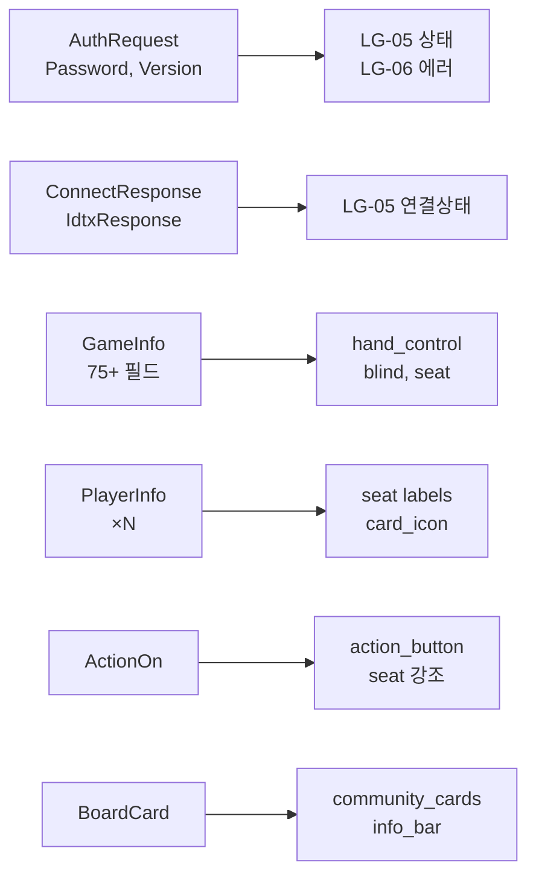

### 예외 흐름 매트릭스

| 예외 | 출발 화면 | 트리거 | 도착 화면 | 변경 요소 |
|------|----------|--------|----------|----------|
| RFID 실패 | AT-02 | 5초 타임아웃 | AT-03 | card_grid 활성 |
| 미스딜 | AT-02 | MISS_DEAL 버튼 | AT-02 리셋 | card_icon 초기화 |
| 네트워크 끊김 | 모든 화면 | TCP 해제 | AT-00 | 전체 비활성 |
| RFID 미등록 | AT-01 | REGISTER | AT-05 | rfid 요소 활성 |

---

## AT-01: Main Layout [파일: at-01]

**786x553** | **90개 요소**

### 원본 스크린샷

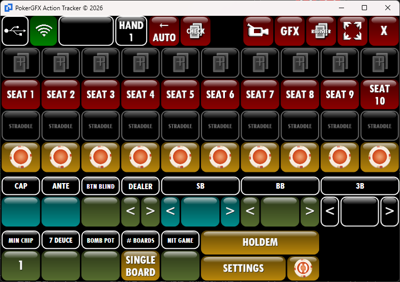

### Annotation Overlay

- [Annotated HTML](html_reproductions/at-01-setup-mode-annotated.html)

### UI Elements (90개)

| ID | Name | Category | Description |
|----|------|----------|-------------|
| 1 | App Icon | titlebar | 앱 아이콘 |
| 2 | Title Text | titlebar | 타이틀 텍스트 |
| 3 | Minimize Button | titlebar | 최소화 버튼 |
| 4 | Maximize Button | titlebar | 최대화 버튼 |
| 5 | Close Button (Window) | titlebar | 윈도우 닫기 |
| 6 | USB Connection Icon | titlebar | USB 서버 연결 토글 |
| 7 | Network Quality Indicator | titlebar | GfxServer TCP 연결 품질 실시간 모니터링. 4단계 신호 막대 (Good/Fair/Poor/Disconnected). Heartbeat 3초 간격. REQ-AT-002 |
| 8 | Hand Number Box | hand_control | 핸드 번호 박스 |
| 9 | HAND Label | hand_control | HAND 라벨 |
| 10 | Hand Back Arrow | hand_control | 이전 핸드 화살표 |
| 11 | Hand Forward Arrow | hand_control | 다음 핸드 화살표 |
| 12 | AUTO Button | hand_control | AUTO 모드 토글 |
| 13 | Video Source Icon Button | toolbar | 비디오 소스 선택 |
| 14 | GFX Button | toolbar | GFX 활성/비활성 토글 |
| 15 | Snapshot Icon Button | toolbar | 스냅샷 캡처 |
| 16 | Fullscreen Icon Button | toolbar | 전체화면 토글 |
| 17 | App Close Button | toolbar | 앱 종료 버튼 |
| 18 | Seat 1 Card Slot | card_area | SEAT 1 카드 입력 |
| 19 | Seat 2 Card Slot | card_area | SEAT 2 카드 입력 |
| 20 | Seat 3 Card Slot | card_area | SEAT 3 카드 입력 |
| 21 | Seat 4 Card Slot | card_area | SEAT 4 카드 입력 |
| 22 | Seat 5 Card Slot | card_area | SEAT 5 카드 입력 |
| 23 | Seat 6 Card Slot | card_area | SEAT 6 카드 입력 |
| 24 | Seat 7 Card Slot | card_area | SEAT 7 카드 입력 |
| 25 | Seat 8 Card Slot | card_area | SEAT 8 카드 입력 |
| 26 | Seat 9 Card Slot | card_area | SEAT 9 카드 입력 |
| 27 | Seat 10 Card Slot | card_area | SEAT 10 카드 입력 |
| 28 | Seat 1 Label | seat | SEAT 1 좌석 라벨. 클릭 → AT-07 Player Edit 전환. 이름 설정 시 "SEAT 1" → 플레이어 이름 변경. 상태별 색상: 활성(빨강), 현재턴(노랑), 빈자리(회색). REQ-AT-008 |
| 29 | Seat 2 Label | seat | SEAT 2 좌석 라벨. 클릭 → AT-07 Player Edit 전환. 이름 설정 시 "SEAT 2" → 플레이어 이름 변경. 상태별 색상: 활성(빨강), 현재턴(노랑), 빈자리(회색) |
| 30 | Seat 3 Label | seat | SEAT 3 좌석 라벨. 클릭 → AT-07 Player Edit 전환. 이름 설정 시 "SEAT 3" → 플레이어 이름 변경. 상태별 색상: 활성(빨강), 현재턴(노랑), 빈자리(회색) |
| 31 | Seat 4 Label | seat | SEAT 4 좌석 라벨. 클릭 → AT-07 Player Edit 전환. 이름 설정 시 "SEAT 4" → 플레이어 이름 변경. 상태별 색상: 활성(빨강), 현재턴(노랑), 빈자리(회색) |
| 32 | Seat 5 Label | seat | SEAT 5 좌석 라벨. 클릭 → AT-07 Player Edit 전환. 이름 설정 시 "SEAT 5" → 플레이어 이름 변경. 상태별 색상: 활성(빨강), 현재턴(노랑), 빈자리(회색) |
| 33 | Seat 6 Label | seat | SEAT 6 좌석 라벨. 클릭 → AT-07 Player Edit 전환. 이름 설정 시 "SEAT 6" → 플레이어 이름 변경. 상태별 색상: 활성(빨강), 현재턴(노랑), 빈자리(회색) |
| 34 | Seat 7 Label | seat | SEAT 7 좌석 라벨. 클릭 → AT-07 Player Edit 전환. 이름 설정 시 "SEAT 7" → 플레이어 이름 변경. 상태별 색상: 활성(빨강), 현재턴(노랑), 빈자리(회색) |
| 35 | Seat 8 Label | seat | SEAT 8 좌석 라벨. 클릭 → AT-07 Player Edit 전환. 이름 설정 시 "SEAT 8" → 플레이어 이름 변경. 상태별 색상: 활성(빨강), 현재턴(노랑), 빈자리(회색) |
| 36 | Seat 9 Label | seat | SEAT 9 좌석 라벨. 클릭 → AT-07 Player Edit 전환. 이름 설정 시 "SEAT 9" → 플레이어 이름 변경. 상태별 색상: 활성(빨강), 현재턴(노랑), 빈자리(회색) |
| 37 | Seat 10 Label | seat | SEAT 10 좌석 라벨 (2줄 표시). 클릭 → AT-07 Player Edit 전환. 이름 설정 시 "SEAT 10" → 플레이어 이름 변경. 상태별 색상: 활성(빨강), 현재턴(노랑), 빈자리(회색) |
| 38 | Seat 1 Straddle | option | SEAT 1 스트래들 토글 |
| 39 | Seat 2 Straddle | option | SEAT 2 스트래들 토글 |
| 40 | Seat 3 Straddle | option | SEAT 3 스트래들 토글 |
| 41 | Seat 4 Straddle | option | SEAT 4 스트래들 토글 |
| 42 | Seat 5 Straddle | option | SEAT 5 스트래들 토글 |
| 43 | Seat 6 Straddle | option | SEAT 6 스트래들 토글 |
| 44 | Seat 7 Straddle | option | SEAT 7 스트래들 토글 |
| 45 | Seat 8 Straddle | option | SEAT 8 스트래들 토글 |
| 46 | Seat 9 Straddle | option | SEAT 9 스트래들 토글 |
| 47 | Seat 10 Straddle | option | SEAT 10 스트래들 토글 |
| 48 | Seat 1 Chip Input | chip_input | SEAT 1 칩(스택) 금액 입력. 클릭하여 숫자 직접 입력. PlayerInfoResponse.Stack 동기화 |
| 49 | Seat 2 Chip Input | chip_input | SEAT 2 칩(스택) 금액 입력. 클릭하여 숫자 직접 입력. PlayerInfoResponse.Stack 동기화 |
| 50 | Seat 3 Chip Input | chip_input | SEAT 3 칩(스택) 금액 입력. 클릭하여 숫자 직접 입력. PlayerInfoResponse.Stack 동기화 |
| 51 | Seat 4 Chip Input | chip_input | SEAT 4 칩(스택) 금액 입력. 클릭하여 숫자 직접 입력. PlayerInfoResponse.Stack 동기화 |
| 52 | Seat 5 Chip Input | chip_input | SEAT 5 칩(스택) 금액 입력. 클릭하여 숫자 직접 입력. PlayerInfoResponse.Stack 동기화 |
| 53 | Seat 6 Chip Input | chip_input | SEAT 6 칩(스택) 금액 입력. 클릭하여 숫자 직접 입력. PlayerInfoResponse.Stack 동기화 |
| 54 | Seat 7 Chip Input | chip_input | SEAT 7 칩(스택) 금액 입력. 클릭하여 숫자 직접 입력. PlayerInfoResponse.Stack 동기화 |
| 55 | Seat 8 Chip Input | chip_input | SEAT 8 칩(스택) 금액 입력. 클릭하여 숫자 직접 입력. PlayerInfoResponse.Stack 동기화 |
| 56 | Seat 9 Chip Input | chip_input | SEAT 9 칩(스택) 금액 입력. 클릭하여 숫자 직접 입력. PlayerInfoResponse.Stack 동기화 |
| 57 | Seat 10 Chip Input | chip_input | SEAT 10 칩(스택) 금액 입력. 클릭하여 숫자 직접 입력. PlayerInfoResponse.Stack 동기화 |
| 58 | CAP Header | blind | CAP 라벨 헤더 (읽기 전용). 최대 베팅 상한 표시. GameInfo._cap |
| 59 | ANTE Header | blind | ANTE 라벨 헤더 (읽기 전용). 강제 베팅 금액 표시. GameInfo._ante |
| 60 | BTN BLIND Header | blind | BTN BLIND 라벨 헤더 (읽기 전용). 버튼 블라인드 표시. GameInfo._button_blind |
| 61 | DEALER Header | blind | DEALER 라벨 헤더 (읽기 전용). 딜러 좌석 번호 표시. GameInfo._pl_dealer |
| 62 | SB Header | blind | SB 라벨 헤더 (읽기 전용). 스몰 블라인드 금액 표시. GameInfo._small_blind |
| 63 | BB Header | blind | BB 라벨 헤더 (읽기 전용). 빅 블라인드 금액 표시. GameInfo._big_blind |
| 64 | 3B Header | blind | 3B 라벨 헤더. 클릭 시 3B 활성화/비활성화 토글. 서드 블라인드 금액 표시. GameInfo._third_blind |
| 65 | CAP Value Input | blind | CAP 값 입력 버튼. 58번 헤더 하위 단일 입력. 클릭하여 금액 직접 입력. GameInfo._cap. WriteGameInfo 전송 |
| 67 | ANTE Value Input | blind | ANTE 값 입력 버튼. 59번 헤더 하위 단일 입력. 클릭하여 금액 직접 입력. GameInfo._ante. WriteGameInfo 전송 |
| 69 | SB Position Left | blind | SB 좌석 위치 ◀ 버튼. 62번 헤더의 좌석 번호를 감소. GameInfo._pl_small. WriteGameInfo 전송 |
| 70 | SB Position Right | blind | SB 좌석 위치 ▶ 버튼. 62번 헤더의 좌석 번호를 증가. GameInfo._pl_small. WriteGameInfo 전송 |
| 71 | BB Position Left | blind | BB 좌석 위치 ◀ 버튼. 63번 헤더의 좌석 번호를 감소. GameInfo._pl_big. WriteGameInfo 전송 |
| 72 | BB Position Right | blind | BB 좌석 위치 ▶ 버튼. 63번 헤더의 좌석 번호를 증가. GameInfo._pl_big. WriteGameInfo 전송 |
| 73 | 3B Value Input Left | blind | 3B 값 입력 좌측 버튼. 64번 헤더의 금액을 MIN CHIP 단위로 감소. GameInfo._third. WriteGameInfo 전송 |
| 74 | 3B Value Input Right | blind | 3B 값 입력 우측 버튼. 64번 헤더의 금액을 MIN CHIP 단위로 증가. GameInfo._third. WriteGameInfo 전송 |
| 75 | MIN CHIP Button | game_settings | 게임 설정 헤더. 최소 칩 단위 표시. 85번 값 버튼에서 값 설정. GameInfo._smallest_chip |
| 76 | 7 DEUCE Button | game_settings | 게임 설정 헤더. 7-2 사이드 게임 금액 표시. 87번 값 버튼에서 값 설정. GameInfo._seven_deuce |
| 77 | BOMB POT Button | game_settings | 게임 설정 헤더. Bomb Pot 강제 베팅 금액 표시. 89번 값 버튼에서 값 설정. GameInfo._bomb_pot |
| 78 | # BOARDS Button | game_settings | 게임 설정 헤더. 보드 수(1/2/3) 표시. 82 SINGLE BOARD에서 보드 수 선택. GameInfo._num_boards |
| 79 | HIT GAME Button | game_settings | 게임 설정 헤더. 특정 핸드 조합 보너스 표시. 93번 값 버튼에서 값 설정. GameInfo._hit_game |
| 80 | HOLDEM Button | game_settings | 게임 타입 순환 선택 버튼. 클릭 시 HOLDEM → PLO4 → PLO5 → SHORT DECK 순환. SendGameType 전송. 83 SETTINGS에서 선택된 게임의 세부 설정 관리 |
| 82 | SINGLE BOARD Button | game_settings | 78 #BOARDS 헤더 아래 배치. 보드 수 선택 토글 버튼. SINGLE BOARD → RUN IT 2x → RUN IT 3x 순환. GameInfo._num_boards 연동. REQ-AT-025 |
| 83 | SETTINGS Button | navigation | 80 HOLDEM 아래 배치. 게임 추가 설정 화면 진입 버튼. 블라인드 구조, 특수 규칙, 좌석별 설정 일괄 관리. REQ-AT-027 |
| 85 | MIN CHIP Value Button | game_settings | 75번 헤더 값 표시 + 클릭 편집 버튼. GameInfo._smallest_chip. WriteGameInfo 전송 |
| 87 | 7 DEUCE Value Button | game_settings | 76번 헤더 값 표시 + 클릭 편집 버튼. GameInfo._seven_deuce_amt. WriteGameInfo 전송 |
| 89 | BOMB POT Value Button | game_settings | 77번 헤더 값 표시 + 클릭 편집 버튼. GameInfo._bomb_pot. WriteGameInfo 전송 |
| 93 | HIT GAME Value Button | game_settings | 79번 헤더 값 표시 + 클릭 편집 버튼. GameInfo._hit_game. WriteGameInfo 전송 |
| 95 | DEALER Position Left | blind | DEALER 좌석 위치 ◀ 버튼. 61번 헤더의 좌석 번호를 감소. GameInfo._pl_dealer. WriteGameInfo 전송 |
| 96 | DEALER Position Right | blind | DEALER 좌석 위치 ▶ 버튼. 61번 헤더의 좌석 번호를 증가. GameInfo._pl_dealer. WriteGameInfo 전송 |
| — | SB Chip Display | blind | SB 칩 금액 표시 버튼. 클릭 시 직접 입력. 62번 헤더의 금액 표시. GameInfo._small_blind |
| — | BB Chip Display | blind | BB 칩 금액 표시 버튼. 클릭 시 직접 입력. 63번 헤더의 금액 표시. GameInfo._big_blind |
| — | 3B Chip Display | blind | 3B 칩 금액 표시 버튼. 클릭 시 직접 입력. 64번 헤더의 금액 표시. GameInfo._third_blind |
| 101 | BTN BLIND Value Input | blind | BTN BLIND 값 입력 버튼. 60번 헤더 하위 단일 입력. 클릭하여 금액 직접 입력. GameInfo._button_blind. WriteGameInfo 전송 |

<!-- AT-01 미매핑 REQ 목록 (요소 추가 별도 작업):
- REQ-AT-003: 방송 스트림 연결 상태 표시 요소 없음
- REQ-AT-004: 녹화 진행 여부 + 경과 시간 표시 요소 없음
- CAP/ANTE/BTN BLIND: 58/59/60 헤더 하위에 단일 입력 버튼 배치 (65/67/101). Left/Right 분리 → 단일 직접 입력으로 변경
- SB/BB/3B 칩 표시 버튼: annotation ID 없음 (표시/입력 전용). 3버튼 구조 ◀ {칩 입력} ▶로 통일. SB/BB는 pos◀▶, 3B는 val◀▶
- Game Settings 값 버튼: 85/87/89/93번 4개 값 버튼 + 82 SINGLE BOARD 토글로 통합 (기존 ◀▶ 10개 + 84번 인풋 → 값 버튼 4개 + 토글 1개)
-->

---

## AT-02: Action View — Pre-Flop [파일: at-02]

**786x553** | **41개 요소**

### 원본 스크린샷

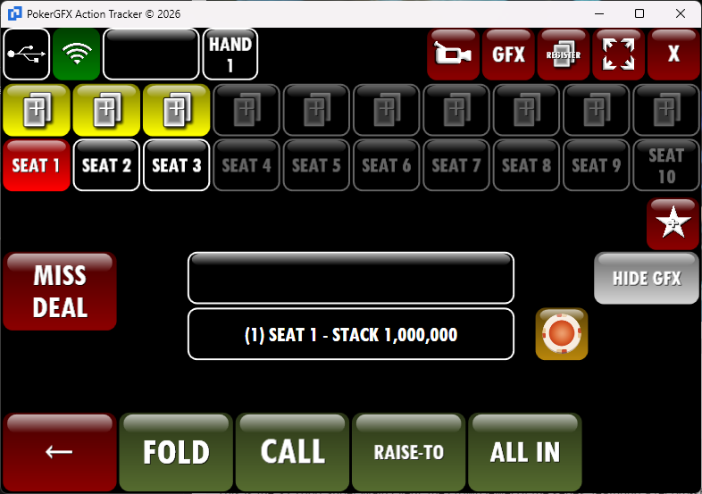

### Annotation Overlay

- [Annotated HTML](html_reproductions/at-02-action-preflop-annotated.html)

### UI Elements (41개)

| ID | Name | Category | Description |
|----|------|----------|-------------|
| 1 | 윈도우 타이틀바 | titlebar | 윈도우 타이틀바 (5개 요소 그룹) |
| 2 | USB 연결 버튼 | toolbar | USB 서버 연결 토글 |
| 3 | WiFi 신호 아이콘 | toolbar | GfxServer TCP 연결 품질 실시간 모니터링. 4단계 신호 막대. Heartbeat 3초 간격. REQ-AT-002 |
| 4 | 핸드 정보 입력 필드 | toolbar | 핸드 관련 메모 입력 필드. 운영자가 핸드별 특이사항 기록. 방송 그래픽 미연동 (로컬 전용) |
| 5 | HAND 1 레이블 | toolbar | HAND 번호 표시 |
| 6 | 카메라/비디오 버튼 | toolbar | 비디오 소스 선택 |
| 7 | GFX 버튼 | toolbar | GFX 활성/비활성 토글 |
| 8 | REGISTER 버튼 | toolbar | 덱 등록 모드 진입. 클릭 시 AT-05 RFID Register 화면 전환. RFID 카드 스캔 대기 상태 |
| 9 | 전체화면 버튼 | toolbar | 전체화면 토글 |
| 10 | X(닫기) 버튼 | toolbar | 앱 종료 버튼 |
| 11 | SEAT 1 카드 아이콘 | card_icon | SEAT 1 카드 아이콘 |
| 12 | SEAT 2 카드 아이콘 | card_icon | SEAT 2 카드 아이콘 |
| 13 | SEAT 3 카드 아이콘 | card_icon | SEAT 3 카드 아이콘 |
| 14 | SEAT 4 카드 아이콘 | card_icon | SEAT 4 카드 아이콘 |
| 15 | SEAT 5 카드 아이콘 | card_icon | SEAT 5 카드 아이콘 |
| 16 | SEAT 6 카드 아이콘 | card_icon | SEAT 6 카드 아이콘 |
| 17 | SEAT 7 카드 아이콘 | card_icon | SEAT 7 카드 아이콘 |
| 18 | SEAT 8 카드 아이콘 | card_icon | SEAT 8 카드 아이콘 |
| 19 | SEAT 9 카드 아이콘 | card_icon | SEAT 9 카드 아이콘 |
| 20 | SEAT 10 카드 아이콘 | card_icon | SEAT 10 카드 아이콘 |
| 21 | SEAT 1 레이블 | seat | SEAT 1 좌석 라벨 |
| 22 | SEAT 2 레이블 | seat | SEAT 2 좌석 라벨 |
| 23 | SEAT 3 레이블 | seat | SEAT 3 좌석 라벨 |
| 24 | SEAT 4 레이블 | seat | SEAT 4 좌석 라벨 |
| 25 | SEAT 5 레이블 | seat | SEAT 5 좌석 라벨 |
| 26 | SEAT 6 레이블 | seat | SEAT 6 좌석 라벨 |
| 27 | SEAT 7 레이블 | seat | SEAT 7 좌석 라벨 |
| 28 | SEAT 8 레이블 | seat | SEAT 8 좌석 라벨 |
| 29 | SEAT 9 레이블 | seat | SEAT 9 좌석 라벨 |
| 30 | SEAT 10 레이블 | seat | SEAT 10 좌석 라벨 |
| 31 | MISS DEAL 버튼 | action_panel | 미스딜 선언 |
| 32 | TAG 버튼 | action_panel | 핸드 태그 마킹 |
| 33 | 커뮤니티 카드 영역 | community_cards | 커뮤니티 카드 영역 |
| 34 | 플레이어 정보 바 | info_bar | 플레이어 정보 바 |
| 35 | 녹화/레코딩 버튼 | action_panel | 녹화 버튼 |
| 36 | HIDE GFX 버튼 | action_panel | GFX 숨기기 토글 |
| 37 | ← 뒤로가기 버튼 | action_panel | 되돌리기 (Undo). UndoLastAction 전송. 최대 5단계 되돌리기 제한. 액션/카드/베팅 역순 복원 |
| 38 | FOLD 버튼 | action_button | FOLD 액션 전송 |
| 39 | CALL 버튼 | action_button | CALL 액션 전송. SendPlayerBet(Player, BiggestBet). 베팅이 있을 때(BiggestBet > 0) 표시. 베팅 없으면 CHECK로 전환 (AT-02 Post-Flop) |
| 40 | RAISE-TO 버튼 | action_button | RAISE-TO 액션 전송. SendPlayerBet(Player, Amount). 베팅이 있을 때(BiggestBet > 0) 표시. 베팅 없으면 BET로 전환 (AT-02 Post-Flop) |
| 41 | ALL IN 버튼 | action_button | ALL IN 액션 전송 |

#### Pre-Flop / Post-Flop Diff (7개 요소)

AT-02 Post-Flop(파일: at-04)에서 변경되는 요소. Post-Flop은 별도 섹션 없이 여기에 통합.

| ID | Pre-Flop | Post-Flop |
|----|----------|-----------|
| 11 | 카드 아이콘 노란 배경 (카드 입력됨) | 카드 아이콘 어두운 회색 배경 (비활성/폴드) |
| 21 | SEAT 1 빨간 배경 (현재턴) | SEAT 1 회색 배경 (비활성) |
| 22 | SEAT 2 흰 배경 (활성) | SEAT 2 빨간 배경 (현재턴) |
| 33 | 커뮤니티 카드 비어있음 | 커뮤니티 카드 7♥ 6♠ 4♥ (Flop) |
| 34 | (1) SEAT 1 - STACK 1,000,000 | (2) SEAT 2 - STACK 995,000 |
| 39 | CALL 액션 전송 | CHECK 액션 전송 |
| 40 | RAISE-TO 액션 전송 | BET 액션 전송 |

---

## AT-02: Action View — Post-Flop [파일: at-04]

**786x553** | **41개 요소** | AT-02 Pre-Flop과 구조 동일, **diff 7개 요소**

### 원본 스크린샷

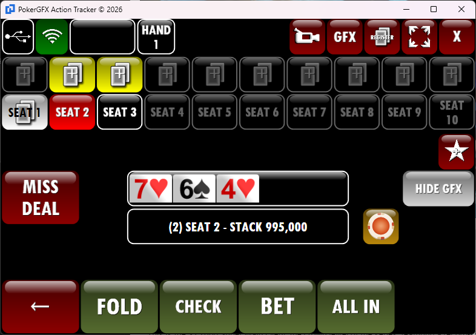

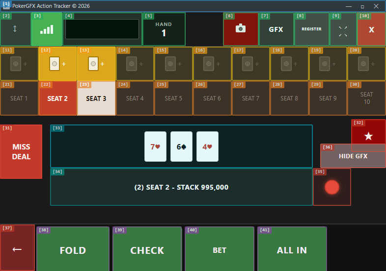

### Annotation Overlay

- [Annotated HTML](html_reproductions/at-04-action-postflop-annotated.html)

### AT-02 Pre-Flop 대비 변경 요소 (diff 7개)

| ID | AT-02 Pre-Flop 상태 | AT-02 Post-Flop 상태 | 변경 내용 |
|----|-----------|-----------|----------|
| 11 | 노란 배경 (카드 입력됨) | 어두운 배경 (비활성) | SEAT 1 폴드/액션 완료 |
| 21 | 빨간 배경 (현재 턴) | 회색 배경 (비활성) | SEAT 1 액션 완료 |
| 22 | 흰 배경 (활성) | 빨간 배경 (현재 턴) | SEAT 2로 턴 이동 |
| 33 | 비어있음 | Flop 3장 (7♥ 6♠ 4♥) | 커뮤니티 카드 표시 |
| 34 | (1) SEAT 1 - STACK 1,000,000 | (2) SEAT 2 - STACK 995,000 | 현재 플레이어 변경 |
| 39 | CALL | CHECK | 베팅 없는 포스트플롭 |
| 40 | RAISE-TO | BET | 베팅 없는 포스트플롭 |

### UI Elements (41개)

| ID | Name | Category | Description |
|----|------|----------|-------------|
| 1 | 윈도우 타이틀바 | titlebar | 5개 요소 그룹 |
| 2 | USB 연결 버튼 | toolbar | USB 서버 연결 토글 |
| 3 | WiFi 신호 아이콘 | toolbar | GfxServer TCP 연결 품질 실시간 모니터링. 4단계 신호 막대. Heartbeat 3초 간격. REQ-AT-002 |
| 4 | 핸드 정보 입력 필드 | toolbar | 핸드 관련 메모 입력 필드. 운영자가 핸드별 특이사항 기록. 방송 그래픽 미연동 (로컬 전용) |
| 5 | HAND 1 레이블 | toolbar | 현재 핸드 번호 |
| 6 | 카메라/비디오 버튼 | toolbar | 비디오 소스 선택 |
| 7 | GFX 버튼 | toolbar | GFX 활성/비활성 토글 |
| 8 | REGISTER 버튼 | toolbar | 덱 등록 모드 진입. 클릭 시 AT-05 RFID Register 화면 전환. RFID 카드 스캔 대기 상태 |
| 9 | 전체화면 버튼 | toolbar | 전체화면 토글 |
| 10 | X(닫기) 버튼 | toolbar | 앱 종료 |
| 11 | SEAT 1 카드 아이콘 | card_icon | **어두운 배경 (비활성)** |
| 12 | SEAT 2 카드 아이콘 | card_icon | 노란 배경 (카드 입력됨) |
| 13 | SEAT 3 카드 아이콘 | card_icon | 노란 배경 (카드 입력됨) |
| 14 | SEAT 4 카드 아이콘 | card_icon | 어두운 배경 (카드 없음) |
| 15 | SEAT 5 카드 아이콘 | card_icon | 어두운 배경 |
| 16 | SEAT 6 카드 아이콘 | card_icon | 어두운 배경 |
| 17 | SEAT 7 카드 아이콘 | card_icon | 어두운 배경 |
| 18 | SEAT 8 카드 아이콘 | card_icon | 어두운 배경 |
| 19 | SEAT 9 카드 아이콘 | card_icon | 어두운 배경 |
| 20 | SEAT 10 카드 아이콘 | card_icon | 어두운 배경 |
| 21 | SEAT 1 레이블 | seat | **회색 배경 (비활성)** |
| 22 | SEAT 2 레이블 | seat | **빨간 배경 (현재 턴)** |
| 23 | SEAT 3 레이블 | seat | 흰 배경 (활성) |
| 24 | SEAT 4 레이블 | seat | 어두운 배경 (빈 좌석) |
| 25 | SEAT 5 레이블 | seat | 어두운 배경 |
| 26 | SEAT 6 레이블 | seat | 어두운 배경 |
| 27 | SEAT 7 레이블 | seat | 어두운 배경 |
| 28 | SEAT 8 레이블 | seat | 어두운 배경 |
| 29 | SEAT 9 레이블 | seat | 어두운 배경 |
| 30 | SEAT 10 레이블 | seat | 어두운 배경 |
| 31 | MISS DEAL 버튼 | action_panel | 미스딜 선언 |
| 32 | TAG 버튼 | action_panel | 핸드 태그 마킹 |
| 33 | 커뮤니티 카드 영역 | community_cards | **Flop 3장 (7♥ 6♠ 4♥)** |
| 34 | 플레이어 정보 바 | info_bar | **(2) SEAT 2 - STACK 995,000** |
| 35 | 녹화/레코딩 버튼 | action_panel | 녹화 상태 표시 |
| 36 | HIDE GFX 버튼 | action_panel | GFX 숨기기 토글 |
| 37 | ← 뒤로가기 버튼 | action_panel | 되돌리기 (Undo). UndoLastAction 전송. 최대 5단계 되돌리기 제한. 액션/카드/베팅 역순 복원 |
| 38 | FOLD 버튼 | action_button | FOLD 액션 전송 |
| 39 | CHECK 버튼 | action_button | **CHECK 액션 전송. 현재 베팅 라운드 패스. 베팅 없을 때(BiggestBet == 0) 표시. 베팅 있으면 CALL로 전환 (AT-02 Pre-Flop)** |
| 40 | BET 버튼 | action_button | **BET 액션 전송. SendPlayerBet(Player, Amount). 베팅 없을 때(BiggestBet == 0) 표시. 베팅 있으면 RAISE-TO로 전환 (AT-02 Pre-Flop)** |
| 41 | ALL IN 버튼 | action_button | ALL IN 액션 전송 |

---

## AT-03: Card Selector

**786x460** | **8개 요소**

### 원본 스크린샷

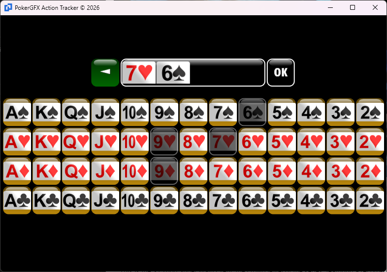

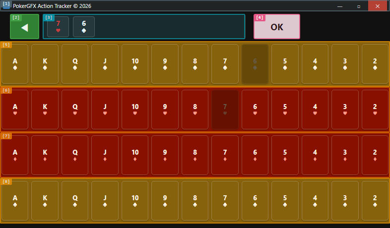

### Annotation Overlay

- [Annotated HTML](html_reproductions/at-03-card-selector-annotated.html)

### UI Elements (8개)

| ID | Name | Category | Description |
|----|------|----------|-------------|
| 1 | Title Bar | chrome | 윈도우 타이틀바 (5개 요소 그룹) |
| 2 | Back Button | navigation | 카드 선택 취소. 클릭 시 이전 액션 화면(AT-02 Action View)으로 복귀. 선택 중인 카드 정보 폐기 |
| 3 | Selected Card Display | display | 선택 카드 실시간 미리보기. Card Grid에서 선택한 카드가 즉시 반영. Suit+Rank 조합 시각화 |
| 4 | OK Button | action | 카드 선택 확정 (OK) |
| 5 | Spade Row | card_grid | 스페이드 슈트 행 (A~K 13장). 검정 카드. 이미 할당된 카드 비활성화(회색). PlayerCardsResponse 기반 |
| 6 | Heart Row | card_grid | 하트 슈트 행 (A~K 13장). 빨간 카드. 이미 할당된 카드 비활성화(회색). PlayerCardsResponse 기반 |
| 7 | Diamond Row | card_grid | 다이아몬드 슈트 행 (A~K 13장). 파란 카드. 이미 할당된 카드 비활성화(회색). PlayerCardsResponse 기반 |
| 8 | Club Row | card_grid | 클럽 슈트 행 (A~K 13장). 초록 카드. 이미 할당된 카드 비활성화(회색). PlayerCardsResponse 기반 |

---

## AT-04: Statistics [파일: at-05]

**786x553** | **22개 요소**

### 원본 스크린샷

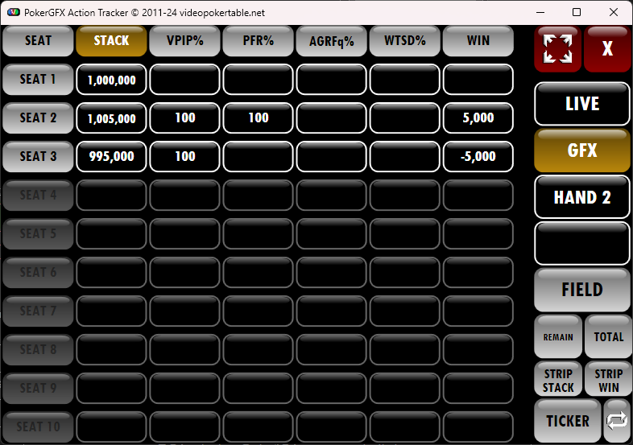

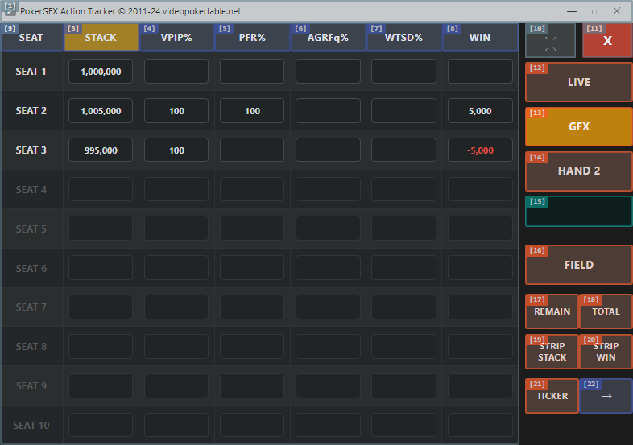

### Annotation Overlay

- [Annotated HTML](html_reproductions/at-05-statistics-register-annotated.html)

### UI Elements (22개)

| ID | Name | Category | Description |
|----|------|----------|-------------|
| 1 | Title Bar | chrome | 윈도우 타이틀바 (5개 요소 그룹) |
| 2 | Header: SEAT | table_header | 테이블 헤더: SEAT |
| 3 | Header: STACK | table_header | 테이블 헤더: STACK |
| 4 | Header: VPIP% | table_header | 테이블 헤더: VPIP% (Voluntarily Put money In Pot). 자발적 팟 참여 비율. PlayerInfoResponse.Vpip |
| 5 | Header: PFR% | table_header | 테이블 헤더: PFR% (Pre-Flop Raise). 프리플롭 레이즈 비율. PlayerInfoResponse.Pfr |
| 6 | Header: AGRFq% | table_header | 테이블 헤더: AGRFq% (Aggression Frequency). 공격적 플레이 빈도. PlayerInfoResponse.Agr |
| 7 | Header: WTSD% | table_header | 테이블 헤더: WTSD% (Went To ShowDown). 쇼다운 진출 비율. PlayerInfoResponse.Wtsd |
| 8 | Header: WIN | table_header | 테이블 헤더: WIN. 누적 수익/손실 금액. PlayerInfoResponse.CumWin |
| 9 | Data Rows (SEAT 1-10) | table_data | 통계 데이터 행 (SEAT 1-10) |
| 10 | Expand Button | action | 창 확장/전체화면 |
| 11 | Close Button | action | Statistics 패널 닫기 |
| 12 | LIVE Button | broadcast_control | LIVE 방송 모드 토글. GFX_ENABLE(enable) 전송. 주의: 반전 전송(!enable) |
| 13 | GFX Button | broadcast_control | GFX 오버레이 토글. SHOW_PANEL 프로토콜로 통계 패널 on/off 전환 |
| 14 | HAND Button | broadcast_control | HAND 번호 표시 |
| 15 | Input Field (Unknown) | input | 입력 필드 (추정: 방송 그래픽 전송 값 입력). broadcast_control 버튼과 연동하여 전송할 값 지정. 역설계 교차검증 필요 |
| 16 | FIELD Button | broadcast_control | FIELD 그래픽 전송. FIELD_VAL(field_id, value) 프로토콜로 방송 그래픽에 특정 필드 값 전송 |
| 17 | REMAIN Button | broadcast_control | REMAIN 잔여 칩 그래픽 전송. 선택된 플레이어의 현재 스택을 방송 그래픽에 표시 |
| 18 | TOTAL Button | broadcast_control | TOTAL 총 칩 그래픽 전송. 선택된 플레이어의 총 바이인 금액을 방송 그래픽에 표시 |
| 19 | STRIP STACK Button | broadcast_control | STRIP STACK 전송. 전체 플레이어 스택 비교 스트립 그래픽 방송 전송 |
| 20 | STRIP WIN Button | broadcast_control | STRIP WIN 전송. 전체 플레이어 수익 비교 스트립 그래픽 방송 전송 |
| 21 | TICKER Button | broadcast_control | TICKER 그래픽 전송. 하단 흐르는 텍스트(ticker) 그래픽 방송 전송 |
| 22 | Arrow Right Button | navigation | 다음 화면 네비게이션 |

---

## AT-05: RFID Register [파일: at-06]

**786x553** | **9개 요소**

### 원본 스크린샷

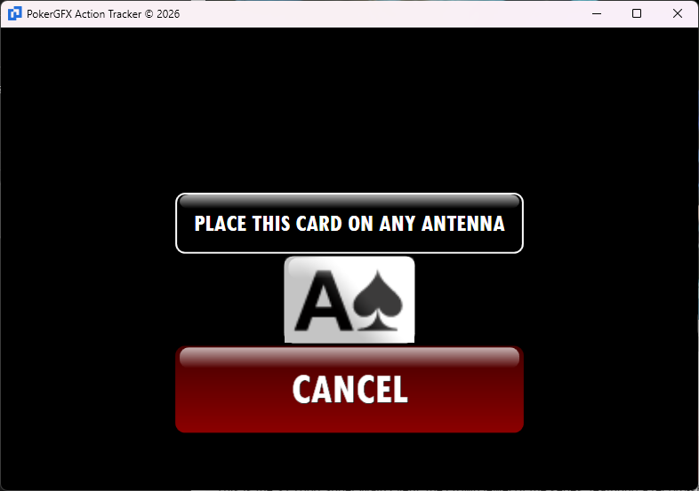

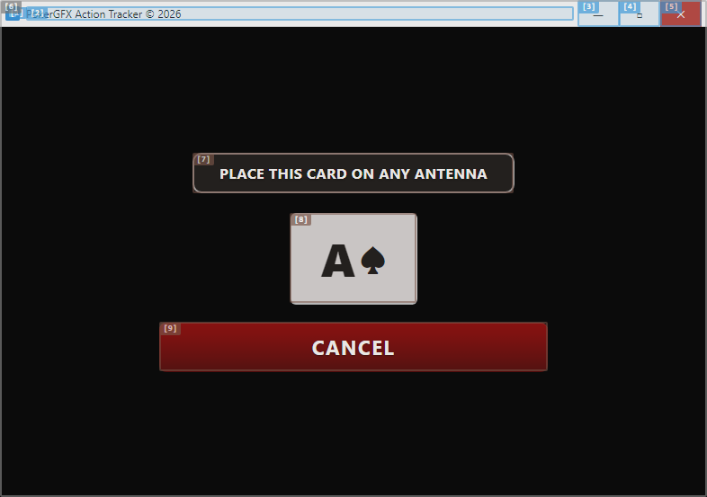

### Annotation Overlay

- [Annotated HTML](html_reproductions/at-06-rfid-registration-annotated.html)

### UI Elements (9개)

| ID | Name | Category | Description |
|----|------|----------|-------------|
| 1 | App Icon | titlebar | 앱 아이콘 |
| 2 | Title Text | titlebar | 타이틀 텍스트 |
| 3 | Minimize Button | titlebar | 최소화 버튼 |
| 4 | Maximize Button | titlebar | 최대화 버튼 |
| 5 | Close Button (Window) | titlebar | 윈도우 닫기 |
| 6 | Black Background | background | RFID 등록 검정 배경 |
| 7 | Instruction Label | rfid | 카드 안테나 안내 메시지 |
| 8 | Card Image | rfid | 등록 중 카드 이미지. RFID 스캔 순서에 따라 표시 카드 자동 변경 (A♠→2♠→...→K♣). 52장 순차 등록 진행률 시각화 |
| 9 | CANCEL Button | rfid | 등록 취소 버튼. 클릭 시 AT-01 Main Layout으로 복귀. 진행 중인 등록 세션 폐기 |

---

## AT-00: Login [파일: at-07]

**720x480** | **6개 요소** | EBS HTML 목업 기반 (PokerGFX 원본 없음)

### 원본 목업

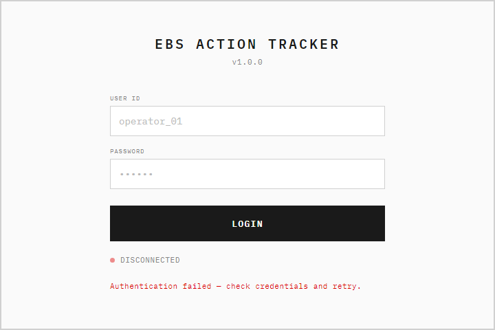

### Annotation Overlay

- (예정)

### UI Elements (6개)

| ID | Name | Category | Description |
|----|------|----------|-------------|
| LG-01 | App Title | header | "EBS ACTION TRACKER" + v1.0.0 |
| LG-02 | User ID | input | 운영자 ID 입력 |
| LG-03 | Password | input | 비밀번호 입력 (masked) |
| LG-04 | LOGIN | action | 로그인 버튼 (52px) |
| LG-05 | Status Indicator | status | Disconnected/Connecting/Connected |
| LG-06 | Error Message | feedback | 인증 실패 메시지 (빨간) |

---

## AT-07: Player Edit [파일: at-09]

**720x400** | **9개 요소** | EBS HTML 목업 기반 (PokerGFX 원본 재설계)

### 원본 목업

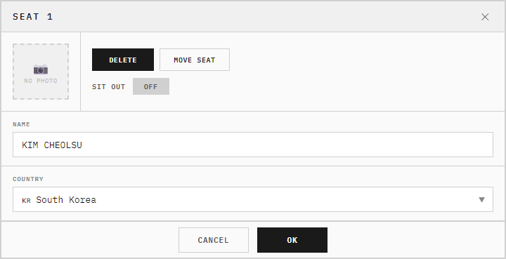

### Annotation Overlay

- (예정)

### UI Elements (9개)

| ID | Name | Category | Description |
|----|------|----------|-------------|
| PE-01 | Seat Label | header | "SEAT N" (1~10) |
| PE-02 | NAME | input | 플레이어 이름 |
| PE-03 | COUNTRY | input | 국가 선택 (국기 아이콘) |
| PE-05 | Photo Area | display | 프로필 사진 (80x80) |
| PE-06 | DELETE | action | 플레이어 제거 |
| PE-07 | MOVE SEAT | action | 좌석 이동 |
| PE-08 | SIT OUT | toggle | 자리비움 ON/OFF |
| PE-09 | OK | action | 저장 + 닫기 |
| PE-10 | CANCEL / X | action | 취소 + 닫기 |

---
