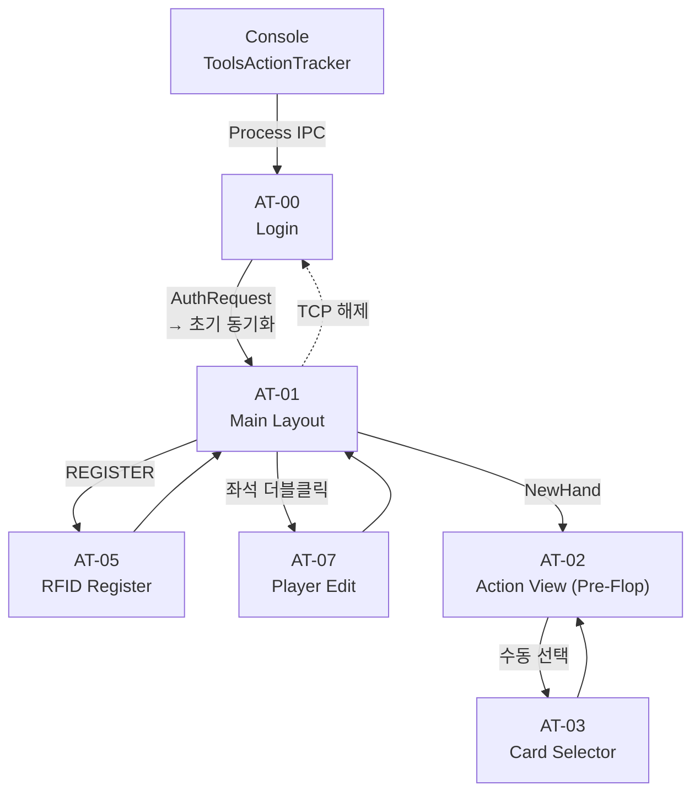
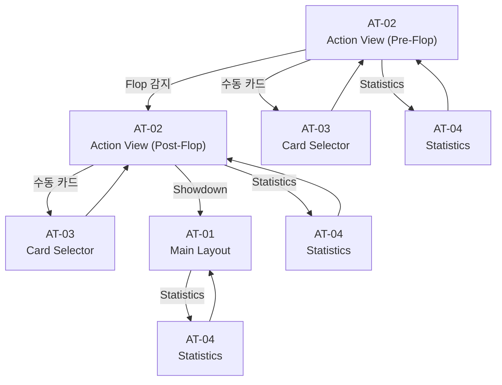
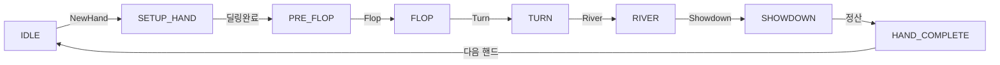

# Action Tracker UI 레이아웃 워크플로우 분석 및 스크린샷 매핑

> **번호 체계 안내**: 본 문서의 화면 ID는 PRD-AT-002 v8.4.0 기준입니다. 파일 자산(HTML/PNG/JSON)은 원본 캡처 번호(at-01~at-06)를 유지합니다.
>
> | 파일명 | 화면 ID | 화면명 |
> |--------|---------|--------|
> | at-01 | AT-01 | Main Layout |
> | at-02 | AT-02 | Action View (Pre-Flop) |
> | at-03 | AT-03 | Card Selector |
> | at-04 | AT-02 | Action View (Post-Flop) — AT-02에 통합 |
> | at-05 | AT-04 | Statistics |
> | at-06 | AT-05 | RFID Register |

## 1. 게임 상태 머신 기반 화면 전환 워크플로우

### 1.1 화면 전환 워크플로우 (Overview)

### 1.2 화면 전환 워크플로우 (세부)

### 1.3 8단계 상태 머신 (프로토콜 기준)

**참고**: AT-02 Action View의 Post-Flop 모드는 FLOP/TURN/RIVER 3개 상태를 공유하며, AT-04(Statistics)는 모든 상태에서 접근 가능한 오버레이입니다.

## 2. 전체 화면 목록 (8개)

### 2.1 확정 화면 (5개)

| ID | 화면명 | 크기 | 요소 | 진입 조건 |
|----|--------|------|:----:|----------|
| AT-01 | Main Layout | 786×553 | 83 | 앱 시작, 핸드 종료 후 |
| AT-02 | Action View | 786×553 | 41 | 딜링 완료 / Flop·Turn·River 감지 |
| AT-03 | Card Selector | 786×460 | 8 | RFID 실패 시 수동 선택 |
| AT-04 | Statistics | 786×553 | 22 | 통계 조회 (언제든) |
| AT-05 | RFID Register | 786×553 | 9 | REGISTER 버튼 클릭 |

### 2.2 미구현 화면 (3개)

| ID | 화면명 | 출처 | 필요 근거 |
|----|--------|------|----------|
| AT-00 | Login Screen | REQ-AT-001 (PRD-AT-001 §4.4) | 운영자 ID/Password 인증 UI |
| AT-06 | Game Settings (재설계) | REQ-AT-027 | Console ⚙ SETTINGS 대체 → 독립 재설계 |
| AT-07 | Player Edit Popup | Phase 1 미완료 | 플레이어 정보/스택 수정 |

## 3. 스크린샷/자산 매핑 및 준비 상태

### 3.1 AT-01: Main Layout [파일: at-01]

| 자산 유형 | 파일 경로 | 상태 |
|----------|---------|:----:|
| 원본 PNG | `docs/analysis/at-01-setup-mode.png` | ✅ |
| Annotated PNG | `docs/analysis/at-01-setup-mode-annotated.png` | ✅ |
| Clean HTML | `docs/analysis/html_reproductions/at-01-setup-mode.html` | ✅ |
| Annotated HTML | `docs/analysis/html_reproductions/at-01-setup-mode-annotated.html` | ✅ |
| EBS 목업 (v3) | `docs/mockups/v3/ebs-at-full-layout.png` | ✅ |
| EBS 목업 (v5) | `docs/mockups/v5/ebs-at-full-layout.png` | ✅ |
| JSON 매핑 | `docs/analysis/analysis/at-01-setup-mode.json` | ✅ |
| Elements JSON | `docs/analysis/elements/at-01-setup-elements.json` | ✅ |

### 3.2 AT-02: Action View — Pre-Flop [파일: at-02]

| 자산 유형 | 파일 경로 | 상태 |
|----------|---------|:----:|
| 원본 PNG | `docs/analysis/at-02-action-preflop.png` | ✅ |
| Annotated PNG | `docs/analysis/at-02-action-preflop-annotated.png` | ✅ |
| Clean HTML | `docs/analysis/html_reproductions/at-02-action-preflop.html` | ✅ |
| Annotated HTML | `docs/analysis/html_reproductions/at-02-action-preflop-annotated.html` | ✅ |
| EBS 목업 (v3) | `docs/mockups/v3/ebs-at-main-layout.png` | ✅ |
| EBS 목업 (v5) | `docs/mockups/v5/ebs-at-main-layout.png` | ✅ |
| JSON 매핑 | `docs/analysis/analysis/at-02-action-preflop.json` | ✅ |
| Elements JSON | `docs/analysis/elements/at-02-action-elements.json` | ✅ |

### 3.3 AT-03: Card Selector [파일: at-03]

| 자산 유형 | 파일 경로 | 상태 |
|----------|---------|:----:|
| 원본 PNG | `docs/analysis/at-03-card-selector.png` | ✅ |
| Annotated PNG | `docs/analysis/at-03-card-selector-annotated.png` | ✅ |
| Clean HTML | `docs/analysis/html_reproductions/at-03-card-selector.html` | ✅ |
| Annotated HTML | `docs/analysis/html_reproductions/at-03-card-selector-annotated.html` | ✅ |
| EBS 목업 (v3) | `docs/mockups/v3/ebs-at-card-selector.png` | ✅ |
| EBS 목업 (v5) | `docs/mockups/v5/ebs-at-card-selector.png` | ✅ |
| JSON 매핑 | `docs/analysis/analysis/at-03-card-selector.json` | ✅ |
| Elements JSON | `docs/analysis/elements/at-03-card-selector-elements.json` | ✅ |

### 3.4 AT-02: Action View — Post-Flop [파일: at-04]

| 자산 유형 | 파일 경로 | 상태 |
|----------|---------|:----:|
| 원본 PNG | `docs/analysis/at-04-action-postflop.png` | ✅ |
| Annotated PNG | `docs/analysis/at-04-action-postflop-annotated.png` | ✅ |
| Clean HTML | `docs/analysis/html_reproductions/at-04-action-postflop.html` | ✅ |
| Annotated HTML | `docs/analysis/html_reproductions/at-04-action-postflop-annotated.html` | ✅ |
| EBS 목업 | (AT-02 `ebs-at-main-layout` 공유) | ✅ |
| JSON 매핑 | `docs/analysis/analysis/at-04-action-postflop.json` | ✅ |
| Elements JSON | (AT-02 `at-02-action-elements.json` 공유) | ✅ |

### 3.5 AT-04: Statistics [파일: at-05]

| 자산 유형 | 파일 경로 | 상태 |
|----------|---------|:----:|
| 원본 PNG | `docs/analysis/at-05-statistics-register.png` | ✅ |
| Annotated PNG | `docs/analysis/at-05-statistics-register-annotated.png` | ✅ |
| Clean HTML | `docs/analysis/html_reproductions/at-05-statistics-register.html` | ✅ |
| Annotated HTML | `docs/analysis/html_reproductions/at-05-statistics-register-annotated.html` | ✅ |
| EBS 목업 (v3) | `docs/mockups/v3/ebs-at-stats-panel.png` | ✅ |
| EBS 목업 (v5) | `docs/mockups/v5/ebs-at-stats-panel.png` | ✅ |
| JSON 매핑 | `docs/analysis/analysis/at-05-statistics-register.json` | ✅ |
| Elements JSON | `docs/analysis/elements/at-05-statistics-register-elements.json` | ✅ |

### 3.6 AT-05: RFID Register [파일: at-06]

| 자산 유형 | 파일 경로 | 상태 |
|----------|---------|:----:|
| 원본 PNG | `docs/analysis/at-06-rfid-registration.png` | ✅ |
| Annotated PNG | `docs/analysis/at-06-rfid-registration-annotated.png` | ✅ |
| Clean HTML | `docs/analysis/html_reproductions/at-06-rfid-registration.html` | ✅ |
| Annotated HTML | `docs/analysis/html_reproductions/at-06-rfid-registration-annotated.html` | ✅ |
| EBS 목업 (v3) | `docs/mockups/v3/ebs-at-rfid-register.png` | ✅ |
| EBS 목업 (v5) | `docs/mockups/v5/ebs-at-rfid-register.png` | ✅ |
| JSON 매핑 | `docs/analysis/analysis/at-06-rfid-registration.json` | ✅ |
| Elements JSON | `docs/analysis/elements/at-06-rfid-registration-elements.json` | ✅ |

### 3.7 미구현 화면 자산 상태

| ID | 화면 | 원본 PNG | Annotated | HTML | EBS 목업 | AT-Ref | 비고 |
|----|------|:--------:|:---------:|:----:|:--------:|:------:|------|
| AT-00 | Login Screen | — | (예정) | ✅ | ✅ v3 | ✅ | EBS 신규 설계 (PokerGFX 원본 없음) |
| AT-06 | Game Settings (재설계) | — | — | — | (예정) | — | Console ⚙ SETTINGS 대체 → 독립 재설계 |
| AT-07 | Player Edit Popup | — | (예정) | ✅ | ✅ v3 | ✅ | EBS 재설계 (PokerGFX 원본 재설계) |

## 4. 역설계 기반 추가 분석

### 4.1 프로토콜 메시지 매핑

| 화면 | 수신 메시지 | 송신 메시지 |
|------|-----------|-----------|
| AT-01 | WriteGameInfo, WritePlayerInfo | GameInfo, PlayerStatus |
| AT-02 | ActionOn, CardDealt, BoardCard | PlayerAction(fold/call/raise/allin) |
| AT-03 | — | ManualCardSelect |
| AT-04 | PlayerStats, HandHistory | RequestStats, BroadcastGFX |
| AT-05 | RfidCardScanned | StartRegistration, CancelRegistration |
| AT-00 | ConnectResponse, AuthResponse | ConnectRequest, AuthRequest |
| AT-07 | PlayerInfoResponse | PlayerInfoRequest(편집), PlayerDelete |

### 4.2 PokerGFX → EBS 설계 차이점

| 항목 | PokerGFX (원본) | EBS (재설계) |
|------|----------------|-------------|
| Framework | WinForms (.NET) | Flutter Desktop |
| 해상도 | 786×553 고정 | 반응형 (최소 786×553) |
| 상태 관리 | God Class (329 메서드) | Riverpod / Bloc |
| 네트워크 | TCP :8888 | TCP :9001 (WebSocket 확장) |
| RFID | 12대 리더 지원 | 동일 |
| 게임 엔진 | 22개 타입 | 초기 3개 (Holdem/PLO/Short Deck) |

## 5. 준비 상태 요약

### 5.1 확정 화면 자산 매트릭스 (5개 — 100% 완성)

| 자산 | AT-01 | AT-02 | AT-03 | AT-04 | AT-05 |
|------|:-----:|:-----:|:-----:|:-----:|:-----:|
| 원본 PNG | ✅ | ✅ | ✅ | ✅ | ✅ |
| Annotated PNG | ✅ | ✅ | ✅ | ✅ | ✅ |
| Clean HTML | ✅ | ✅ | ✅ | ✅ | ✅ |
| Annotated HTML | ✅ | ✅ | ✅ | ✅ | ✅ |
| EBS 목업 v3 | ✅ | ✅ | ✅ | ✅ | ✅ |
| EBS 목업 v5 | ✅ | ✅ | ✅ | ✅ | ✅ |
| JSON 매핑 | ✅ | ✅ | ✅ | ✅ | ✅ |
| Elements JSON | ✅ | ✅ | ✅ | ✅ | ✅ |

**총 자산**: 고유 파일 48개 (AT-02 Action View는 Pre-Flop/Post-Flop 파일 자산을 포함)

### 5.2 미구현 화면 분석

| 화면 | 스크린샷 필요성 | 이유 |
|------|:----------:|------|
| Login Screen (AT-00) | 낮음 | 단순 로그인 다이얼로그, EBS 신규 설계 |
| Game Settings (AT-06) | 중간 | Console ⚙ SETTINGS 대체 → 독립 재설계 |
| Player Edit Popup (AT-07) | 중간 | Phase 1 미완료 항목 |

미구현 화면 3개는 Phase 2 분석 단계에서 필요에 따라 추가 분석 예정입니다.

## 6. 다음 단계

1. **Phase 1 미완료 항목 마무리**: Settings Popup (G-2) + Player Edit Popup (G-1) 분석
2. **AT-07~09 화면 HTML 재현물 작성** (필요시)
3. **Phase 3 진입**: Flutter 프로젝트 초기화 + 컴포넌트 구현 시작

---

## Changelog

| 날짜 | 버전 | 변경 내용 | 변경 유형 | 결정 근거 |
|------|------|-----------|----------|----------|
| 2026-03-31 | v1.3.1 | 화면 ID를 PRD-AT-002 v8.4.0 기준으로 전면 갱신. 매핑 테이블 추가 | TECH | PRD-Analysis 번호 체계 통일 |
| 2026-03-18 | v1.3.0 | §3.7 AT-07/AT-09 자산 상태 갱신 (AT-Ref ✅), HTML ✅ 반영 | PRODUCT | AT-Annotation-Reference.md 섹션 추가 연동 |
| 2026-03-17 | v1.2.0 | AT-07 Login Screen 전환, AT-08 Settings Popup 폐기 | PRODUCT | 사용자 피드백 F-2/F-3 반영 |
| 2026-03-17 | v1.1.0 | AT-07/08/09 EBS 목업 상태 갱신 (❌→✅) | PRODUCT | 미구현 3개 화면 목업 완성 |
| 2026-03-17 | v1.0.0 | 최초 작성 — 워크플로우 분석 + 자산 매핑 검증 | TECH | Phase 2→3 전환 준비 |
