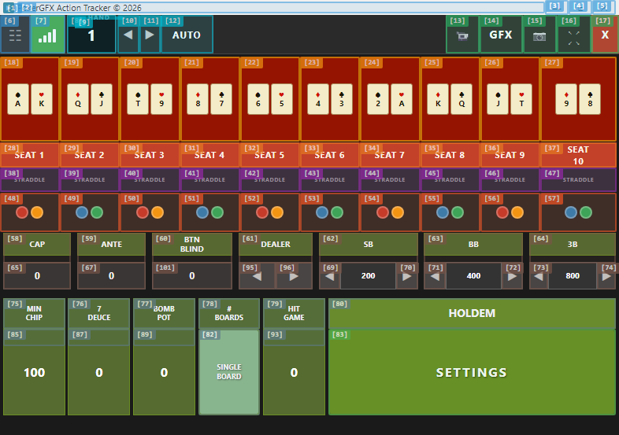
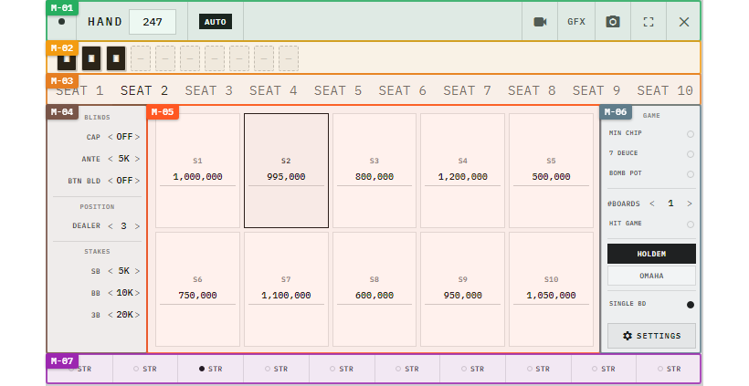
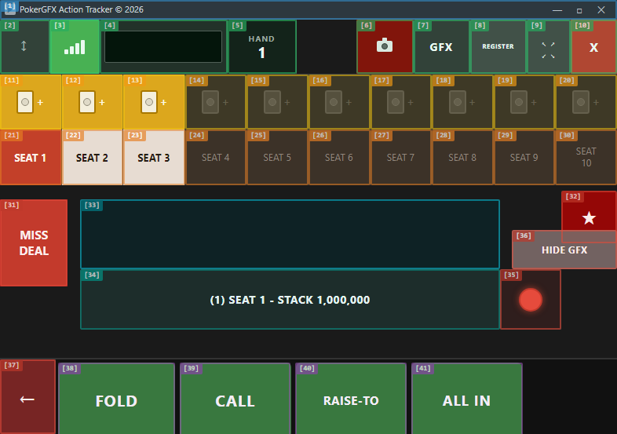
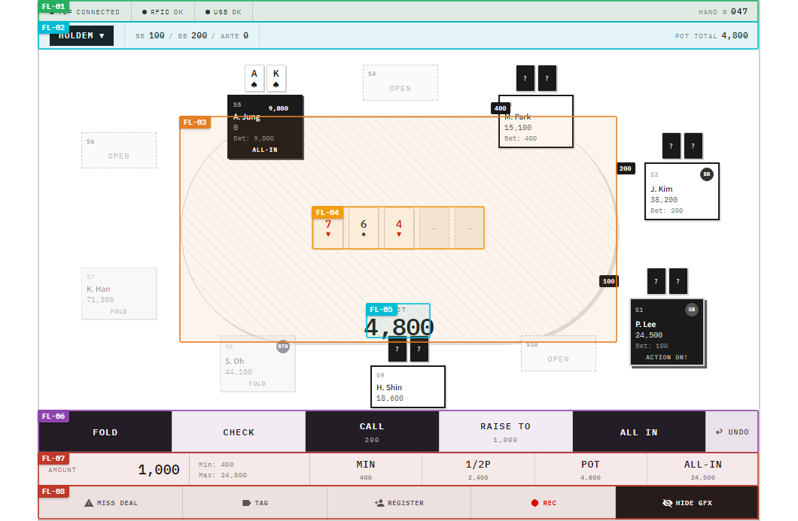

# EBS Action Tracker 설계 당위성 분석

> **목적**: PokerGFX Action Tracker의 검증된 설계를 계승하되, 구조적 한계만 해결했음을 증명한다.
> **원칙**: PokerGFX에 이미 있는 기능을 "없다"고 주장하지 않는다.

---

## 1. Executive Summary — 계승 vs 개선 vs 신규

PokerGFX Action Tracker는 수년간 실전 방송에서 검증된 운영 콘솔이다. EBS는 이를 "대체"하는 것이 아니라, **검증된 설계를 그대로 가져오고(계승)** 구조적 한계만 해결(개선)했다.

### 3축 분류

| 축 | 정의 | 항목 |
|:--:|------|------|
| **계승** | PokerGFX에서 이미 최적해를 찾은 설계 | 키보드 단축키, Pot 실시간 표시, 동적 버튼 레이블, Blind 자동화, UNDO 5단계 |
| **개선** | 기능은 있으나 구조적 한계가 있는 부분 | Zone-Based Layout, QTabs 탭 전환, 반응형 해상도, 직접 입력, AT-02 Pre-Flop/Post-Flop 통합, action-glow |
| **신규** | PokerGFX AT에 없던 화면/기능 | Login(AT-00), Game Settings(AT-06), RFID 진행률 바, Quasar 크로스플랫폼 |

### Side-by-Side 비교

**AT-01: Main Layout**

| | PokerGFX | EBS |
|---|---|---|
| 스크린샷 |  |  |
| 요소 수 | 90개 (평면 배열) | 79개 (7존 그룹핑) |
| 해상도 | 786×553 고정 | 720px min-width, auto height |
| 디자인 톤 | Win32 네이티브 | Quasar white minimal |

**AT-02: Action View**

| | PokerGFX (Pre-Flop + Post-Flop 분리) | EBS (단일 AT-02) |
|---|---|---|
| 스크린샷 |  |  |
| 화면 수 | 2개 (Pre-Flop / Post-Flop) | **1개** (동적 전환) |
| 좌석 표현 | 수평 10좌석 고정 | v1: 수평 계승, v2: 타원형 예정 |
| 현재 턴 강조 | 정적 색상 | action-glow 애니메이션 |

---

## 2. PokerGFX에서 계승한 설계 원칙

PokerGFX가 수년간 검증한 5가지 핵심 설계 원칙. EBS는 이를 **변경하지 않고 그대로 가져왔다**.

| # | 계승 원칙 | PokerGFX 구현 | EBS 구현 | 계승 이유 |
|:-:|----------|--------------|---------|----------|
| I-1 | **키보드 우선** | F/C/B/A/U/N/G/F1/F8 | 동일 + Ctrl+Z, F11, Esc, Enter, Tab 확장 | 6시간+ 방송 피로 최소화 검증 완료 |
| I-2 | **Pot 실시간 표시** | 커뮤니티 카드 존(Zone B)에 표시 | 테이블 중앙 FL-05 | 동일 위치, 동일 역할 |
| I-3 | **동적 버튼 레이블** | CALL↔CHECK, RAISE-TO↔BET (BiggestBet 기반) | 동일 규칙, 단일 화면 내 적용 | BiggestBet 기준 자동 전환 |
| I-4 | **Blind 자동화** | WriteGameInfo 1회 설정 → 서버 자동 관리 | 동일 프로토콜(22+ 필드) 활용 | 운영자 부담 최소화 |
| I-5 | **UNDO 5단계** | UndoLastAction → GameState 복원 → 브로드캐스트 | 동일 메커니즘 | 라이브 방송 에러 복구 필수 |

### I-1. 키보드 우선 — Fitts's Law

> *"타겟까지의 이동 시간은 타겟의 크기와 거리에 비례한다"* — Fitts, 1954

운영자는 6시간+ 연속 방송 중 한 핸드당 3~8개 액션을 입력한다. 마우스 이동은 누적 피로를 만들지만, 키보드 단축키는 이동 거리가 0이다. PokerGFX가 F/C/B/A를 도입한 이유가 바로 이것이며, EBS는 이를 그대로 유지한다.

### I-2. Pot 실시간 표시 — Nielsen 1st Heuristic (Visibility of System Status)

운영자와 시청자 모두 현재 Pot 규모를 즉시 파악해야 한다. PokerGFX는 Zone B(커뮤니티 카드 영역)에 실시간 갱신하며, EBS는 FL-05(테이블 중앙)에 동일하게 배치한다. 위치와 역할이 동일하므로 변경할 이유가 없다.

### I-3. 동적 버튼 레이블 — 인지 부하 최소화

BiggestBet > 0이면 CALL/RAISE-TO, BiggestBet == 0이면 CHECK/BET. PokerGFX Pre-Flop/Post-Flop에서 이미 이 규칙을 사용한다(AT-Annotation-Reference §AT-02 Pre-Flop/Post-Flop diff 참조). EBS는 동일 규칙을 적용하되, **별도 화면 전환 없이** 단일 화면에서 처리한다(§4.1에서 상세).

### I-4. Blind 자동화 — WriteGameInfo 프로토콜

PokerGFX는 WriteGameInfo 메시지 1회로 ante, small_blind, big_blind 등 22+ 필드를 서버에 전송하면 이후 서버가 자동 관리한다(DESIGN-AT-002 §5.1). EBS는 동일 프로토콜을 사용하므로 자동화 로직을 변경할 이유가 없다.

### I-5. UNDO 5단계 — 라이브 방송 안전망

라이브 방송에서 잘못된 액션 입력은 그래픽 오류로 직결된다. PokerGFX의 UndoLastAction(최대 5단계)은 이를 복구하는 안전망이며, EBS는 동일 메커니즘을 그대로 계승한다.

---

## 3. AT-01 Main Layout — 구조적 한계 해결

PokerGFX AT-01은 **기능은 갖추었으나 구조적으로 한계**가 있다. AT-01은 기능을 유지하면서 구조만 개선한다.

### Decision 3.1: 90요소 평면 배열 → 7존 Zone-Based Layout

**문제**: 786×553px에 90개 UI 요소가 카테고리 구분 없이 밀집 배치. Blind 설정, 좌석 관리, 게임 옵션이 시각적으로 분리되지 않아 운영자가 원하는 컨트롤을 찾으려면 전체를 스캔해야 한다.

**결정**: 7개 기능 존(M-01 Toolbar ~ M-07 Straddle Row)으로 시각적 그룹핑.

**근거**: Miller's Law (7±2) — 인간 작업기억은 한 번에 7±2개 청크를 처리한다. 90개 개별 요소보다 7개 그룹이 인지 부하가 현저히 낮다. NN/g Chunking 가이드라인과 동일 원리.

**증거**: Astro UXDS(미 우주군 디자인 시스템) zone-based dashboard — 미션 크리티컬 환경에서 zone 그룹핑이 오류율을 줄인다는 실증 사례.

### Decision 3.2: 10인 수평 고정 배열 → QTabs 탭 네비게이션

**문제**: 786px에 10좌석 수평 고정 = 좌석당 78px. 기능은 동작하지만 **시각적 밀도 과다**. 특히 6인 이하 게임(WSOP 기준 대다수)에서 빈 좌석 4개가 공간을 낭비한다.

**결정**: QTabs로 포커스 좌석만 상세 표시. 전체 좌석은 탭으로 전환.

**근거**: Progressive Disclosure (NN/g) — 현재 필요한 정보만 노출하고 나머지는 요청 시 제공. 10좌석 중 현재 설정 중인 좌석만 상세 표시하면 인지 부하가 1/10로 감소한다.

**증거**: WSOP/WPT 실제 운영 데이터에서 6-max, 9-max 게임이 대다수. 10-max 풀링은 상대적으로 소수.

### Decision 3.3: 786×553 고정 해상도 → 720px 반응형

**문제**: PokerGFX는 2000년대 XGA(1024×768) 기준 설계. 현대 1080p/4K 환경에서 DPI scaling이 깨지며, 전체 화면 활용이 불가하다.

**결정**: 720px min-width, auto height. CSS Container Queries 기반 반응형.

**근거**: Nielsen Heuristic #7 (Flexibility and Efficiency of Use) — 시스템은 다양한 하드웨어 환경의 사용자를 수용해야 한다. 786×553 고정은 현대 디스플레이에서 유연성을 제거한다.

**증거**: Steam HW Survey 기준 1080p 해상도가 58% 점유. CSS Container Queries는 W3C 표준화 완료. 방송 장비가 1080p 이상으로 전환된 현실을 반영.

### Decision 3.4: Blind 설정 ◀▶ 위젯 → 직접 입력 + 자동화 유지

**문제**: PokerGFX도 Blind를 자동화하지만(I-4 계승), **초기 설정 UI가 ◀▶ 반복 클릭 방식**이다. SB=5000을 설정하려면 ◀▶를 약 50회 클릭해야 한다. 직접 숫자 입력이 불가하다.

**결정**: QInput으로 직접 숫자 입력 가능. 자동화 로직(WriteGameInfo)은 그대로 계승.

**근거**: Hick's Law — 선택지(◀▶ 반복 vs 직접 입력) 중 인지 부하가 낮은 쪽을 선택. 직접 입력은 O(1), ◀▶ 반복은 O(n).

**증거**: 초기 설정에서 SB=5000 세팅 시 PokerGFX ◀▶ 약 50회 vs EBS 직접 입력 1회. 방송 시작 전 세팅 시간이 체감적으로 단축된다.

### Decision 3.5: 게임 설정 항상 노출 → Game Settings 분리 (AT-06)

**문제**: PokerGFX에서 Connection/Display 설정은 Console에 통합되어 있다. AT에는 독립 설정 화면이 없어 Console에 의존해야 한다.

**결정**: AT-06 Game Settings로 AT 독립 설정 화면 신설.

**근거**: Jakob's Law — 사용자는 다른 소프트웨어에서의 경험을 기대한다. OBS Studio, vMix, Ross XPression 모두 독립 Settings 화면을 제공한다.

**분류**: **EBS 신규** — PokerGFX AT에는 독립 설정 화면이 존재하지 않았다.

---

## 4. AT-02 Action View — 구조적 한계 해결

PokerGFX Pre-Flop과 Post-Flop은 41개 요소 중 **34개가 동일**하다. EBS는 이 중복을 제거하고 단일 AT-02로 통합하며, v1/v2 단계 전략으로 점진 개선한다.

### Decision 4.1: Pre-Flop/Post-Flop 2화면 → 단일 화면 통합 ★핵심

**문제**: PokerGFX는 동적 레이블(I-3)을 **이미 사용**하지만, Pre-Flop과 Post-Flop을 **별도 화면으로 분리**한다. AT-Annotation-Reference diff 분석 결과:

| 요소 | Pre-Flop | Post-Flop |
|------|:-:|:-:|
| Card Icons (11) | Yellow bg | Dark gray bg |
| Seat Labels (21) | Red bg | Gray bg |
| Seat Labels (22) | White bg | Red bg |
| Community Cards (33) | 비어있음 | Flop 3장 표시 |
| Info Bar (34) | SEAT 1 정보 | SEAT 2 정보 |
| Action 39 | CALL | CHECK |
| Action 40 | RAISE-TO | BET |

**41개 중 7개만 다르다 (83% 동일)**. 이를 위해 화면 자체를 분리하는 것은 과잉 설계.

**결정**: 단일 AT-02에서 동적 레이블 + 커뮤니티 카드 표시를 모두 처리.

**근거**: Context Switching Cost — 화면 전환당 200~500ms 인지 재적응 소요. 6시간 방송에서 수백 회 누적되면 상당한 인지 피로가 된다. 83% 동일한 화면을 분리하는 것은 전환 비용 대비 이득이 없다.

### Decision 4.2: v1 — PokerGFX 수평 리스트 뷰 계승 + Quasar/White Minimal 적용

**결정**: v1은 PokerGFX Pre-Flop/Post-Flop의 수평 좌석 배열을 유지한다. Quasar 컴포넌트 + white minimal style로 **디자인 톤만 변경**한다.

**근거**: PokerGFX가 수년간 검증한 레이아웃이다. 기능 동등성(1차 복제) 우선. 레이아웃까지 동시에 바꾸면 운영자 학습 비용이 기능 변경 비용에 겹쳐 리스크가 높아진다.

**참조**: AT-Annotation-Reference.md AT-02 Action View annotation HTML 기반 설계.

### Decision 4.3: v2 (2차 개선안) — 타원형 테이블 뷰 전환 조건

**미래 목표**: 타원형 펠트에 10개 SeatCell 배치 → Nielsen 2nd Heuristic (Match Between System and Real World). 실제 포커 테이블 형태를 반영.

**전환 조건** (모두 충족 시):

| # | 조건 | 현재 상태 |
|:-:|------|:--------:|
| 1 | 딜러 위치 / 플레이어 위치 불균형 해결 (좌석 번호 ≠ 딜러 버튼 위치, 타원형에서 시각적 기준점 미정) | **미해결** |
| 2 | 대회마다 다른 테이블 배치(6-max, 9-max, 10-max) 동적 대응 | **미해결** |
| 3 | 운영자 테스트로 수평 뷰 대비 효율성 검증 | **미실시** |

**증거**: PokerStars, GGPoker, WPT Global 모두 타원형 테이블을 사용한다. 목표 방향은 맞으나, **운영 콘솔 ≠ 플레이어 클라이언트**이므로 검증 없이 적용할 수 없다.

### Decision 4.4: action-glow 애니메이션으로 현재 턴 강조

**문제**: PokerGFX도 현재 턴 좌석을 색상으로 강조한다. 그러나 정적 색상만으로는 10개 좌석 중 1개를 찾는 과정이 serial search(순차 탐색)가 된다.

**결정**: box-shadow 펄스 애니메이션(0.8s 주기) 추가. 수평 배열(v1)에서도 유효하다.

**근거**: Preattentive Processing (Healey & Enns, 2012) — 움직임(motion)은 색상/크기/방향과 함께 parallel search(병렬 탐색)를 유발하는 preattentive feature다. 10개 중 1개를 찾는 시간이 serial(순차)에서 parallel(즉시)로 전환된다.

**증거**: Astro UXDS Critical state pulse 패턴 — 미션 크리티컬 환경에서 긴급 상태 표시에 펄스 애니메이션을 사용하는 실증 사례.

---

## 5. 공통 설계 원칙 Evidence Map

### 5.1 계승 vs 개선 매핑

| 원칙 | 출처 | PokerGFX | EBS | 분류 |
|------|------|----------|-----|:----:|
| Fitts's Law | Fitts 1954 | F/C/B/A 단축키 | 동일 + 확장 | 계승 |
| Nielsen 1st (Visibility) | Nielsen 1994 | Pot 실시간 표시 (Zone B) | 동일 위치 (FL-05) | 계승 |
| 동적 레이블 | BiggestBet 규칙 | CALL↔CHECK, RAISE-TO↔BET | 동일 규칙 | 계승 |
| Blind 자동화 | WriteGameInfo | 1회 설정 → 서버 관리 | 동일 프로토콜 | 계승 |
| UNDO 안전망 | UndoLastAction | 최대 5단계 | 동일 | 계승 |
| Nielsen 7th (Flexibility) | Nielsen 1994 | 786×553 고정 | 720px 반응형 | 개선 |
| Miller's Law (7±2) | Miller 1956 | 미적용 (90요소 평면) | 7존 그룹핑 | 개선 |
| Hick's Law | Hick 1952 | ◀▶ 반복 | 직접 입력 | 개선 |
| Progressive Disclosure | NN/g | 10좌석 항상 표시 | QTabs 탭 전환 | 개선 |
| Context Switching Cost | Cognitive Psych | Pre-Flop/Post-Flop 분리 | AT-02 단일 화면 통합 | 개선 |
| Preattentive Processing | Healey 2012 | 정적 색상 강조 | action-glow 애니메이션 | 개선 |
| Nielsen 2nd (Real World) | Nielsen 1994 | 수평 리스트 | v1: 수평 계승, v2: 타원형 | v2 예정 |
| Jakob's Law | Jakob Nielsen | Console 통합 설정 | AT-06 Game Settings 분리 | 신규 |

### 5.2 방송 업계 벤치마크

| 소프트웨어 | 관련 설계 원칙 | EBS 적용 |
|-----------|---------------|---------|
| Ross XPression | 템플릿 기반 그래픽 운영, 독립 Settings | Zone Layout, Game Settings |
| Viz Trio | 데이터 바인딩 + 키보드 제어 | 키보드 우선 계승 |
| vMix | 반응형 UI, 독립 Settings | 720px 반응형, AT-06 Game Settings |
| Astro UXDS | Zone-based dashboard, Critical pulse | 7존 그룹핑, action-glow |

### 5.3 포커 도메인 벤치마크

| 플랫폼 | 참조 설계 | EBS 적용 | 비고 |
|--------|----------|---------|------|
| PokerStars | 타원형 테이블, 턴 강조 애니메이션 | v2 타원형 목표 | 플레이어 클라이언트 |
| GGPoker | 타원형 테이블, Pot 중앙 배치 | Pot 중앙 계승 | 플레이어 클라이언트 |
| WPT Global | 타원형 테이블, 반응형 | v2 타원형 목표 | 플레이어 클라이언트 |

> **주의**: 위 벤치마크는 **플레이어 클라이언트**이며, EBS는 **운영 콘솔**이다. 운영 콘솔은 정보 밀도·입력 속도가 우선이므로 플레이어 클라이언트 설계를 그대로 적용할 수 없다. v2 타원형 전환 시 운영자 테스트가 필수인 이유다.

---

## 6. 참조 문헌

### 프로젝트 내부 문서

| 문서 | 경로 | 버전 |
|------|------|:----:|
| PRD-AT-001 | docs/prd/action-tracker.prd.md | v2.2.0 |
| PRD-AT-002 | docs/prd/EBS-AT-UI-Design.prd.md | v5.0.0 |
| DESIGN-AT-002 | docs/design/PokerGFX-UI-Design-ActionTracker.md | v1.3.0 |
| Annotation Reference | docs/analysis/AT-Annotation-Reference.md | 226 elements |

### UX 학술 참조

| 원칙 | 출처 |
|------|------|
| Fitts's Law | Fitts, P.M. (1954). The information capacity of the human motor system in controlling the amplitude of movement. |
| Miller's Law | Miller, G.A. (1956). The magical number seven, plus or minus two. |
| Hick's Law | Hick, W.E. (1952). On the rate of gain of information. |
| Nielsen's Heuristics | Nielsen, J. (1994). 10 Usability Heuristics for User Interface Design. |
| Jakob's Law | Nielsen, J. Users spend most of their time on other sites. |
| Preattentive Processing | Healey, C.G. & Enns, J.T. (2012). Attention and Visual Memory in Visualization and Computer Graphics. |
| Progressive Disclosure | Nielsen Norman Group. Progressive Disclosure. |
| Context Switching Cost | Cognitive Psychology — task switching paradigm. |

### 업계 벤치마크

| 소프트웨어 | 벤더 | 도메인 |
|-----------|------|--------|
| Astro UXDS | US Space Force / Rocket Communications | 미션 크리티컬 UI |
| Ross XPression | Ross Video | 방송 그래픽 |
| Viz Trio | Vizrt | 방송 그래픽 |
| vMix | StudioCoast | 라이브 스트리밍 |
| PokerStars | Flutter Entertainment | 온라인 포커 |
| GGPoker | NSUS Group | 온라인 포커 |
| WPT Global | World Poker Tour | 온라인 포커 |

---

## Changelog

| 날짜 | 버전 | 변경 내용 | 변경 유형 | 결정 근거 |
|------|------|-----------|----------|----------|
| 2026-03-23 | v1.0.0 | 최초 작성 | PRODUCT | PRD-AT-002 v4.1.0 설계 당위성 증명 |
