# PRD-AT-001: EBS Action Tracker

## 1. 배경 및 목적

### 1.1 왜 필요한가

포커 본방송 진행 중 운영자는 두 가지 화면을 동시에 관리한다. EBS Server(GfxServer)는 그래픽 렌더링·출력·설정을 담당하는 "제어실"이고, Action Tracker는 실시간 게임 진행을 입력하는 "운영 콘솔"이다.

본방송 중 **운영자 주의력의 85%**가 Action Tracker에 집중된다. 한 핸드당 평균 3~8개의 베팅 액션이 발생하며, 1초 이상 지연 시 방송 그래픽에 즉각적인 공백이 생긴다. 잘못된 입력은 방송 오버레이에 오류 데이터를 노출시킨다.

Action Tracker가 별도 앱으로 분리된 이유는 세 가지다:

1. **실수 방지**: GfxServer 설정 화면과 분리하여 본방송 중 설정 오조작을 원천 차단
2. **입력 최적화**: 키보드 단축키 중심의 고속 입력에 특화된 레이아웃
3. **멀티 모니터**: 운영자 전용 모니터에서 전체 화면으로 운영 가능

### 1.2 핵심 설계 철학

수 시간 연속 사용에서 운영자 피로를 최소화하는 것이 최우선이다.

- **키보드 우선**: 마우스 이동 없이 핵심 액션 완료 가능
- **시각적 명확성**: 현재 상태(누구 차례인지, 어떤 스트리트인지)를 한눈에 파악
- **오류 복구**: UNDO 5단계, 에러 발생 시 명확한 가이드 표시
- **일관성**: 반복 작업(새 핸드 시작, 액션 입력)의 UI 패턴이 동일

### 1.3 연결 구조

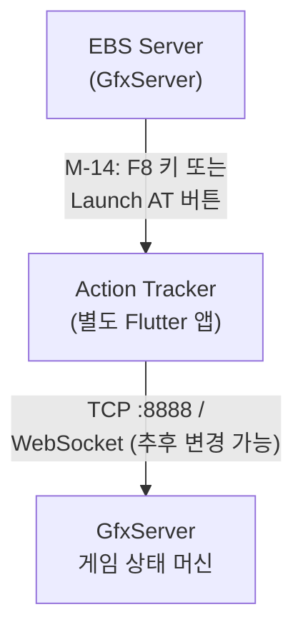

GfxServer의 System 탭에서 "Allow Action Tracker access"를 체크해야 연결이 허용된다.

---

## 2. 요구사항 목록

총 44개 요구사항. P0(필수) 27개, P1(중요) 17개.

> **v2.0 추가분**: 스크린샷 정밀 분석에서 18개 신규 요구사항 발견 (REQ-AT-027~044).

### 2.1 상태 표시 (4개)

| REQ ID | Feature ID | 요구사항 | Priority |
|--------|:----------:|----------|:--------:|
| REQ-AT-001 | AT-001 | 앱 상단에 GfxServer 연결 상태를 실시간 표시한다. Connected(녹색)/Disconnected(빨간색)로 구분하며, 연결 끊김 시 자동 재연결 카운트다운을 표시한다. | P0 |
| REQ-AT-002 | AT-002 | RFID 테이블 연결 상태를 표시한다. 마지막 heartbeat 시간을 함께 표시하며, heartbeat 5초 이상 없으면 경고 상태로 전환한다. | P0 |
| REQ-AT-003 | AT-003 | OBS/방송 스트림 연결 상태를 표시한다. Live/Offline/Buffering 세 가지 상태를 색상으로 구분한다. | P1 |
| REQ-AT-004 | AT-004 | 녹화 진행 여부와 경과 시간을 표시한다. 녹화 중일 때 빨간 점(●)과 카운터를 표시한다. | P1 |

### 2.2 게임 설정 (3개)

| REQ ID | Feature ID | 요구사항 | Priority |
|--------|:----------:|----------|:--------:|
| REQ-AT-005 | AT-005 | HOLDEM / PLO4 / PLO5 / SHORT DECK 중 게임 타입을 선택할 수 있다. 선택 시 SendGameType 메시지를 전송하고 UI가 즉시 반영된다. | P0 |
| REQ-AT-006 | AT-006 | Small Blind / Big Blind / Ante 값을 표시하고 수정할 수 있다. 수정 시 WriteGameInfo 메시지를 전송한다. | P0 |
| REQ-AT-007 | AT-007 | 핸드 번호를 자동으로 추적하고 표시한다. 새 핸드 시작 시 자동 증가하며, 수동 조정이 가능하다. | P0 |

### 2.3 테이블 레이아웃 (4개)

| REQ ID | Feature ID | 요구사항 | Priority |
|--------|:----------:|----------|:--------:|
| REQ-AT-008 | AT-008 | 포커 테이블 형태의 10인 좌석 레이아웃(Seat 1~10)을 화면 중앙에 표시한다. | P0 |
| REQ-AT-009 | AT-009 | 각 좌석의 플레이어 상태를 시각적으로 구분한다. Active(참여)/Folded(폴드)/Empty(빈자리)/SittingOut 네 가지 상태를 색상으로 표시한다. | P0 |
| REQ-AT-010 | AT-010 | 현재 액션 차례인 플레이어 좌석을 강조 표시한다. 깜빡임 또는 하이라이트 테두리로 즉시 식별 가능해야 한다. | P0 |
| REQ-AT-011 | AT-011 | 딜러(D) / 스몰블라인드(SB) / 빅블라인드(BB) / 스트래들(STR) 포지션 뱃지를 각 좌석에 표시한다. | P0 |

### 2.4 액션 버튼 (3개)

| REQ ID | Feature ID | 요구사항 | Priority |
|--------|:----------:|----------|:--------:|
| REQ-AT-012 | AT-012 | FOLD / CHECK / CALL / BET / RAISE / ALL-IN 기본 액션 버튼을 제공한다. 현재 게임 상황에 따라 사용 불가 버튼은 비활성화한다. | P0 |
| REQ-AT-013 | AT-013 | UNDO 버튼으로 마지막 액션을 취소한다. 최대 5단계까지 되돌리기가 가능하다. UNDO 가능 단계 수를 숫자로 표시한다. | P0 |
| REQ-AT-014 | AT-014 | 키보드 단축키로 핵심 액션을 수행한다. F=Fold, C=Check/Call, B=Bet/Raise, A=All-in, U=Undo, N=New Hand, Space=확인/진행. | P1 |

### 2.5 베팅 입력 (4개)

| REQ ID | Feature ID | 요구사항 | Priority |
|--------|:----------:|----------|:--------:|
| REQ-AT-015 | AT-015 | 숫자 키패드 또는 텍스트 필드로 베팅 금액을 직접 입력할 수 있다. Enter 키로 확정하고 SendPlayerBet을 전송한다. | P0 |
| REQ-AT-016 | AT-016 | +/- 버튼으로 Min Chip 단위(smallest_chip 설정값)로 베팅 금액을 증감한다. | P1 |
| REQ-AT-017 | AT-017 | Quick Bet 프리셋 버튼을 제공한다. MIN(최소 레이즈) / 1/2 POT / POT / ALL-IN 네 가지 프리셋이다. | P0 |
| REQ-AT-018 | AT-018 | 현재 베팅 가능한 최소/최대 금액을 실시간으로 표시한다. 서버 게임 상태에서 R-02(Min Raise) 값을 참조한다. | P0 |

### 2.6 보드 관리 (2개)

| REQ ID | Feature ID | 요구사항 | Priority |
|--------|:----------:|----------|:--------:|
| REQ-AT-019 | AT-019 | Community Card 영역을 표시한다. Flop 3장 / Turn 1장 / River 1장 위치를 고정 배치하고, 카드 확정 여부를 표시한다. | P0 |
| REQ-AT-020 | AT-020 | 보드 카드를 RFID 자동 인식 또는 수동 선택으로 업데이트한다. RFID 실패 시 수동 카드 선택 그리드(52장)를 표시한다. | P0 |

### 2.7 특수 액션 (6개)

| REQ ID | Feature ID | 요구사항 | Priority |
|--------|:----------:|----------|:--------:|
| REQ-AT-021 | AT-021 | HIDE GFX 버튼으로 방송 오버레이 전체를 즉시 숨김/표시 토글한다. SendGfxEnable 메시지를 전송하며, 현재 상태(HIDE/SHOW)를 버튼 텍스트로 표시한다. | P0 |
| REQ-AT-022 | AT-022 | TAG HAND 버튼으로 현재 핸드에 태그를 추가한다. 태그 텍스트 입력 후 SendTag 메시지를 전송한다. | P1 |
| REQ-AT-023 | AT-023 | ADJUST STACK 버튼으로 특정 플레이어의 칩 스택을 수동으로 조정한다. 좌석 선택 후 금액 입력 다이얼로그를 표시하고 SendPlayerStack을 전송한다. | P0 |
| REQ-AT-024 | AT-024 | CHOP 버튼으로 팟 분할(Chop) 상황을 처리한다. 분할 대상 좌석과 비율 입력 후 SendChop을 전송한다. | P1 |
| REQ-AT-025 | AT-025 | RUN IT 2x 버튼으로 Run It Twice를 활성화한다. 두 번째 보드 표시 영역을 추가하고 SendRunItTimes를 전송한다. | P1 |
| REQ-AT-026 | AT-026 | MISS DEAL 버튼으로 미스딜을 선언한다. 확인 다이얼로그 후 SendMissDeal을 전송하고 핸드를 무효화한다. | P1 |

### 2.8 게임 설정 확장 (9개) — v2.0 스크린샷 발견

Settings/Configuration 화면에서 발견된 게임 파라미터 설정 기능.

| REQ ID | Feature ID | 요구사항 | Priority |
|--------|:----------:|----------|:--------:|
| REQ-AT-027 | AT-027 | Settings 컴팩트 뷰를 제공한다. 모든 게임 파라미터(블라인드 구조, 특수 규칙, 게임 타입)를 한 화면에서 일괄 설정할 수 있다. | P1 |
| REQ-AT-028 | AT-028 | AUTO 모드를 제공한다. 활성화 시 일부 반복 액션(블라인드 포스팅 등)이 자동 진행된다. | P1 |
| REQ-AT-029 | AT-029 | 좌석별 STRADDLE 설정을 지원한다. 각 좌석에 STRADDLE1~STRADDLE10까지 개별 지정이 가능하며, WriteGameInfo의 _third, _pl_third 필드를 사용한다. | P0 |
| REQ-AT-030 | AT-030 | 3rd Blind(3B) 설정을 지원한다. 일반적인 SB/BB 외에 세 번째 블라인드를 설정할 수 있다. | P1 |
| REQ-AT-031 | AT-031 | Button Blind(BTN BLIND) 설정을 지원한다. 딜러 위치에서 블라인드를 포스팅하는 특수 규칙을 활성화한다. WriteGameInfo의 _button_blind 필드를 사용한다. | P1 |
| REQ-AT-032 | AT-032 | CAP(Maximum Bet Cap) 금액을 설정한다. 베팅 상한을 지정하여 CAP 게임 운영을 가능하게 한다. WriteGameInfo의 _cap 필드를 사용한다. | P0 |
| REQ-AT-033 | AT-033 | 7 DEUCE(7-2) 사이드 게임 금액을 설정한다. 7-2 핸드로 팟을 이기면 보너스를 받는 사이드 베팅 규칙이다. WriteGameInfo의 _seven_deuce 필드를 사용한다. | P1 |
| REQ-AT-034 | AT-034 | BOMB POT 금액을 설정한다. 모든 플레이어가 동일 금액을 강제 베팅하고 프리플롭 없이 플랍부터 시작하는 특수 핸드이다. WriteGameInfo의 _bomb_pot 필드를 사용한다. | P0 |
| REQ-AT-035 | AT-035 | HIT GAME 보너스를 설정한다. 특정 핸드 조합 달성 시 보너스를 지급하는 프로모션 규칙이다. | P1 |

### 2.9 통계 및 방송 제어 (5개) — v2.0 스크린샷 발견

Statistics/Scoreboard 화면에서 발견된 플레이어 통계 및 방송 출력 제어 기능.

| REQ ID | Feature ID | 요구사항 | Priority |
|--------|:----------:|----------|:--------:|
| REQ-AT-036 | AT-036 | Statistics/Scoreboard 뷰를 제공한다. SEAT별 STACK, VPIP%, PFR%, AGRFq%, WTSD%, WIN 컬럼을 테이블 형태로 표시한다. SendPanelValue로 표시 모드를 전환한다. | P0 |
| REQ-AT-037 | AT-037 | STRIP STACK / STRIP WIN 하단 스트립 표시를 제어한다. SendShowStrip(mode 0/1)과 SendCumwinStrip(mode 2)으로 스트립 모드를 전환한다. | P1 |
| REQ-AT-038 | AT-038 | TICKER 스크롤링 텍스트를 입력하고 표시한다. SendTicker로 텍스트를 전송하고, SendTickerLoop로 반복 재생을 제어한다. | P1 |
| REQ-AT-039 | AT-039 | LIVE 토글로 라이브/지연 방송 모드를 전환한다. 지연 방송 모드에서는 OnDelayedGameInfoReceived와 OnDelayedPlayerInfoReceived를 사용한다. | P0 |
| REQ-AT-040 | AT-040 | FIELD(참가자 수)를 관리한다. REMAIN(잔여)/TOTAL(전체) 값을 입력하고, SendFieldVisibility로 방송 표시를 토글한다. SendFieldValue로 값을 전송한다. | P1 |

### 2.10 RFID 덱 관리 (2개) — v2.0 스크린샷 발견

RFID Card Registration 화면에서 발견된 덱 등록/검증 기능.

| REQ ID | Feature ID | 요구사항 | Priority |
|--------|:----------:|----------|:--------:|
| REQ-AT-041 | AT-041 | RFID 덱 등록 모드를 제공한다. 52장 카드를 순차적으로 안테나에 올려 UID를 매핑한다. 풀스크린 모달로 현재 등록할 카드를 안내하고, CANCEL로 취소할 수 있다. SendRegisterDeck/SendRegisterDeckCancel을 사용한다. | P0 |
| REQ-AT-044 | AT-044 | RFID 덱 검증 모드를 제공한다. 등록된 52장 카드의 UID 매핑이 정확한지 확인한다. SendVerifyDeck/SendVerifyExit/SendVerifyStart를 사용한다. | P0 |

### 2.11 동적 UI (2개) — v2.0 스크린샷 발견

스크린샷 비교 분석에서 발견된 동적 UI 동작.

| REQ ID | Feature ID | 요구사항 | Priority |
|--------|:----------:|----------|:--------:|
| REQ-AT-042 | AT-042 | 액션 버튼을 게임 상태에 따라 동적으로 전환한다. 베팅 없는 상태에서는 CHECK/BET를 표시하고, 베팅이 있으면 CALL/RAISE-TO로 전환한다. 버튼 라벨, 단축키 동작 모두 상태에 연동된다. | P0 |
| REQ-AT-043 | AT-043 | 좌석별 카드 스캔 상태 아이콘 행을 표시한다. 각 좌석의 RFID 카드 인식 상태를 아이콘으로 실시간 표시한다. 카드 인식 성공(카드 아이콘)/미인식(빈 아이콘)/에러(빨간 아이콘)를 구분한다. | P0 |

---

## 3. 기능 범위

### 3.1 이번 단계 v1.0 (44개 전체)

Flutter Desktop 앱으로 구현하는 기능 범위.

- REQ-AT-001 ~ REQ-AT-044 전체 44개 요구사항
- 키보드 입력 (P0 + P1 단축키 포함)
- 마우스 입력 (모든 버튼/입력 필드)
- TCP 또는 WebSocket 서버 연결
- 로컬 상태 관리 (5단계 UNDO 히스토리)

**이번 단계 제외**:
- 터치 입력 (추후 v2.0)
- 서버 구현 (Mock Server 또는 실제 서버 개발 시 연동)
- 실제 RFID 하드웨어 연동 (서버 경유)
- OBS 직접 연동 (서버 경유 상태만 표시)

### 3.2 추후 개발 v2.0+

| 항목 | 설명 |
|------|------|
| 터치 UI | 태블릿 최적화 레이아웃, 버튼 크기 확대 |
| 다중 테이블 | 테이블 탭 전환 (토너먼트 파이널 테이블) |
| 음성 입력 | 베팅 금액 음성 인식 |
| 통계 오버레이 | AT 화면에서 실시간 VPIP/PFR 열람 |
| 녹화 제어 | OBS 직접 제어 (Start/Stop Recording) |

---

## 4. 기술 아키텍처

### 4.1 Tech Stack

| 레이어 | 기술 | 선택 이유 |
|--------|------|----------|
| UI Framework | Flutter Desktop | 크로스 플랫폼, 고성능 렌더링, Dart 생태계 |
| 상태 관리 | Riverpod 또는 Bloc | 단방향 데이터 흐름, 테스트 용이성 |
| 네트워크 | dart:io Socket 또는 web_socket_channel | 저지연 실시간 통신 |
| 로컬 저장 | SharedPreferences | 서버 IP, 포트, 마지막 설정 저장 |
| 직렬화 | Protobuf 또는 JSON | 서버 프로토콜 메시지 직렬화 |

**대상 플랫폼**: Windows 10/11 Desktop (Primary), macOS (Secondary)

**최소 해상도**: 1280×800. 권장: 1920×1080 이상.

### 4.2 통신 프로토콜

원본 PokerGFX ActionTracker는 TCP :8888을 사용한다. EBS 구현에서는 WebSocket으로 전환할 수 있다(서버 개발 시 결정).

**메시지 구조 (Request 방향: AT → Server)**:

```
[Header]   Type: string (예: "PlayerBetRequest")
[Payload]  Fields: Protocol Buffer 직렬화 또는 JSON
```

**메시지 구조 (Response 방향: Server → AT)**:

```
[Header]   Type: string (예: "GameInfoResponse")
[Payload]  Fields: 게임 상태 전체 또는 델타
```

**연결 수명주기**:

```
AT 시작
  |
  +--> ConnectToServer()
  |      서버 IP:Port 지정
  |      IsConnected = true
  |
  +--> SendAuth(pwd)
  |      OnAuthReceived 응답 대기
  |
  +--> StartHeartbeat()
         SendHeartBeat 주기 전송 (3초마다)
         OnHeartBeatReceived 응답 확인
         5회 무응답 시 연결 끊김 감지
```

**68개 메시지 카테고리별 요약**:

| 카테고리 | 메시지 수 | AT에서 주요 사용 |
|----------|:---------:|-----------------|
| Connection/Session | 5 | ConnectToServer, SendAuth, SendHeartBeat |
| Player Management | 10 | SendPlayerAdd, SendDeletePlayer, SendPlayerSitOut |
| Betting Actions | 5 | SendPlayerBet, SendPlayerFold, SendPlayerCheckCall |
| Board/Cards | 7 | SendCardEnter, SendForceCardScan, SendRunItTimes |
| Pot/Chips | 3 | SendPlayerStack, SendChop |
| Hand Control | 7 | SendStartHand, SendResetHand, SendNextHand, SendMissDeal |
| Display/GFX | 12 | SendGfxEnable, SendTag, SendClearTag |
| Game Configuration | 6 | SendGameType, WriteGameInfo, SendGameVariant |
| Tournament | 4 | (추후 토너먼트 기능) |
| System/Hardware | 8 | SendRegisterDeck, SendVerifyDeck |
| Server Responses | 15 | OnGameInfoReceived, OnPlayerInfoReceived, OnAuthReceived |

상세 스펙: `docs/01_PokerGFX_Analysis/04_Protocol_Spec/actiontracker-messages.md`

### 4.3 게임 상태 머신

AT는 서버 게임 상태를 수신하여 UI를 자동 갱신한다.

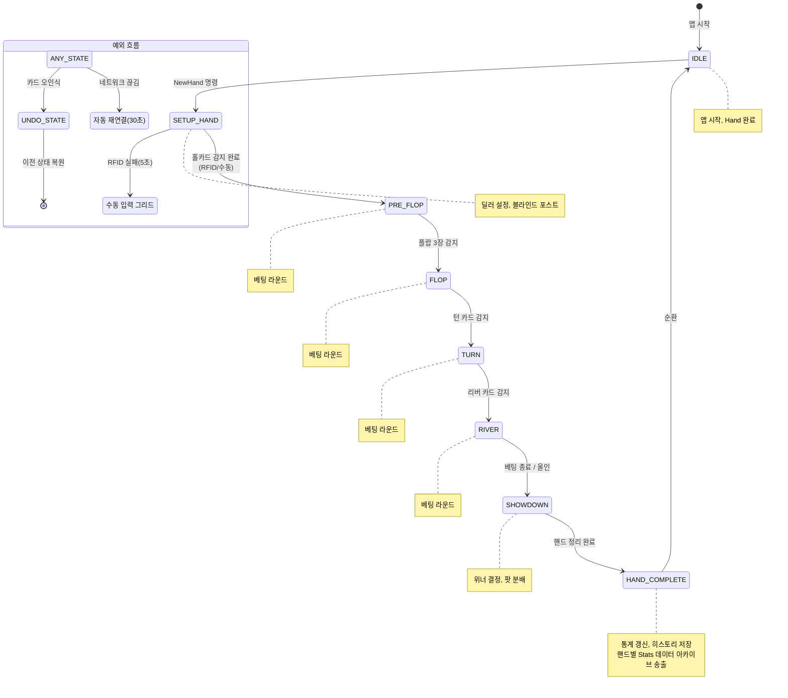

**게임 분류별 상태 머신 차이**:

| 게임 계열 | 상태 머신 변형 |
|----------|---------------|
| Community (Hold'em/Omaha) | 위 표준 흐름 |
| Draw (Five Card Draw 등) | PRE_FLOP 대신 DRAW_ROUND 반복 (교환 횟수만큼) |
| Stud (7-Card Stud 등) | THIRD_STREET → FOURTH → FIFTH → SIXTH → SEVENTH |
| Run It Twice 활성 | SHOWDOWN 전 RUN_IT_TWICE 상태 추가 |

**AT의 상태 머신 구현 방식**: 서버 OnGameInfoReceived 응답에서 현재 game_state를 수신하고, AT는 해당 상태에 맞는 UI를 렌더링한다. AT 자체는 상태를 전환하지 않고, 서버 상태를 반영한다.

### 4.4 앱 구조

**화면 구조**:

```
ActionTrackerApp (Flutter MaterialApp)
  |
  +-- ConnectScreen        서버 IP/Port 입력, 연결 버튼
  |
  +-- MainScreen           연결 성공 후 메인 화면
       |
       +-- StatusBar        상단: 연결 상태, 스트림, 녹화
       +-- GameConfigBar    게임 타입, 블라인드, 핸드 번호
       +-- TableLayout      10인 좌석 그리드 (중앙)
       +-- BoardArea        Community Cards 표시
       +-- ActionPanel      액션 버튼 + 베팅 입력
       +-- SpecialActions   HIDE GFX, TAG HAND 등 하단 바
```

**상태 관리 흐름**:

```
서버 WebSocket/TCP
  |
  | OnGameInfoReceived
  | OnPlayerInfoReceived
  v
GameStateNotifier (Riverpod Provider)
  |
  +-- 게임 상태 (상태 머신, 스트리트)
  +-- 플레이어 상태 (10명 배열)
  +-- 보드 카드 (최대 5장)
  +-- 베팅 상태 (팟, 현재 베팅, 최소/최대)
  |
  v
UI Widgets (watch 구독)
  -- 상태 변경 시 해당 위젯만 재렌더링
```

---

## 5. UI 설계 — 3단계 분석 기반

이 섹션은 [PRD-0004](EBS-UI-Design-v3.prd.md)의 3단계 내러티브를 따른다.

| 단계 | 설명 |
|:----:|------|
| **1. 원본 관찰** | PokerGFX Action Tracker 실제 스크린샷을 관찰하여 기존 시스템의 동작을 파악한다 |
| **2. 체계적 분석** | 각 UI 요소에 ID를 부여하고 기능, 역할, 우선순위를 정리한다 |
| **3. 설계 반영** | 분석 결과를 바탕으로 EBS Action Tracker의 신규 UI를 설계한다 |

**분석 대상**: PokerGFX Action Tracker (vpt_remote, © 2011-2026 videopokertable.net). 6개 화면, 68개 프로토콜 메시지로 구성된 포커 방송 운영 콘솔.

---

### 5.1 메인 액션 화면 (Main Action View)

본방송 중 운영자가 85% 시간을 보내는 핵심 화면. 게임 상태에 따라 UI가 동적으로 변한다.

#### 5.1.1 원본 관찰


*그림 1: Seat 1(노란색)이 action-on. FOLD/CALL/RAISE-TO/ALL IN 버튼 표시.*


*그림 2: Seat 2가 action-on. 보드에 7♥ 6♠ 4♥. CHECK/BET 버튼으로 동적 전환.*

두 스크린샷의 핵심 차이: **게임 상태에 따라 버튼 라벨이 자동 전환**된다. 베팅이 없으면 CHECK/BET, 베팅이 있으면 CALL/RAISE-TO.

#### 5.1.2 체계적 분석

| ID | 요소 | 기능 | 역할 | Priority |
|----|------|------|------|:--------:|
| AT-M01 | 상단 툴바 | 연결 아이콘, WiFi(녹색=연결), HAND 카운터, 카메라, GFX, REGISTER, 리사이즈, X | 시스템 상태 일괄 모니터링 | P0 |
| AT-M02 | 카드 아이콘 행 | 좌석별 카드 스캔 상태 (카드 이미지/빈 아이콘) | RFID 인식 결과 즉시 확인 | P0 |
| AT-M03 | 좌석 라벨 행 | SEAT 1-10, 색상 코딩 (노란=action-on, 빨강=active, 회색=empty) | 현재 게임 참여자 한눈에 파악 | P0 |
| AT-M04 | MISS DEAL 버튼 | 미스딜 선언 (좌측 고정, 큰 빨간 버튼) | 긴급 상황 즉시 대응 | P1 |
| AT-M05 | 카드/텍스트 표시 영역 | 보드 카드 이미지 또는 플레이어 이름/ID 입력 | 현재 상태 정보 제공 | P0 |
| AT-M06 | 상태 바 | "(N) SEAT N - STACK NNN,NNN" | 현재 액션 대상+스택 확인 | P0 |
| AT-M07 | HIDE GFX 버튼 | 방송 오버레이 즉시 숨김/표시 (우측 고정, 은색) | 긴급 오버레이 제어 | P0 |
| AT-M08 | TAG 별 아이콘 | 핸드 태깅 (우측 상단, 별 모양) | 하이라이트 핸드 마킹 | P1 |
| AT-M09 | ← UNDO 화살표 | 마지막 액션 취소 (좌측 하단, 검정) | 실수 즉시 복구 | P0 |
| AT-M10 | FOLD 버튼 | 폴드 (진녹색) | 핵심 액션 | P0 |
| AT-M11 | CHECK/CALL 버튼 | 동적: 베팅 없으면 CHECK, 있으면 CALL (녹색) | 핵심 액션 (상태 연동) | P0 |
| AT-M12 | BET/RAISE-TO 버튼 | 동적: 베팅 없으면 BET, 있으면 RAISE-TO (밝은색) | 핵심 액션 (상태 연동) | P0 |
| AT-M13 | ALL IN 버튼 | 올인 (진회색) | 핵심 액션 | P0 |
| AT-M14 | 녹화 상태 아이콘 | 주황색 원 (녹화 중 표시) | 녹화 모니터링 | P1 |

**핵심 발견 — 동적 버튼 전환 패턴**:

```
베팅 없는 상태 (그림 2):     베팅 있는 상태 (그림 1):
  [←] [FOLD] [CHECK] [BET] [ALL IN]     [←] [FOLD] [CALL] [RAISE-TO] [ALL IN]
```

서버 OnGameInfoReceived의 biggest_bet_amt 필드가 0이면 CHECK/BET, >0이면 CALL/RAISE-TO.

#### 5.1.3 EBS 설계 반영

> 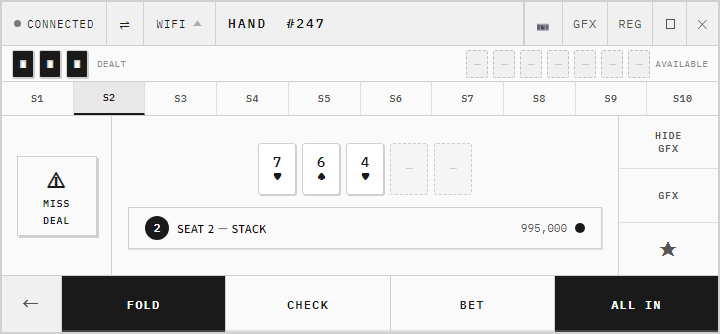
> *AT 메인 화면 — 툴바 + 카드 아이콘 + 좌석 행 + 보드/액션 영역*

**EBS 설계 결정**:
- 원본의 버튼 4개(FOLD/CALL or CHECK/RAISE-TO or BET/ALL IN)를 유지. 불필요한 비활성 버튼 없이 현재 가능한 액션만 표시.
- UNDO는 ← 화살표 아이콘으로 왼쪽 고정 (원본 동일).
- MISS DEAL과 HIDE GFX는 좌/우 측면에 항상 노출 (원본 동일).

---

### 5.2 설정/구성 화면 (Settings/Configuration)

본방송 전 게임 파라미터를 일괄 설정하는 컴팩트 뷰.

#### 5.2.1 원본 관찰


*그림 3: Settings/Configuration 컴팩트 뷰. 모든 게임 파라미터를 한 화면에서 설정.*

메인 액션 화면과 동일한 창에서 모드 전환. 좌석 행(SEAT 1-10) 아래에 STRADDLE 라벨이 추가되고, 하반부에 게임 규칙 설정 버튼들이 배치된다.

#### 5.2.2 체계적 분석

| ID | 요소 | 기능 | 역할 | Priority |
|----|------|------|------|:--------:|
| AT-S01 | SEAT 1-10 + STRADDLE 행 | 좌석별 STRADDLE 지정 (STRADDLE1~10 라벨) | 각 좌석의 스트래들 순서 설정 | P0 |
| AT-S02 | 카드 상태 아이콘 | 좌석별 빨간/주황 원 (카드 스캔 상태) | 딜링 전 카드 인식 확인 | P0 |
| AT-S03 | CAP 버튼 | 베팅 캡 금액 설정 | CAP 게임 활성화 | P0 |
| AT-S04 | ANTE 버튼 | 앤티 금액 설정 | 앤티 규칙 적용 | P0 |
| AT-S05 | BTN BLIND 버튼 | 버튼 블라인드 금액 설정 | 버튼 블라인드 규칙 적용 | P1 |
| AT-S06 | DEALER 버튼 | 딜러 위치 지정 | 포지션 설정 | P0 |
| AT-S07 | SB / BB 버튼 | SB/BB 좌석 지정 | 블라인드 위치 설정 | P0 |
| AT-S08 | 3B 버튼 | 3rd Blind 좌석/금액 설정 | 3블라인드 게임 지원 | P1 |
| AT-S09 | MIN CHIP 버튼 | 최소 칩 단위 설정 | +/- 조정 단위 결정 | P0 |
| AT-S10 | 7 DEUCE 버튼 | 7-2 사이드 게임 보너스 금액 | 특수 사이드 베팅 | P1 |
| AT-S11 | BOMB POT 버튼 | 봄팟 강제 베팅 금액 | 특수 핸드 규칙 | P0 |
| AT-S12 | # BOARDS 버튼 | 보드 수 설정 (1~N) | Run It Twice/Thrice 지원 | P1 |
| AT-S13 | HIT GAME 버튼 | 히트 게임 보너스 설정 | 프로모션 규칙 | P1 |
| AT-S14 | HOLDEM 선택기 | 게임 타입 순환 (HOLDEM/PLO4/PLO5/SHORT DECK) | 게임 변경 | P0 |
| AT-S15 | SINGLE BOARD / MULTI BOARD | 보드 모드 전환 | Run It Twice 표시 모드 | P1 |
| AT-S16 | SETTINGS 버튼 | 상세 설정 진입 | 추가 설정 접근 | P1 |
| AT-S17 | AUTO 버튼 | 자동 모드 활성화/비활성화 | 반복 액션 자동화 | P1 |

#### 5.2.3 EBS 설계 반영

> 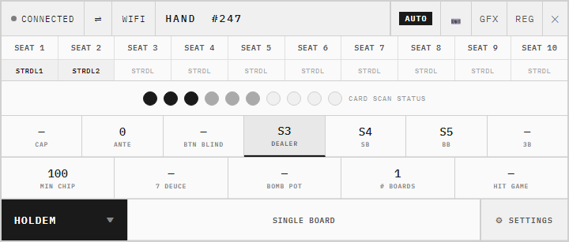
> *Settings/Configuration 컴팩트 뷰 — STRADDLE 행 + 게임 설정 버튼*

**EBS 설계 결정**:
- 원본의 컴팩트 뷰를 유지. 모든 WriteGameInfo 22개 필드를 개별 버튼으로 설정.
- 버튼 클릭 시 숫자 키패드 팝업으로 금액 입력 (원본 동일 패턴).
- STRADDLE 행은 좌석마다 독립 설정 (원본 확인됨).

---

### 5.3 수동 카드 선택 (Manual Card Selection)

RFID 인식 실패 시 또는 수동 모드에서 52장 카드를 직접 선택하는 그리드.

#### 5.3.1 원본 관찰


*그림 4: 52장 카드 그리드. 4행(♠♥♦♣) × 13열(A~2). 선택 카드는 상단에 표시.*

어두운 배경에 카드만 밝게 표시. 상단에 선택된 카드(7♥, 6♠)가 실제 카드 이미지로 표시되고, OK 버튼으로 확정. ◀ 뒤로가기로 마지막 선택 취소.

#### 5.3.2 체계적 분석

| ID | 요소 | 기능 | 역할 | Priority |
|----|------|------|------|:--------:|
| AT-C01 | ◀ 뒤로가기 | 마지막 선택 카드 취소 | 선택 실수 복구 | P0 |
| AT-C02 | 선택 카드 표시 영역 | 현재까지 선택된 카드를 이미지로 표시 | 입력 확인 | P0 |
| AT-C03 | OK 버튼 | 카드 선택 확정, SendCardEnter 전송 | 선택 완료 | P0 |
| AT-C04 | ♠ 스페이드 행 (A~2) | 13장 스페이드 카드 | 카드 선택 | P0 |
| AT-C05 | ♥ 하트 행 (A~2) | 13장 하트 카드 | 카드 선택 | P0 |
| AT-C06 | ♦ 다이아 행 (A~2) | 13장 다이아 카드 | 카드 선택 | P0 |
| AT-C07 | ♣ 클럽 행 (A~2) | 13장 클럽 카드 | 카드 선택 | P0 |

**핵심 발견**: 이미 사용된 카드(보드에 표시된 카드, 다른 플레이어 홀카드)는 그리드에서 비활성화되어 중복 선택을 방지한다.

#### 5.3.3 EBS 설계 반영

> 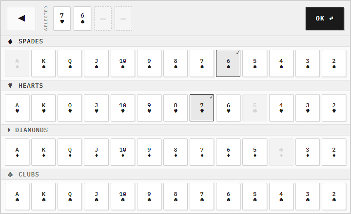
> *52장 카드 그리드 — 4행(♠♥♦♣) x 13열(A~2), 사용 카드 비활성*

**EBS 설계 결정**:
- 풀스크린 모달 (원본 동일). 어두운 배경으로 집중도 유지.
- 카드 이미지는 실제 카드 그래픽 사용 (텍스트 아닌 이미지).
- 사용된 카드는 반투명 + 취소선으로 비활성 표시.
- SendCardEnter의 _num_pad_tag에 따라 Player/Board/Edit 분기.

---

### 5.4 통계/스코어보드 (Statistics/Scoreboard)

플레이어 통계와 방송 출력을 제어하는 관리 화면.

#### 5.4.1 원본 관찰


*그림 5: Statistics 뷰. SEAT별 STACK/VPIP%/PFR%/AGRFq%/WTSD%/WIN 표시. 우측에 방송 제어 버튼.*

10인 좌석의 통계 테이블과 우측의 방송 출력 제어 버튼이 분리 배치된다. 저작권 표시가 "© 2011-24 videopokertable.net"으로 본 프로그램의 원본 제작사 정보를 보여준다.

#### 5.4.2 체계적 분석

| ID | 요소 | 기능 | 역할 | Priority |
|----|------|------|------|:--------:|
| AT-T01 | SEAT 컬럼 | 좌석 번호 (SEAT 1~10) | 플레이어 식별 | P0 |
| AT-T02 | STACK 컬럼 | 현재 칩 스택 (노란색 하이라이트) | 자산 현황 | P0 |
| AT-T03 | VPIP% 컬럼 | Voluntarily Put $ In Pot (자발적 팟 참여율) | 공격성 지표 | P1 |
| AT-T04 | PFR% 컬럼 | Pre-Flop Raise (프리플롭 레이즈 비율) | 공격성 지표 | P1 |
| AT-T05 | AGRFq% 컬럼 | Aggression Frequency (공격 빈도) | 플레이 스타일 지표 | P1 |
| AT-T06 | WTSD% 컬럼 | Went To ShowDown (쇼다운 진행 비율) | 핸드 완주율 | P1 |
| AT-T07 | WIN 컬럼 | 누적 수익/손실 (양수=수익, 음수=손실) | 성적 추적 | P0 |
| AT-T08 | LIVE 버튼 | 라이브/지연 방송 모드 전환 | 방송 모드 제어 | P0 |
| AT-T09 | GFX 버튼 | 그래픽 활성/비활성 (금색=활성) | 방송 출력 제어 | P0 |
| AT-T10 | HAND N 표시 | 현재 핸드 번호 | 진행 추적 | P0 |
| AT-T11 | FIELD 버튼 | 참가자 수 표시/숨김 토글 | 방송 정보 제어 | P1 |
| AT-T12 | REMAIN / TOTAL | 잔여/전체 참가자 수 입력 | 토너먼트 정보 | P1 |
| AT-T13 | STRIP STACK 버튼 | 하단 스트립에 칩 스택 표시 | 방송 정보 레이어 | P1 |
| AT-T14 | STRIP WIN 버튼 | 하단 스트립에 누적 수익 표시 | 방송 정보 레이어 | P1 |
| AT-T15 | TICKER 버튼 | 하단 티커 텍스트 입력 및 재생 | 방송 자막 | P1 |

#### 5.4.3 EBS 설계 반영

> 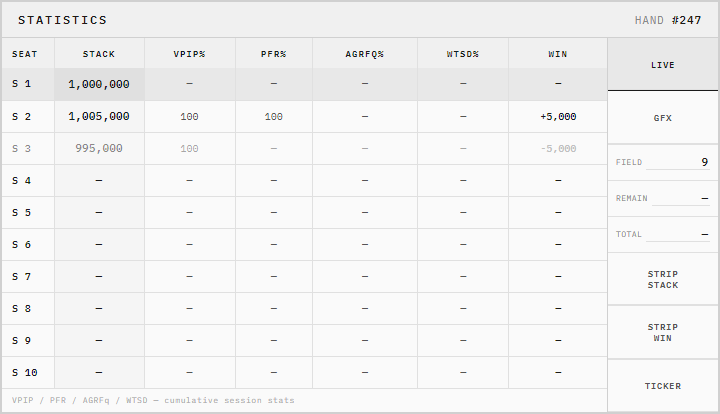
> *Statistics/Scoreboard — 7컬럼 테이블 + 우측 방송 제어 사이드 패널*

**EBS 설계 결정**:
- 원본의 테이블+사이드 버튼 레이아웃을 유지.
- VPIP/PFR/AGRFq/WTSD는 서버 OnGameInfoReceived에서 계산된 값을 표시 (AT는 표시만).
- WIN 컬럼 음수는 빨간색 텍스트로 구분.
- SendPanelValue(panel_type)로 어떤 통계를 방송 오버레이에 표시할지 제어.
- SendVpipReset으로 통계 초기화 가능.

**Stats 데이터 아카이브 출력 시점**:
- 통계 데이터는 방송 중 각 핸드가 종료되는 시점(HAND_COMPLETE)에 해당 핸드의 데이터가 개별 송출된다.
- 즉, 실시간 누적이 아닌 **핸드 단위 아카이브** 방식이다. 각 핸드 종료 시 해당 핸드의 액션/결과 데이터가 서버로 전송되어 통계에 반영된다.

---

### 5.5 RFID 카드 등록 (Card Registration)

52장 카드의 RFID UID를 순차적으로 매핑하는 등록 모드.

#### 5.5.1 원본 관찰


*그림 6: RFID 등록 모달. "PLACE THIS CARD ON ANY ANTENNA" 메시지와 등록 대상 카드(A♠) 표시.*

풀스크린 검정 배경의 모달 화면. 운영자에게 현재 등록해야 할 카드를 안내하고, 해당 카드를 RFID 안테나에 올리면 자동으로 UID가 매핑된다. CANCEL 버튼으로 등록 프로세스를 취소할 수 있다.

#### 5.5.2 체계적 분석

| ID | 요소 | 기능 | 역할 | Priority |
|----|------|------|------|:--------:|
| AT-R01 | 안내 메시지 | "PLACE THIS CARD ON ANY ANTENNA" (흰색, 테두리 박스) | 운영자에게 현재 동작 안내 | P0 |
| AT-R02 | 카드 이미지 | 현재 등록할 카드 표시 (대형 카드 이미지) | 어떤 카드를 올려야 하는지 시각적 확인 | P0 |
| AT-R03 | CANCEL 버튼 | 등록 취소 (대형 빨간 버튼) | SendRegisterDeckCancel 전송 | P0 |
| AT-R04 | 진행 상태 | 52장 중 현재 진행률 (추정, 원본 미확인) | 등록 진행도 파악 | P1 |

**등록 프로세스 흐름**:

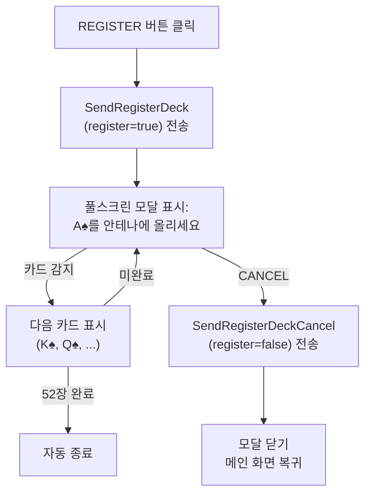

#### 5.5.3 EBS 설계 반영

> 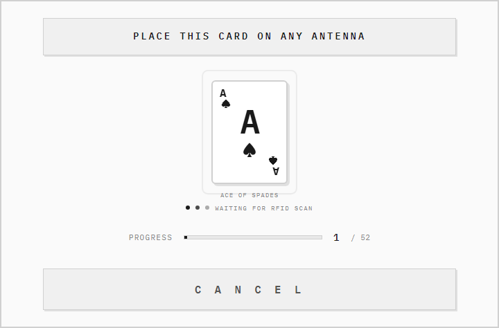
> *RFID 등록 모달 — 풀스크린, 카드 안내 + Progress 1/52 + CANCEL*

**EBS 설계 결정**:
- 풀스크린 모달 유지 (원본 동일). 다른 조작 차단.
- 진행 카운터(N/52) 추가 (원본에서는 확인 안 됐으나 UX 개선).
- CANCEL 버튼은 하단 중앙에 대형 배치 (긴급 취소 용이).
- 카드 순서: A♠→K♠→...→2♠→A♥→...→2♣ (표준 덱 순서).
- 이미 등록된 카드를 다시 감지하면 "이미 등록됨" 경고 표시.

---

### 5.6 전체 레이아웃

> 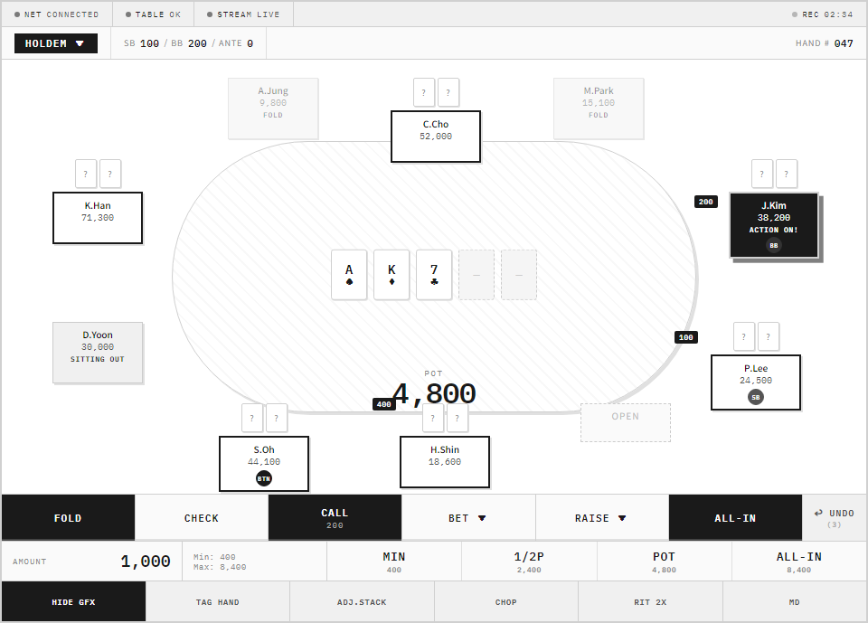
> *AT 전체 레이아웃 — 상태바 + 게임설정 + 10좌석 타원형 + 보드 + 액션/베팅/특수 패널*

**좌석 배치 원칙**: 포커 테이블 형태 (타원형). Seat 1은 화면 기준 하단 우측부터 시계 반대 방향으로 배치. Dealer 버튼은 해당 좌석 뱃지로 표시.

**각 좌석 셀 구성**:

> 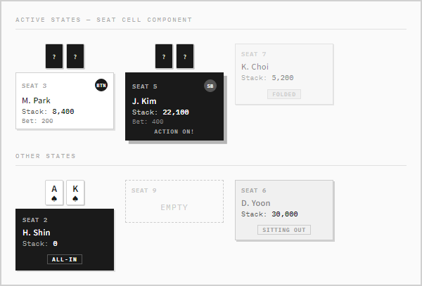
> *개별 좌석 셀 — 번호 + 포지션 뱃지 + 이름 + 스택 + 베팅 + 상태*

**상태별 셀 색상**:

| 상태 | 배경색 | 테두리 |
|------|--------|--------|
| Active | 기본(어두운 녹색) | 없음 |
| Action-on | 밝은 노란색 또는 흰색 | 굵은 흰색 (깜빡임) |
| Folded | 회색 (반투명) | 없음 |
| Empty | 매우 어두운 회색 | 점선 |
| SittingOut | 주황색 톤 | 없음 |
| WRONG CARD | 빨간색 | 굵은 빨간색 |

### 5.7 키보드 입력 매핑

수 시간 연속 운영에 최적화된 키보드 단축키 설계. 왼손 포지션 유지 원칙 (WASD 영역).

**핵심 액션 단축키**:

| 키 | 액션 | 설명 |
|----|------|------|
| `F` | FOLD | 현재 action-on 플레이어 폴드 |
| `C` | CHECK / CALL | 베팅 없으면 체크, 있으면 콜 |
| `B` | BET | 베팅 금액 입력 모드 진입 |
| `R` | RAISE | 레이즈 금액 입력 모드 진입 |
| `A` | ALL-IN | 올인 (스택 전액 베팅) |
| `U` | UNDO | 마지막 액션 취소 (최대 5단계) |
| `N` | NEW HAND | 새 핸드 시작 (확인 다이얼로그) |
| `Space` | 확인/진행 | 금액 입력 확정, 다이얼로그 확인 |
| `Esc` | 취소 | 입력 모드 취소, 다이얼로그 닫기 |
| `H` | HIDE GFX | 방송 오버레이 숨김/표시 토글 |

**베팅 금액 입력 단축키** (금액 입력 모드 진입 후):

| 키 | 동작 |
|----|------|
| `1` | 1/3 POT 프리셋 |
| `2` | 1/2 POT 프리셋 |
| `3` | 2/3 POT 프리셋 |
| `4` | POT 프리셋 |
| `5` | ALL-IN 프리셋 |
| `M` | MIN 레이즈 프리셋 |
| `+` | Min Chip 단위 증가 |
| `-` | Min Chip 단위 감소 |
| `0~9` | 직접 금액 입력 |
| `Enter` | 베팅 확정 |
| `Esc` | 입력 취소 |

**좌석 선택 단축키** (ADJUST STACK 등 좌석 선택이 필요한 액션):

| 키 | 동작 |
|----|------|
| `1~9`, `0` | 해당 번호 좌석 선택 (0=Seat 10) |
| `Tab` | 다음 좌석으로 이동 |
| `Enter` | 현재 선택 좌석 확정 |

**단축키 설계 원칙**:
- 핵심 액션(F, C, B, A)은 왼손 단일 타격으로 완료
- 베팅 금액 입력은 오른손 숫자 키패드 사용
- 실수 방지: NEW HAND(`N`)는 확인 다이얼로그 필수
- 긴급 액션: HIDE GFX(`H`)는 즉시 실행 (확인 없음)

### 5.8 화면별 상세

**5.8.1 상태 바 (StatusBar)**

```
+----------------------------------------------------------+
| (●) NET: Connected  |  TABLE: OK 00:02  |  STREAM: Live |
| 서버 IP: 192.168.1.100:8888            |  REC: ●02:34  |
+----------------------------------------------------------+
```

- NET 상태: Connected(녹색)/Reconnecting.../Disconnected(빨간색)
- TABLE 상태: OK + 마지막 heartbeat 경과 시간 / Offline(주황색)
- STREAM 상태: Live(녹색)/Offline(회색)/Buffering(노란색 점멸)
- REC: 녹화 중 빨간 점 + 경과 시간 / 녹화 없으면 숨김

**5.8.2 게임 설정 바 (GameConfigBar)**

```
+----------------------------------------------------------+
| Game: [ HOLDEM v ]   SB: [100] / BB: [200] / Ante: [0]  |
|                                          Hand #: [ 047 ] |
+----------------------------------------------------------+
```

- 게임 타입 드롭다운: HOLDEM / PLO4 / PLO5 / SHORT DECK
- Blind 값: 클릭하면 인라인 편집 가능
- Hand 번호: 클릭하면 수동 조정 가능

**5.8.3 액션 패널 (ActionPanel)**

현재 게임 상황에 따라 버튼 활성/비활성 자동 전환:

```
PRE_FLOP, 체크 가능:
  [ FOLD ]  [CHECK]  [  -  ]  [  BET  ]  [  -  ]  [ALL-IN]

PRE_FLOP, 콜 필요:
  [ FOLD ]  [  -  ]  [ CALL ]  [RAISE]  [  -  ]  [ALL-IN]

올인 상황 (베팅 완료):
  [ FOLD ]  [  -  ]  [ CALL ]  [ - ]  [  -  ]  [ALL-IN]
```

- 비활성 버튼: 회색 표시, 클릭 무반응
- ALL-IN 버튼: 항상 활성 (스택이 있으면)
- UNDO: 우측 하단 고정, UNDO 가능 단계 수 괄호 표시

**5.8.4 베팅 입력 (BetInput)**

```
+----------------------------------------------------------+
| Amount: [________________________]  [MIN] [1/2P][POT][AI]|
|         Min Raise: 400    All-in: 8,400                  |
|                                          [  UNDO (3)  ]  |
+----------------------------------------------------------+
```

- 텍스트 필드: 포커스 시 숫자 키패드 직접 입력
- Quick Bet: MIN / 1/2 POT / POT / ALL-IN 클릭 시 즉시 해당 금액 입력
- Min/Max 표시: 서버 상태에서 자동 계산
- +/- 버튼: 명시적 버튼 or `+`/`-` 키

**5.8.5 특수 액션 바 (SpecialActions)**

```
+----------------------------------------------------------+
| [HIDE GFX] [TAG HAND] [ADJ.STACK] [CHOP] [RIT 2x] [MD] |
+----------------------------------------------------------+
```

| 버튼 | 동작 | 확인 다이얼로그 |
|------|------|:--------------:|
| HIDE GFX | SendGfxEnable 토글 | 없음 |
| TAG HAND | 태그 텍스트 입력 → SendTag | 있음 |
| ADJ.STACK | 좌석+금액 입력 → SendPlayerStack | 있음 |
| CHOP | 촙 확인 → SendChop | 있음 |
| RIT 2x | Run It Twice → SendRunItTimes | 있음 |
| MD | Miss Deal → SendMissDeal | 있음 |

---

## 6. 비기능 요구사항

### 6.1 성능

| 항목 | 목표값 | 측정 방법 |
|------|--------|----------|
| 버튼 응답 지연 | < 50ms | 입력 → 서버 전송 시간 |
| UI 갱신 지연 | < 100ms | 서버 응답 → 화면 반영 시간 |
| Heartbeat 주기 | 3초 | 연결 유지 신호 |
| 연결 끊김 감지 | < 15초 | Heartbeat 5회 미응답 |
| 자동 재연결 | 30초 이내 | 끊김 감지 → 재연결 완료 |

### 6.2 안정성

| 항목 | 요구사항 |
|------|----------|
| 연속 운영 | 수 시간(4~10시간) 메모리 누수 없이 운영 |
| UNDO 히스토리 | 5단계 액션 로컬 저장, 재연결 후 유지 |
| 서버 재연결 | 끊김 후 재연결 시 게임 상태 자동 복원 |
| 입력 오류 | 잘못된 액션(규칙 위반)은 서버가 거부, AT는 에러 메시지 표시 |

### 6.3 사용성

| 항목 | 요구사항 |
|------|----------|
| 가독성 | 어두운 조명(방송 스튜디오) 환경에서 식별 가능한 대비율 |
| 폰트 크기 | 최소 14pt (상태 표시), 핵심 버튼 20pt 이상 |
| 버튼 최소 크기 | 44×44px (실수 방지) |
| 색상 의미 | 녹색=정상/활성, 빨간색=에러/위험, 노란색=경고/액션중, 회색=비활성 |

### 6.4 운영 환경

| 항목 | 사양 |
|------|------|
| OS | Windows 10/11 |
| 최소 해상도 | 1280×800 |
| 권장 해상도 | 1920×1080 이상 |
| 네트워크 | 로컬 LAN (GfxServer와 동일 네트워크) |
| 멀티 모니터 | 전용 모니터에서 전체 화면 운영 가능 |

---

## 7. 제약사항

| 제약 | 내용 |
|------|------|
| 서버 미존재 | 현 단계에서 서버 구현 없음. Mock Server 또는 실제 서버 개발 후 연동 |
| 터치 미구현 | v1.0은 키보드/마우스만. 터치 레이아웃은 v2.0 |
| Phase 0 상태 | RFID 하드웨어 미확정. RFID 자동 인식은 서버 경유로 구현 |
| 프로토콜 변경 가능 | 원본 TCP :8888에서 WebSocket으로 전환 여부는 서버 개발 시 확정 |
| 인증 | AT 접속 비밀번호 인증(SendAuth)은 GfxServer System 탭 설정에 의존 |

---

## 8. 에러 처리

### 8.1 에러 유형 및 복구 전략

| 에러 유형 | AT 표시 | 자동 복구 | 수동 개입 |
|----------|---------|----------|----------|
| RFID 인식 실패 | 좌석 셀 빨간 테두리 "RFID FAIL", 5초 카운트다운 | 5초 재시도 | 수동 카드 선택 그리드 활성화 |
| 잘못된 카드 | 해당 좌석 "WRONG CARD" 경고, 빨간 테두리 | 없음 | UNDO → 카드 제거 → 재입력 |
| 네트워크 끊김 | 상태 바 NET 빨간색, "재연결 시도 중 (N초)" | 30초 자동 재연결 | 수동 재연결 버튼 |
| 서버 액션 거부 | "Invalid Action" 토스트 메시지 (2초) | 없음 | 현재 게임 상태 확인 후 재시도 |
| 서버 크래시 | NET 끊김과 동일 처리 | 서버 재시작 후 자동 재연결 | 게임 상태 수동 재입력 |
| 인증 실패 | "Authentication Failed" 모달 | 없음 | 비밀번호 재입력 |

### 8.2 UNDO 동작 상세

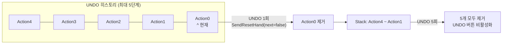

### 8.3 연결 끊김 복구 흐름

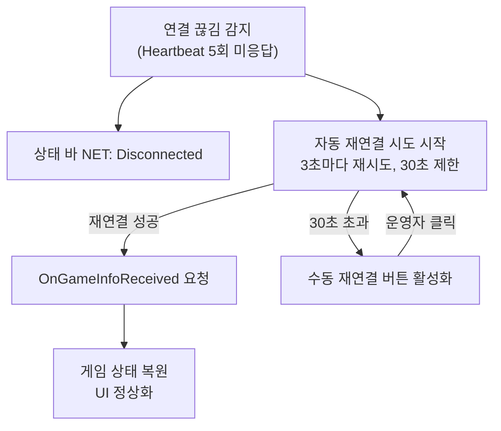

---

## 9. 우선순위 및 로드맵

### 9.1 P0 기능 목록 (27개, MVP)

방송 진행에 필수. 이 기능 없으면 본방송 불가.

| REQ ID | 기능 |
|--------|------|
| REQ-AT-001 | 서버 연결 상태 표시 |
| REQ-AT-002 | RFID 테이블 연결 상태 |
| REQ-AT-005 | 게임 타입 선택 |
| REQ-AT-006 | 블라인드 표시/수정 |
| REQ-AT-007 | 핸드 번호 추적 |
| REQ-AT-008 | 10인 좌석 레이아웃 |
| REQ-AT-009 | 플레이어 상태 표시 |
| REQ-AT-010 | Action-on 하이라이트 |
| REQ-AT-011 | 포지션 뱃지 |
| REQ-AT-012 | 기본 액션 버튼 |
| REQ-AT-013 | UNDO |
| REQ-AT-015 | 베팅 금액 직접 입력 |
| REQ-AT-017 | Quick Bet 프리셋 |
| REQ-AT-018 | Min/Max 범위 표시 |
| REQ-AT-019 | Community Cards 표시 |
| REQ-AT-020 | 보드 카드 업데이트 |
| REQ-AT-021 | HIDE GFX |
| REQ-AT-023 | ADJUST STACK |
| REQ-AT-029 | STRADDLE 좌석별 설정 |
| REQ-AT-032 | CAP 금액 설정 |
| REQ-AT-034 | BOMB POT 금액 설정 |
| REQ-AT-036 | Statistics/Scoreboard 뷰 |
| REQ-AT-039 | LIVE 방송 모드 토글 |
| REQ-AT-041 | RFID 덱 등록 모드 |
| REQ-AT-042 | 동적 액션 버튼 전환 |
| REQ-AT-043 | 카드 스캔 상태 아이콘 행 |
| REQ-AT-044 | RFID 덱 검증 모드 |

### 9.2 P1 기능 목록 (17개, 초기 배포 후)

방송은 가능하나 운영 효율/품질에 영향.

| REQ ID | 기능 |
|--------|------|
| REQ-AT-003 | 스트림 상태 표시 |
| REQ-AT-004 | 녹화 상태 표시 |
| REQ-AT-014 | 키보드 단축키 전체 |
| REQ-AT-016 | +/- 금액 조정 |
| REQ-AT-022 | TAG HAND |
| REQ-AT-024 | CHOP |
| REQ-AT-025 | RUN IT 2x |
| REQ-AT-026 | MISS DEAL |
| REQ-AT-027 | Settings 컴팩트 뷰 |
| REQ-AT-028 | AUTO 모드 |
| REQ-AT-030 | 3rd Blind 설정 |
| REQ-AT-031 | Button Blind 설정 |
| REQ-AT-033 | 7 DEUCE 사이드 게임 |
| REQ-AT-035 | HIT GAME 보너스 |
| REQ-AT-037 | STRIP STACK/WIN 표시 |
| REQ-AT-038 | TICKER 텍스트 |
| REQ-AT-040 | FIELD 참가자 수 관리 |

### 9.3 개발 순서 권장

```
Phase 1: 연결 및 기본 UI
  - 서버 연결 화면 (IP/Port 입력)
  - 상태 바 (연결 상태만)
  - 10인 좌석 레이아웃 (정적)

Phase 2: 게임 상태 반영
  - 서버 상태 수신 및 파싱
  - 좌석 상태 동적 업데이트
  - Action-on 하이라이트

Phase 3: 액션 입력
  - 기본 액션 버튼 (FOLD/CHECK/CALL/BET/RAISE/ALL-IN)
  - 베팅 금액 입력
  - Quick Bet 프리셋
  - UNDO

Phase 4: 게임 설정
  - 게임 타입 선택
  - 블라인드 수정
  - 핸드 번호

Phase 5: 보드 및 특수
  - Community Cards 표시
  - HIDE GFX, ADJUST STACK
  - 에러 처리 (RFID 실패, 잘못된 카드)

Phase 6: P1 기능
  - 키보드 단축키
  - TAG HAND, CHOP, RUN IT 2x, MISS DEAL
  - 스트림/녹화 상태
```

---

## 10. 프로토콜 매핑

44개 기능과 68개 메시지의 매핑 테이블.

| REQ ID | Feature ID | 기능 | 전송 메시지 | 수신 응답 | 특이사항 |
|--------|:----------:|------|------------|----------|---------|
| REQ-AT-001 | AT-001 | 서버 연결 상태 | ConnectToServer, SendAuth, SendHeartBeat | OnConnected, OnAuthReceived, OnHeartBeatReceived | 연결 해제 시 OnDisconnected |
| REQ-AT-002 | AT-002 | RFID 테이블 연결 | SendReaderStatus | OnReaderStatusReceived | heartbeat 기반 |
| REQ-AT-003 | AT-003 | 스트림 상태 | (서버 상태 폴링) | OnGameInfoReceived | stream_state 필드 참조 |
| REQ-AT-004 | AT-004 | 녹화 상태 | (서버 상태 폴링) | OnGameInfoReceived | record_state 필드 참조 |
| REQ-AT-005 | AT-005 | 게임 타입 선택 | SendGameType(gametype) | OnGameInfoReceived | gametype 0~3 순환 |
| REQ-AT-006 | AT-006 | 블라인드 수정 | WriteGameInfo(22개 필드) | OnGameInfoReceived | 전체 게임 정보 갱신 |
| REQ-AT-007 | AT-007 | 핸드 번호 | (서버 상태 참조) | OnGameInfoReceived | hand_num 필드 |
| REQ-AT-008 | AT-008 | 10인 좌석 레이아웃 | (수신 전용) | OnPlayerInfoReceived | 10명 배열 |
| REQ-AT-009 | AT-009 | 플레이어 상태 | SendPlayerSitOut(player, !sitOut) | OnPlayerInfoReceived | bool 반전 전송 |
| REQ-AT-010 | AT-010 | Action-on 하이라이트 | (수신 전용) | OnGameInfoReceived | action_on 필드 |
| REQ-AT-011 | AT-011 | 포지션 뱃지 | (수신 전용) | OnGameInfoReceived | pl_dealer, pl_small, pl_big 필드 |
| REQ-AT-012 | AT-012 | 기본 액션 버튼 | SendPlayerFold / SendPlayerCheckCall / SendPlayerBet / SendPlayerBet(all-in) | OnGameInfoReceived | CheckCall은 PlayerBetRequest 재사용 |
| REQ-AT-013 | AT-013 | UNDO | SendResetHand(next=false) | OnGameInfoReceived | next=false: 리셋만 |
| REQ-AT-014 | AT-014 | 키보드 단축키 | (REQ-AT-012 등과 동일) | - | Flutter KeyboardListener |
| REQ-AT-015 | AT-015 | 베팅 금액 입력 | SendPlayerBet(player, amount) | OnGameInfoReceived | amount는 int |
| REQ-AT-016 | AT-016 | +/- 조정 | SendPlayerBet(player, amount±smallest_chip) | OnGameInfoReceived | smallest_chip 단위 |
| REQ-AT-017 | AT-017 | Quick Bet 프리셋 | SendPlayerBet(player, preset_amount) | OnGameInfoReceived | 팟 크기는 서버에서 계산 |
| REQ-AT-018 | AT-018 | Min/Max 범위 | (수신 전용) | OnGameInfoReceived | min_raise, max_bet 필드 |
| REQ-AT-019 | AT-019 | Community Cards 표시 | (수신 전용) | OnGameInfoReceived | board_cards 배열 |
| REQ-AT-020 | AT-020 | 보드 카드 업데이트 | SendCardEnter(tag="B,N", cards) / SendForceCardScan | OnGameInfoReceived | RFID 실패 시 수동 그리드 |
| REQ-AT-021 | AT-021 | HIDE GFX | SendGfxEnable(!enable) | OnGameInfoReceived | 반전 전송: !enable |
| REQ-AT-022 | AT-022 | TAG HAND | SendTag(tag) / SendClearTag() | OnGameInfoReceived | 콤마→틸드 치환 |
| REQ-AT-023 | AT-023 | ADJUST STACK | SendPlayerStack(player, amount) | OnPlayerInfoReceived | 직접 스택 설정 |
| REQ-AT-024 | AT-024 | CHOP | SendChop() | OnGameInfoReceived | 파라미터 없음 |
| REQ-AT-025 | AT-025 | RUN IT 2x | SendRunItTimes() / SendRunItTimesClearBoard() | OnGameInfoReceived | 호출마다 보드 수 +1 |
| REQ-AT-026 | AT-026 | MISS DEAL | SendMissDeal() | OnGameInfoReceived | 파라미터 없음 |
| REQ-AT-027 | AT-027 | Settings 컴팩트 뷰 | (UI 전용) | - | 모드 전환만 |
| REQ-AT-028 | AT-028 | AUTO 모드 | (서버 내부 플래그) | OnGameInfoReceived | auto_mode 필드 추정 |
| REQ-AT-029 | AT-029 | STRADDLE 설정 | WriteGameInfo(_third, _pl_third) | OnGameInfoReceived | 22개 필드 일괄 |
| REQ-AT-030 | AT-030 | 3rd Blind | WriteGameInfo(_third, _pl_third) | OnGameInfoReceived | _num_blinds 연동 |
| REQ-AT-031 | AT-031 | Button Blind | WriteGameInfo(_button_blind) | OnGameInfoReceived | 22개 필드 일괄 |
| REQ-AT-032 | AT-032 | CAP 설정 | WriteGameInfo(_cap) | OnGameInfoReceived | 22개 필드 일괄 |
| REQ-AT-033 | AT-033 | 7 DEUCE | WriteGameInfo(_seven_deuce) | OnGameInfoReceived | 22개 필드 일괄 |
| REQ-AT-034 | AT-034 | BOMB POT | WriteGameInfo(_bomb_pot) | OnGameInfoReceived | 22개 필드 일괄 |
| REQ-AT-035 | AT-035 | HIT GAME | (서버 내부 설정) | OnGameInfoReceived | 프로토콜 미확인 |
| REQ-AT-036 | AT-036 | Statistics 뷰 | SendPanelValue(panel_type) | OnGameInfoReceived, OnPlayerInfoReceived | panel_type enum 0~19 |
| REQ-AT-037 | AT-037 | STRIP 표시 | SendShowStrip(1), SendCumwinStrip(2) | OnGameInfoReceived | mode 0=OFF/1=스택/2=cumwin |
| REQ-AT-038 | AT-038 | TICKER | SendTicker(text), SendTickerLoop(!active) | OnGameInfoReceived | active 반전 전송 |
| REQ-AT-039 | AT-039 | LIVE 토글 | SendDelayedGameInfo, SendDelayedPlayerInfo | OnDelayedGameInfoReceived | 지연 방송 전용 응답 |
| REQ-AT-040 | AT-040 | FIELD 관리 | SendFieldVisibility(visible), SendFieldValue(remain, total) | OnGameInfoReceived | bool + 2int |
| REQ-AT-041 | AT-041 | RFID 덱 등록 | SendRegisterDeck(true) / SendRegisterDeckCancel(false) | OnGameInfoReceived | RegisterDeckRequest 공유 |
| REQ-AT-042 | AT-042 | 동적 버튼 | (UI 로직: biggest_bet_amt 기반) | OnGameInfoReceived | 서버 메시지 없음, UI 판단 |
| REQ-AT-043 | AT-043 | 카드 스캔 아이콘 | SendReaderStatus | OnReaderStatusReceived | cards 필드 참조 |
| REQ-AT-044 | AT-044 | RFID 덱 검증 | SendVerifyDeck/SendVerifyExit/SendVerifyStart | OnGameInfoReceived | CardVerifyRequest 공유 |

### 10.1 반전 전송 패턴 주의사항

일부 bool 필드는 와이어 전송 시 반전(`!value`)된다. 구현 시 주의 필요.

| 메시지 | 파라미터 | 실제 전송 값 | 이유 |
|--------|---------|------------|------|
| SendGfxEnable(enable) | enable=true (활성화) | !enable = false | 서버 내부 로직 |
| SendTickerLoop(active) | active=true (루프 ON) | !active = false | 서버 내부 로직 |
| SendPlayerSitOut(sitOut) | sitOut=true (자리 비움) | !sitOut = false | 서버 내부 로직 |

### 10.2 Request Type 재사용 패턴

여러 메시지가 동일한 Request 타입을 공유한다. AT 구현 시 필드 값으로 구분한다.

| Request Type | 사용 메시지 | 구분 필드 |
|-------------|-----------|---------|
| ResetHandRequest | SendResetHand, SendNextHand | next (false/true) |
| TagRequest | SendTag, SendClearTag | tag 유무 |
| RegisterDeckRequest | SendRegisterDeck, SendRegisterDeckCancel | register (true/false) |
| CardVerifyRequest | SendVerifyDeck, SendVerifyExit, SendVerifyReset, SendVerifyStart | verify (bool) + 상태 머신 |
| PlayerBetRequest | SendPlayerBet, SendPlayerCheckCall | amount 값으로 서버 구분 |
| ShowStripRequest | SendShowStrip, SendCumwinStrip | mode (0/1/2) |

---

## 11. 용어집

| 용어 | 정의 |
|------|------|
| Action Tracker (AT) | 포커 본방송 중 게임 진행을 실시간 입력하는 별도 Flutter Desktop 앱 |
| GfxServer | EBS Server UI (그래픽 렌더링 및 방송 출력 담당) |
| Action-on | 현재 베팅 차례인 플레이어 |
| Community Cards | 모든 플레이어가 공유하는 보드 카드 (Flop/Turn/River) |
| RFID | 카드 자동 인식 시스템. 카드에 내장된 태그를 리더가 읽음 |
| UID | RFID 카드의 고유 식별자 |
| Heartbeat | 연결 유지 확인 신호 (3초 주기) |
| UNDO | 마지막 입력 액션을 취소하는 기능 (최대 5단계) |
| Run It Twice | 올인 상황에서 보드 카드를 두 번 오픈하는 변형 규칙 |
| Chop | SB/BB 둘만 남았을 때 팟을 나누는 합의 |
| Miss Deal | 딜 실수로 핸드를 무효화하는 선언 |
| HIDE GFX | 방송 오버레이 전체를 즉시 숨기는 긴급 기능 |
| TAG HAND | 중요한 핸드에 태그를 추가하는 기능 (하이라이트 또는 메모) |
| Smallest Chip | 칩 단위의 최소값. +/- 조정 시 이 단위로 증감 |
| P0 | 없으면 방송 불가한 필수 기능 |
| P1 | 방송은 가능하나 운영 효율/품질에 영향을 주는 기능 |
| bool 반전 패턴 | 일부 메시지에서 bool 값이 !value로 반전 전송되는 프로토콜 특성 |
| STRADDLE | BB의 2배를 자발적으로 블라인드 베팅하는 규칙. 좌석별 ON/OFF 설정 |
| CAP | 1 Street 내 베팅/레이즈 상한 횟수 제한 (예: 4-Bet Cap) |
| ANTE | 매 핸드 시작 시 모든 플레이어가 내는 강제 베팅 |
| BTN BLIND | 버튼 포지션이 블라인드를 내는 특수 규칙 |
| 3rd Blind | SB/BB 외 추가 블라인드 (3B). STRADDLE과 별개 설정 |
| 7 DEUCE | 7-2 오프수트로 팟을 이기면 보너스를 받는 사이드 게임 |
| BOMB POT | 모든 플레이어가 동일 금액을 팟에 넣고 프리플랍 베팅 없이 플랍부터 시작 |
| HIT GAME | 특정 핸드/조건 달성 시 보너스 발동되는 게임 변형 |
| VPIP | Voluntarily Put money In Pot. 자발적 팟 참여율 (%) |
| PFR | Pre-Flop Raise. 프리플랍 레이즈 빈도 (%) |
| AGRFq | Aggression Frequency. 공격적 액션 빈도 (%) |
| WTSD | Went To ShowDown. 쇼다운 진출 빈도 (%) |
| WIN | 핸드 승률 또는 누적 수익 |
| Statistics View | 좌석별 플레이어 통계(VPIP/PFR/AGRFq/WTSD/WIN)를 테이블로 표시하는 화면 |
| STRIP | 플레이어 이름/스택 또는 누적 수익을 한 줄로 표시하는 방송 오버레이 |
| TICKER | 화면 하단에 흐르는 텍스트 (토너먼트 정보, 안내 등) |
| FIELD | 잔여 참가자(REMAIN) 및 전체 참가자(TOTAL) 표시 필드 |
| LIVE 토글 | 실시간/지연 방송 전환. 지연 모드에서 SendDelayedGameInfo/SendDelayedPlayerInfo 사용 |
| Card Registration | RFID 덱 등록 모드. 52장 전체를 순차적으로 안테나에 올려 UID를 매핑 |
| Card Verification | 등록된 RFID 덱의 52장 무결성을 검증하는 기능 |
| Dynamic Button | 게임 상태(biggest_bet_amt)에 따라 CHECK↔CALL, BET↔RAISE-TO로 전환되는 액션 버튼 |
| Card Scan Icon | RFID 리더 상태를 시각적으로 표시하는 좌석별 아이콘 행 |

---

## 변경 이력

---

| 버전 | 날짜 | 변경 내용 |
|------|------|----------|
| 1.0.0 | 2026-02-19 | 초기 작성. 26개 기능 전체 요구사항 정의, 68개 프로토콜 메시지 매핑, Flutter Desktop 아키텍처, ASCII 레이아웃 및 키보드 단축키 설계 |
| 2.0.0 | 2026-02-19 | 3단계 분석 기반 UI 설계 전면 재구성. 6개 스크린샷 정밀 분석 삽입 (5.1~5.5). 18개 신규 요구사항 추가 (REQ-AT-027~044): Settings 컴팩트 뷰, STRADDLE 좌석별 설정, 3rd Blind, BTN BLIND, CAP, 7 DEUCE, BOMB POT, HIT GAME, Statistics/Scoreboard 뷰(VPIP/PFR/AGRFq/WTSD/WIN), STRIP STACK/WIN, TICKER, LIVE 토글, FIELD/REMAIN/TOTAL, RFID 덱 등록 모드(52장 전체화면), 동적 액션 버튼(CHECK↔CALL, BET↔RAISE-TO), RFID 스캔 상태 아이콘 행, REGISTER 버튼. 앱 구조에 신규 화면 추가(SettingsScreen, StatisticsScreen, CardGridScreen, RegisterDeckScreen). 프로토콜 매핑 확장 (26개 → 44개). |
| 2.1.0 | 2026-03-05 | Tier 1 UI 와이어프레임 7개 ASCII → HTML/PNG B&W 목업 교체 (메인 레이아웃, 설정 뷰, 카드 선택, 통계 패널, RFID 등록, 전체 레이아웃, 좌석 셀). Tier 2 상태 머신/흐름도 5개 ASCII → Mermaid 변환 (연결 구조, 게임 상태 머신, RFID 등록 흐름, UNDO 히스토리, 연결 끊김 복구). Tier 3 코드 구조/인라인 8개 보존. |
| 2.2.0 | 2026-03-13 | 설계 문서 통합 — DESIGN-AT-001/DESIGN-AT-v3 → DESIGN-AT-002 (EBS-UI-Design-ActionTracker.md). 역설계 문서 + GGP-GFX Story 3.1/3.2 기반 통합. GGP-GFX 기획서 AT 이미지 10장 추출 삽입. |
| 2.2.1 | 2026-03-13 | PRD-AT-002 (EBS-AT-UI-Design.prd.md) 신규 생성. UI 설계 전용 PRD로 분리. |
| 2.2.2 | 2026-03-24 | §5.4.3 Stats 데이터 아카이브 출력 시점 명시 (핸드 종료 시 개별 송출 방식). 상태 머신 HAND_COMPLETE note 보강. |

**Version**: 2.2.2 | **Updated**: 2026-03-24
