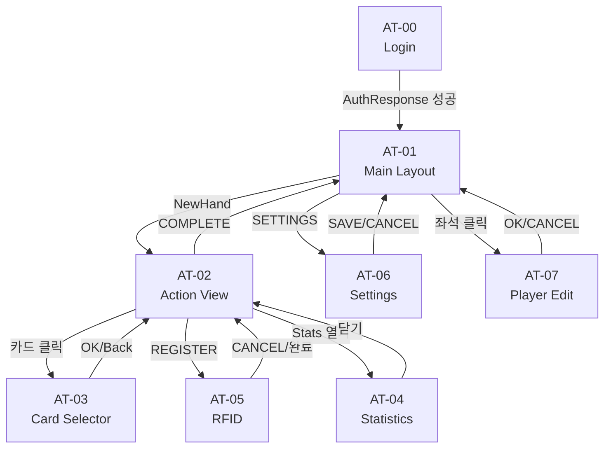
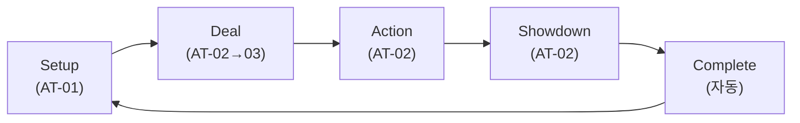
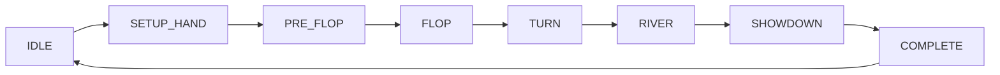

# PRD-AT-002: EBS Action Tracker UI Design v6.2.0

> PokerGFX Action Tracker를 **내재화**하여 EBS 전용 운영 콘솔로 재설계한 UI 설계 문서.


## §0. EBS Action Tracker의 가치

### 0.1 AT는 운영자 → 데이터 시스템의 유일한 실시간 입력점

포커 방송에서 발생하는 모든 액션(폴드, 콜, 레이즈, 올인)은 **AT를 통해서만** 데이터 시스템에 입력된다. 카메라가 포착한 게임 상황을 운영자가 AT에 입력하면, 그 데이터가 방송 그래픽(GFX)과 통계(Stats)로 변환된다.

```
운영자의 눈 ──→ AT 키보드 입력 ──→ EBS Server ──→ 방송 그래픽 + Stats
     (유일한 입력 경로)              (TCP :9001)     (출력)
```

한 핸드당 3~8개 베팅 액션이 발생하며, 포커 본방송 중 운영자 주의력의 대부분이 AT에 집중된다.

| 시점 | AT의 역할 | 데이터 흐름 |
|------|----------|------------|
| 방송 전 | 좌석 배치, 블라인드/칩 설정 | Console 설정 → AT 동기화 |
| 핸드 진행 중 | 액션 실시간 입력 (FOLD/CALL/BET/RAISE/ALL-IN) | AT 입력 → GFX 즉시 반영 |
| 핸드 종료 시 | SHOWDOWN 결과 입력 → 자동 완료 | AT → Stats 아카이브 (핸드 단위 개별 송출) |

> **Stats 아카이브 출력 시점**: 방송 중 각 핸드가 종료되는 시점(HAND_COMPLETE)에 해당 핸드의 액션/결과 데이터가 개별 송출된다. 실시간 누적이 아닌 **핸드 단위 아카이브** 방식.

### 0.2 Persona

| Persona | 역할 | 주요 관심사 |
|---------|------|------------|
| 방송 운영자 | 실시간 액션 입력 | "1초 지연 = 방송 공백" |
| 방송 감독 | 통계 확인, 그래픽 제어 | "올바른 데이터가 방송에 나가는가" |
| 기술 운영자 | 설정, 연결, 문제 해결 | "RFID/TCP 연결이 안정적인가" |

### 0.3 세 도구의 관계

```
┌──────────────┐    ┌──────────────┐    ┌──────────────┐
│   Console    │    │Action Tracker│    │ Stats/Back   │
│   "제어실"   │<──>│ "운영 콘솔"  │───>│   Office     │
└──────┬───────┘    └──────┬───────┘    └──────────────┘
       └───────┬───────────┘
         EBS Server (TCP :9001)
```

### 0.4 참조 문서

| 문서 | 역할 |
|------|------|
| [Design Rationale](../analysis/EBS-AT-Design-Rationale.md) | 계승/개선/신규 3축 설계 근거 (D3.1~D4.4) |
| [AT-Annotation-Reference](../analysis/AT-Annotation-Reference.md) | PokerGFX 8화면 226요소 분석 정본 |
| [DESIGN-AT-002](../design/PokerGFX-UI-Design-ActionTracker.md) | 역설계: Send 23개, Receive 7개, 상태 머신 |
| [PRD-AT-001](action-tracker.prd.md) | 44개 기능 요구사항 (v2.2.0) |

## §1. 화면 흐름

### 1.1 화면 전이 다이어그램



화면은 두 허브를 중심으로 전이된다:
- **AT-01 (Setup)**: 방송 전 설정 허브 — Settings(AT-06), Player Edit(AT-07) 진입점
- **AT-02 (Action)**: 핸드 진행 허브 — Card Selector(AT-03), Statistics(AT-04), RFID(AT-05) 진입점

### 1.2 화면 목록 — 8화면

| EBS ID | 화면명 | 크기 | PokerGFX 원본 | 비고 |
|--------|--------|:----:|:-------------:|------|
| AT-00 | Login | 480×360 | — (신규) | 중앙 폼 6요소 |
| AT-01 | Main Layout (Setup) | 640×auto | AT-01 (90요소) | 7존 재설계 |
| AT-02 | Action View | 640×auto | AT-02+AT-04 통합 | v1 수평, Pre/Post 통합 |
| AT-03 | Card Selector | 560×auto | AT-03 (8요소) | QDialog 모달 |
| AT-04 | Statistics Panel | 640×auto | AT-05 (22요소) | QTable 재설계 |
| AT-05 | RFID Registration | 480×auto | AT-06 (9요소) | 진행률 바 추가 |
| AT-06 | Settings View | 640×auto | — (신규) | AT 독립 설정 |
| AT-07 | Player Edit | 400×auto | AT-09 (9요소) | QDialog popup |

> AT-08 Seat Cell → §5.3 Design System으로 이동 (화면 아닌 컴포넌트).
> AT-09 Integration → AT-02에 통합 (QLayout wrapper 중복 제거).

## §2. 운영자 워크플로우

운영자가 AT를 사용하여 1핸드를 처리하는 실제 행동 흐름. §6 State Machine이 **시스템** 상태를 정의한다면, 이 섹션은 **운영자가 무엇을 하는가**를 정의한다.

### 2.1 핸드 진행 워크플로우

운영자 관점의 1핸드 라이프사이클.



| 단계 | 운영자 행동 | 화면 | 시스템 상태 |
|------|------------|------|-----------|
| **Setup** | 좌석 배치, 블라인드 설정, NEW HAND | AT-01 | IDLE → SETUP_HAND |
| **Deal** | 홀카드 배분 (RFID 자동 or 수동 선택) | AT-02 → AT-03 | SETUP_HAND → PRE_FLOP |
| **Action** | Action-On 좌석에 FOLD/CALL/BET/RAISE/ALL-IN 입력 | AT-02 | PRE_FLOP → FLOP → TURN → RIVER |
| **Showdown** | MUCK/SHOW 선택, 위너 지정, 팟 지급 | AT-02 | SHOWDOWN |
| **Complete** | 자동: 스택 갱신 → Stats 아카이브 송출 → 3초 → IDLE | AT-02 → AT-01 | COMPLETE → IDLE |

### 2.2 카드 딜링 워크플로우

AT는 "카드 배분이 시작되었다"를 알 수 없다 — 이를 알려주는 프로토콜이 없다. Card Selector(AT-03) 진입은 두 경로로만 발생한다.

#### RFID 상태 전이

```
EMPTY (빈 슬롯) ─┬─ RFID 신호 없음 → EMPTY 유지
                  │   └─ 운영자 클릭 → [AT-03] (경로 B)
                  └─ RFID 신호 수신 → DETECTING (노란색 펄스)
                      ├─ 매핑 성공 (5초 이내) → DEALT (카드 이미지, 완료)
                      ├─ 매핑 실패 (5초 경과) → [AT-03] 자동 진입 (경로 A)
                      └─ 이미 할당된 카드 → WRONG_CARD (빨간 테두리)
```

#### 진입 경로

| 경로 | 트리거 | 조건 | 동작 |
|------|--------|------|------|
| **A: RFID Fallback** | RFID 신호 수신 (DETECTING) → 5초 내 UID→카드 매핑 실패 | 신호는 왔지만 매핑 안 됨 | AT-03 **자동** 표시 |
| **B: 수동 진입** | 운영자가 카드 아이콘 직접 클릭 | 슬롯이 EMPTY (RFID 신호 자체 없음) | AT-03 **즉시** 표시 |

> **핵심 구분**: 5초 카운트다운 ≠ "RFID 신호가 안 왔다" (그건 EMPTY로 유지). 5초 카운트다운 = "RFID **신호는 왔는데**(DETECTING) 매핑이 안 된다".

#### 프로토콜 분기

동일한 Card Selector UI이지만, **어디서 진입했느냐**에 따라 전송 프로토콜이 다르다:

| 진입 컨텍스트 | 프로토콜 | 필드 | 게임 상태 |
|--------------|---------|------|----------|
| 홀카드 (플레이어 카드 아이콘) | `SendCardVerify` | Player, CardIndex, Suit, Rank | PRE_FLOP |
| 커뮤니티 카드 (보드 슬롯) | `SendBoardCard` | CardIndex, Suit, Rank | FLOP/TURN/RIVER |

홀카드는 `Player` 필드로 좌석을 식별하고, 커뮤니티 카드는 보드 위치(CardIndex 0~4)만 전송한다.

#### 카드 비활성화

52장 그리드에서 이미 사용된 카드는 **opacity 0.3으로 비활성화** (선택 불가):

| 데이터 소스 | 비활성 대상 |
|------------|-----------|
| `PlayerCardsResponse` | 각 플레이어에 할당된 홀카드 |
| `BoardCardResponse` | 보드에 놓인 커뮤니티 카드 |

비활성 카드 = {할당된 홀카드} ∪ {놓인 보드 카드}. TURN 상태 예시: SEAT1(2장) + SEAT2(2장) + BOARD(3장) = 7장 비활성, 45장 선택 가능.

#### 반복 진입 패턴

| 상황 | 진입 횟수 | 프로토콜 |
|------|:--------:|---------|
| Hold'em 홀카드 (2장) | 2회 | SendCardVerify (CardIndex 0, 1) |
| Omaha 4-Card 홀카드 | 4회 | SendCardVerify (CardIndex 0~3) |
| FLOP (3장) | 3회 | SendBoardCard (CardIndex 0, 1, 2) |
| TURN / RIVER (1장) | 1회 | SendBoardCard (CardIndex 3 / 4) |

Back/Esc: 선택 취소 → AT-02 복귀 (서버 미전송). RFID 재대기 또는 재진입 가능.

#### 화면 전이 흐름

```
AT-02 (카드 아이콘 클릭 또는 RFID Fallback)
  → AT-03 Card Selector (1장 선택)
    → OK: 서버 전송 → AT-02 복귀
    → Back/Esc: 취소 → AT-02 복귀
  → (다음 슬롯 필요 시) AT-03 재진입
```

### 2.3 액션 입력 워크플로우

핸드 진행 중 운영자의 액션 입력 흐름.

#### Action-On 수신 → 입력

1. `ActionOnResponse` 수신 → 해당 좌석 `action-glow` 펄스 활성
2. 운영자가 키보드 또는 버튼으로 액션 선택:

| 키 | 액션 | 프로토콜 | 조건 |
|----|------|---------|------|
| `F` | FOLD | SendPlayerFold | — |
| `C` | CALL / CHECK | SendPlayerBet | BiggestBet > 0 → CALL, == 0 → CHECK |
| `B` | BET / RAISE-TO | SendPlayerBet | BiggestBet > 0 → RAISE-TO, == 0 → BET |
| `A` | ALL IN | SendPlayerAllIn | — |

3. 액션 전송 → 팟 갱신 → 다음 `ActionOnResponse` 대기

#### Bet/Raise 금액 입력

BET 또는 RAISE-TO 선택 시 금액 입력이 필요하다:

| 방법 | UI 요소 | 동작 |
|------|---------|------|
| Preset 버튼 | MIN / ½P / POT / ALL-IN | 1클릭으로 금액 자동 설정 |
| 직접 입력 | AMOUNT QInput + ±증감 | 정확한 금액 직접 입력 |

금액 확정 후 BET/RAISE-TO 버튼 클릭 또는 `B` 키로 전송.

#### UNDO 5단계

| 키 | 동작 | 제한 |
|----|------|------|
| `Ctrl+Z` | 마지막 액션 취소 | 최대 5단계까지 연속 실행 |

UNDO는 서버에 UndoLastAction을 전송하며, 서버가 게임 상태를 이전 단계로 롤백한다.

## §3. 화면 상세

### §3.1 AT-00 Login

**480×360** | **6개 요소** | EBS 신규


운영자가 AT 앱을 실행하면 가장 먼저 보는 화면. EBS Server에 연결하고 인증한다.

| ID | Name | Category | Description |
|----|------|----------|-------------|
| LG-01 | App Title | header | "EBS ACTION TRACKER" + v1.0.0 |
| LG-02 | User ID | input | 운영자 ID 입력 (28px, dense) |
| LG-03 | Password | input | 비밀번호 입력 (28px, masked) |
| LG-04 | LOGIN | action | 36px 버튼 → AuthRequest 전송 |
| LG-05 | Status | status | Disconnected → Connecting → Connected |
| LG-06 | Error | feedback | 인증 실패 메시지 (#d00) |

**Quasar**: QInput dense, QBtn 36px, QSpinner. **v4→v5 변경**: 720→480px, 입력 44→28px, 버튼 52→36px, 상단 여백 축소.

---

### §3.2 AT-01 Main Layout (Setup)

**640×auto** | **7개 존** | PokerGFX AT-01 (90요소) 재설계


Setup 모드 — 핸드 시작 전 블라인드/좌석/칩을 설정하는 화면. 90개 평면 배열을 7존으로 그룹핑 (Design Rationale D3.1, Miller's Law).

| ID | Zone | Category | 내용 | 요소 수 |
|----|------|----------|------|:-------:|
| M-01 | Toolbar | toolbar | 연결 상태, HAND#, AUTO, 아이콘 버튼 (32px) | 12 |
| M-02 | Card Icon Row | card_area | 10 카드 아이콘 (RFID 스캔 상태) | 10 |
| M-03 | Seat Tab Row | seat_tab | SEAT 1~10 QTabs (28px, D3.2) | 10 |
| M-04 | Blind Panel | blind | CAP/ANTE/BTN BLD, POSITION, STAKES — QInput dense 직접 입력 (D3.4) | 17 |
| M-05 | Chip Grid | chip_input | 10좌석 칩 입력 (5×2 그리드, 28px input) | 10 |
| M-06 | Game Settings | game_settings | MIN CHIP, 7 DEUCE, BOMB POT, HIT GAME, #BOARDS, HOLDEM/OMAHA | 10 |
| M-07 | Straddle Row | option | 10 스트래들 토글 | 10 |

**v4→v5 변경**: 720→640px, Toolbar 44→32px, Tab 34→28px, Blind ◀▶→QInput 직접 입력, 전체 높이 ~20% 감소.

#### §3.2.1 AT-07 Player Edit (AT-01에서 좌석 클릭 시)

**400×auto** | **7개 요소** | PokerGFX AT-09 (9요소) — QDialog popup


좌석 클릭 시 열리는 플레이어 정보 편집 다이얼로그.

| ID | Name | Category | Description |
|----|------|----------|-------------|
| PE-01 | Title Bar | header | "SEAT X" 헤더 + 닫기 (32px) |
| PE-02 | NAME | input | 플레이어 이름 (28px) |
| PE-03 | COUNTRY | input | 국가 선택 (QSelect dense) |
| PE-05 | Photo Area | display | 프로필 사진 영역 |
| PE-06 | Action Buttons | action | DELETE / MOVE SEAT (32px) |
| PE-08 | SIT OUT | option | SIT OUT 토글 (**반전 전송**, §7.3) |
| PE-09 | Bottom Row | action | CANCEL / OK (32px) |

**v4→v5 변경**: 720→400px (dialog popup에 적합), compact density.

#### §3.2.2 AT-06 Settings View (AT-01에서 SETTINGS 시)

**640×auto** | **5개 존** | EBS 신규 (Design Rationale D3.5)


연결/디스플레이/게임/키보드 설정을 관리하는 화면. PokerGFX AT에는 독립 설정 화면이 없었음 (Jakob's Law 근거).

| ID | Zone | Category | Description |
|----|------|----------|-------------|
| SV-01 | Toolbar | toolbar | 연결 상태 + Hand# (32px) |
| SV-02 | Seat Grid | seat | 10좌석 칩 + 스트래들 |
| SV-03 | Card Status | card_area | 10 카드 스캔 상태 |
| SV-04 | Settings Form | settings | Connection / Display / Game / Keyboard 섹션 (QInput 28px) |
| SV-05 | Bottom Actions | action | CANCEL / SAVE 버튼 (32px) |

**v4→v5 변경**: 720→640px, 입력/버튼 compact density.

---

### §3.3 AT-02 Action View (v1 수평)

**640×auto** | **7개 존** | PokerGFX AT-02+AT-04 **통합** (Design Rationale D4.1) | **PokerGFX 6-Layer 구조 복원**


핸드 진행 중 — 실시간 액션을 입력하는 핵심 화면. Pre-Flop/Post-Flop을 단일 화면으로 통합 (83% 동일 요소, Context Switching Cost 제거).

| ID | Zone | Height | Category | 내용 |
|----|------|:------:|----------|------|
| AV-01 | Toolbar | 48px | toolbar | TCP/RFID/USB conn-dots, HAND#, GFX/REG/Fullscreen 버튼 |
| AV-02 | Game Config | 28px | hand_control | 게임 타입, 블라인드, STR, POT (단일 표시) |
| AV-03 | Card Icon Row | 48px | card_icon | 수평 10좌석 카드 상태 (has/no/fold/allin/empty/sitout) |
| AV-04 | Seat Label Row | 40px | seat | 수평 10좌석 (Position Badge + 이름 + Stack + Bet) |
| AV-05 | Action Panel | 170px | action_panel | 좌: MISS DEAL(11%), 중: Board Cards + Player Info Bar(68%), 우: TAG/HIDE GFX/REC(21%) |
| AV-06 | Action Buttons | 42px | action_button | ← UNDO(9%) + FOLD / CHECK·CALL / BET·RAISE-TO / ALL IN (각 22%) |
| AV-07 | Bet Row | 32px | action_panel | AMOUNT 입력 + +/- 증감 + MIN/½P/POT/ALL-IN 퀵 버튼 |

**v5.1.0 구조 변경** (PokerGFX 6-Layer 복원):
- AV-03/AV-04 분리: Card Row + Seat Row 독립 (기존 SeatCell 90px → 48+40px)
- AV-05 통합: Board Cards + Player Info Bar + MISS DEAL + TAG/REC (기존 AV-04+05+08)
- AV-06: UNDO 버튼 좌측 복원 (PokerGFX #37), Action 금액 12px 확대
- POT 중복 제거: AV-02에서만 표시

**Pre-Flop / Post-Flop 통합 규칙** (Design Rationale I-3 계승):

| 조건 | CALL/CHECK | BET/RAISE-TO |
|------|:----------:|:------------:|
| BiggestBet > 0 | CALL | RAISE-TO |
| BiggestBet == 0 | CHECK | BET |

#### §3.3.1 AT-03 Card Selector (AT-02에서 카드 클릭 시)

**560×auto** | **6개 요소** | PokerGFX AT-03 (8요소)


홀카드 또는 커뮤니티 카드를 수동으로 선택하는 QDialog. **1회 진입 = 1장 선택**. 여러 장이 필요하면 반복 진입한다.

| ID | Name | Category | Description |
|----|------|----------|-------------|
| CS-01 | Header | chrome | 타이틀 + Back/OK 버튼 (32px) |
| CS-02 | Selected Display | display | 선택 카드 실시간 미리보기 |
| CS-03 | Spade Row (♠) | card_grid | A~K 13장 (검정) |
| CS-04 | Heart Row (♥) | card_grid | A~K 13장 (#d00) |
| CS-05 | Diamond Row (♦) | card_grid | A~K 13장 (모노크롬) |
| CS-06 | Club Row (♣) | card_grid | A~K 13장 (검정) |

13카드×38px+gap = ~542px → 560px.

**v4→v5 변경**: 720→560px, 버튼 32px.

→ 동작 로직 (진입 경로, RFID 상태 전이, 프로토콜 분기, 반복 진입): §2.2 카드 딜링 워크플로우 참조.

#### §3.3.2 AT-04 Statistics Panel (AT-02에서 Stats 열기 시)

**640×auto** | **4개 존** | PokerGFX AT-05 (22요소)


10좌석 통계 테이블 + 방송 제어 버튼 패널.

| ID | Zone | Category | Description |
|----|------|----------|-------------|
| SP-01 | Header | header | "Statistics" + Hand # (32px) |
| SP-02 | Stats Table | table_data | SEAT/STACK/VPIP%/PFR%/AGRFq%/WTSD%/WIN 7열×10행 (QTable dense) |
| SP-03 | Side Panel | broadcast_control | LIVE/GFX/HAND/FIELD/REMAIN/TOTAL/STRIP STACK/STRIP WIN/TICKER |
| SP-04 | Footer | action | EXPAND / CLOSE 버튼 (32px) |

LIVE 버튼은 SendGfxEnable **반전 전송** (§7.3).

**데이터 갱신 타이밍**: 통계 데이터는 각 핸드 종료 시점(HAND_COMPLETE)에 해당 핸드의 데이터가 개별 송출되어 갱신된다. 핸드 진행 중에는 이전까지의 누적 통계를 표시하며, 핸드 완료 이벤트 수신 시 새로운 데이터를 반영한다.

**v4→v5 변경**: 720→640px, 컴포넌트 compact density.

#### §3.3.3 AT-05 RFID Registration (AT-02에서 REGISTER 시)

**480×auto** | **5개 요소** | PokerGFX AT-06 (9요소)


52장 카드를 RFID 안테나에 순차 등록/검증하는 화면. 등록 모드(SendRegisterDeck)와 검증 모드(SendVerifyDeck) 공유.

| ID | Name | Category | Description |
|----|------|----------|-------------|
| RR-01 | Instruction | rfid | "PLACE CARD ON RFID ANTENNA" |
| RR-02 | Card Image | rfid | 등록/검증 중 카드 (A♠→K♣ 순차) |
| RR-03 | Progress | rfid | QLinearProgress + 카운터 (1/52~52/52) |
| RR-04 | CANCEL | action | 등록/검증 취소 → AT-01 복귀 (36px) |
| RR-05 | Mode Indicator | status | "REGISTER" / "VERIFY" 모드 표시 |

검증 모드 프로토콜: SendVerifyDeck → SendVerifyStart → (카드 52장 스캔) → SendVerifyExit.

**v4→v5 변경**: 720→480px (단순 콘텐츠에 적합), compact density, 검증 모드 추가.

## §4. Design Spec

### 4.1 Core Spec

| 속성 | 값 | 근거 |
|------|-----|------|
| 프레임워크 | Quasar Framework (Vue.js) | 크로스플랫폼, dense prop 기본 지원 |
| 디자인 | Minimal White (B&W Refined) | 6시간+ 연속 사용 눈부심 최소화 |
| 기준폭 | **640px** (v1) | 1920÷3=640, AT+Console+OBS 타일링 (D3.3) |
| Density | **Compact** (desktop keyboard-first) | 모바일 터치 타겟 44px 불필요 |
| 입력 방식 | 키보드 우선 (F/C/B/A) + 마우스 | Fitts's Law — 6시간+ 피로 최소화 |
| 좌석 표현 | v1: 수평 10좌석 리스트 (PokerGFX 계승) | Design Rationale D4.2 |

### 4.2 Design Principles

| 원칙 | 출처 | 적용 |
|------|------|------|
| PokerGFX 기능 계승 | Design Rationale §2 (I-1~I-5) | 키보드 우선, Pot 실시간, 동적 레이블, Blind 자동화, UNDO 5단계 |
| 구조적 한계만 개선 | Design Rationale §3~§4 (D3.1~D4.4) | 7존 그룹핑(D3.1), QTabs(D3.2), 640px 반응형(D3.3), 직접 입력(D3.4), Pre/Post 통합(D4.1), action-glow(D4.4) |
| Compact Density | Material Design 3 Density | 데스크톱 keyboard-first 콘솔에 44px 터치 타겟 불필요 |

### 4.3 Component Sizing (Compact Density)

데스크톱 keyboard-first 콘솔. 모바일 터치 타겟(44px) 불필요. Quasar `dense` prop 활용.

| 컴포넌트 | v4.1.0 | **v5.0.0** | 근거 |
|----------|:------:|:----------:|------|
| Button (primary) | 44px | **32px** | Material Compact density |
| Button (action) | 56px | **36px** | 빈번 클릭 타겟 약간 여유 |
| Input | 44px | **28px** | Quasar dense 기본값 |
| Toolbar | 44px | **32px** | Compact header |
| Tab | 34px | **28px** | Quasar dense tabs |
| Board Card | 40×56px | **36×50px** | 비례 축소 |
| Hole Card | 26×36px | **22×30px** | 비례 축소 |
| Badge | 18px | **16px** | Tighter |

### 4.4 Spacing Scale (4px Grid)

| Token | Value | 용도 |
|-------|:-----:|------|
| --sp-1 | 4px | 인라인 gap, badge margin |
| --sp-2 | 8px | input padding, toolbar padding |
| --sp-3 | 12px | 섹션 내부 padding |
| --sp-4 | 16px | card padding, dialog padding |
| --sp-6 | 24px | 섹션 간 gap, zone 분리 |

## §5. Design System

### 5.1 Color Tokens (B&W Refined 12토큰)

| 토큰 | 값 | 용도 |
|------|-----|------|
| `--bg-primary` | `#ffffff` | 메인 배경, 카드 배경 |
| `--bg-secondary` | `#fafafa` | 컴포넌트 배경, 패널 |
| `--bg-tertiary` | `#f0f0f0` | 툴바, 헤더, hover |
| `--bg-muted` | `#f5f5f5` | 비활성 영역 |
| `--fg-primary` | `#1a1a1a` | 주요 텍스트, 액센트 |
| `--fg-secondary` | `#555555` | 보조 텍스트, 아이콘 |
| `--fg-muted` | `#888888` | 라벨, placeholder |
| `--fg-disabled` | `#bbbbbb` | 비활성 텍스트 |
| `--border-default` | `#d0d0d0` | 기본 테두리 |
| `--border-light` | `#e0e0e0` | 세부 구분선 |
| `--accent` | `#1a1a1a` | 강조 (solid black) |
| `--error` | `#dd0000` | 에러, 경고 |

### 5.2 Typography

| 용도 | 폰트 | 크기 | 두께 | 추가 |
|------|------|:----:|:----:|------|
| 라벨/헤더 | IBM Plex Mono | 9-13px | 600 | uppercase, letter-spacing: 0.08-0.15em |
| 본문/값 | Noto Sans KR | 10-12px | 400-500 | — |
| 숫자/데이터 | IBM Plex Mono | 10-14px | 600 | tabular-nums |

### 5.3 Seat Cell States (AT-08에서 이동)

| ID | 상태 | 배경 | 텍스트 | 특수 효과 |
|----|------|------|--------|----------|
| SC-01 | Active | `#fff` | `#1a1a1a` | 기본 shadow |
| SC-02 | Action-On | `#1a1a1a` | `#fff` | `action-glow` (D4.4) |
| SC-03 | Folded | `#f5f5f5` | 연한 | `opacity: 0.5` |
| SC-04 | All-In | `#1a1a1a` | `#fff` | "ALL-IN" 배지 |
| SC-05 | Empty | `#fafafa` (dashed) | `#ccc` | — |
| SC-06 | Sitting-Out | `#f0f0f0` | `#888` | "SITTING OUT" 배지 |

구성: 홀카드(2 cards, 22×30px) + 박스(seat#, 포지션 배지 16px, 이름, 스택, 베팅).

### 5.4 Animations

| 이름 | 용도 | 정의 |
|------|------|------|
| `pulse` | 연결 상태 표시 | `opacity: 1→0.3→1` (2s ease-in-out infinite) |
| `action-glow` | 현재 턴 좌석 강조 (D4.4) | `box-shadow: 3px→5px` (0.8s alternate) |
| `pulse-red` | 에러/경고 | `opacity: 1→0.35→1` (1.8s, `#d00` dot) |

## §6. State Machine

### 6.1 7단계 게임 상태



| 상태 | 좌석 표시 | 보드 | 가능 액션 | 정보 바 |
|------|----------|------|----------|---------|
| IDLE | 이름+스택만 | — | NEW HAND, EDIT SEATS | Hand # |
| SETUP_HAND | 포지션 뱃지, 블라인드 자동 수거 | — | 대기 | SB/BB/Ante |
| PRE_FLOP | 홀카드 슬롯 활성, Action-on 펄스 | — | FOLD/CHECK/BET/CALL/RAISE/ALL-IN | 팟 실시간 |
| FLOP | 액션 플레이어 강조, 폴드 반투명 | 3장 | 동일 | 팟 갱신 |
| TURN | 동일 | 4장 | 동일 | 팟 갱신 |
| RIVER | 동일 | 5장 | 동일 | 팟 갱신 |
| SHOWDOWN | 위너 강조, 핸드 공개 | 5장+핸드명 | MUCK/SHOW/SPLIT | 결과 |
| COMPLETE | 팟 지급 → 스택 갱신 → **Stats 아카이브 송출** → 3초 → IDLE | 클리어 | — | Hand#+1 |

### 6.2 상태-요소 활성 매트릭스

| Category | IDLE | SETUP | PRE_FLOP | FLOP~RIVER | SHOWDOWN | COMPLETE |
|----------|:----:|:-----:|:--------:|:----------:|:--------:|:--------:|
| hand_control | edit | edit | r/o | r/o | r/o | r/o |
| blind | edit | r/o | r/o | r/o | r/o | r/o |
| seat | edit | edit | 상태표시 | 상태표시 | 위너강조 | r/o |
| chip_input | edit | edit | r/o | r/o | r/o | r/o |
| card_area | — | edit | r/o(RFID) | r/o | 공개 | — |
| action_button | hidden | hidden | **ACTIVE** | **ACTIVE** | MUCK/SHOW | hidden |
| community_cards | — | — | empty | 3→4→5장 | 5장+핸드명 | clear |
| info_bar | — | — | 현재 플레이어 | 현재 플레이어 | 위너 | — |
| broadcast_control | 가능 | 가능 | 가능 | 가능 | 가능 | 가능 |

## §7. Protocol-UI Mapping

### 7.1 AT → EBS Server (Send 26개)

| 프로토콜 | 필드 | UI 트리거 (AT-xx) |
|---------|------|-------------------|
| SendPlayerBet | Player, Amount | AT-02: CALL/RAISE-TO/BET |
| SendPlayerBlind | Player, Amount | AT-02: 블라인드 자동 수거 |
| SendPlayerFold | Player | AT-02: FOLD (단축키 F) |
| SendPlayerAllIn | Player | AT-02: ALL IN (단축키 A) |
| SendBoardCard | CardIndex, Suit, Rank | AT-03: 커뮤니티 카드 선택 |
| SendCardVerify | Player, CardIndex, Suit, Rank | AT-03: 홀카드 선택 확인 |
| SendForceCardScan | Player | AT-02: 카드 강제 재스캔 |
| SendNextHand | — | AT-01: NEW HAND |
| SendResetHand | — | AT-02: MISS DEAL |
| SendGameType | GameType | AT-01: HOLDEM 순환 |
| SendGameVariant | Variant | AT-06: 게임 변형 설정 |
| SendChop | — | AT-02: 팟 분할 |
| SendMissDeal | — | AT-02: MISS DEAL |
| SendRunItTwice | — | AT-02: 더블 런아웃 |
| SendPayout | Player, Amount | AT-02: SHOWDOWN 팟 지급 |
| SendPlayerAdd | Seat, Name | AT-07: OK (신규) |
| SendPlayerDelete | Seat | AT-07: DELETE |
| SendPlayerStack | Player, Amount | AT-01: 칩 입력 변경 |
| SendGfxEnable | enable | AT-04: LIVE (**반전**) |
| SendTagHand | — | AT-02: TAG |
| SendTickerLoop | active | AT-04: TICKER (**반전**) |
| SendPlayerSitOut | sitOut | AT-07: SIT OUT (**반전**) |
| SendVerifyDeck | — | AT-05: 검증 모드 시작 |
| SendVerifyStart | — | AT-05: 검증 스캔 시작 |
| SendVerifyExit | — | AT-05: 검증 모드 종료 |
| WriteGameInfo | 22+ fields | AT-01: blind/game_settings |

### 7.2 EBS Server → AT (Receive 7개)

| 프로토콜 | 주요 필드 | UI 갱신 (AT-xx) |
|---------|----------|-----------------|
| AuthResponse | success, error | AT-00: 로그인 결과 → AT-01 전이 |
| GameInfoResponse | 75+ 필드 | AT-01/02: 전체 게임 상태 동기화 |
| PlayerInfoResponse | 20 필드 | AT-01/02: 좌석별 상태 갱신 |
| PlayerCardsResponse | Suit, Rank | AT-02: 카드 아이콘 + AT-03: 사용 카드 비활성 |
| ActionOnResponse | Player | AT-02: 해당 좌석 action-glow 펄스 |
| BoardCardResponse | CardIndex, Suit, Rank | AT-02: 커뮤니티 카드 표시 |
| ConnectResponse | status | AT-00: 연결 상태 표시 |

### 7.3 반전 전송 3건

| 프로토콜 | AT UI 값 | 실제 전송 | 이유 |
|---------|---------|----------|------|
| SendGfxEnable(enable) | LIVE 활성화 → true | `!enable` (false) | PokerGFX 레거시 반전 |
| SendTickerLoop(active) | TICKER 활성화 → true | `!active` (false) | 동일 |
| SendPlayerSitOut(sitOut) | SIT OUT 활성화 → true | `!sitOut` (false) | 동일 |

## §8. Keyboard Shortcuts

### 8.1 핵심 액션 (AT-02)

| 키 | 액션 | 프로토콜 | 조건 |
|----|------|---------|------|
| `F` | FOLD | SendPlayerFold | Action-On |
| `C` | CALL / CHECK | SendPlayerBet | BiggestBet 기준 분기 |
| `B` | BET / RAISE-TO | SendPlayerBet | BiggestBet 기준 분기 |
| `A` | ALL IN | SendPlayerAllIn | Action-On |
| `Ctrl+Z` | UNDO | UndoLastAction | 최대 5단계 |

### 8.2 네비게이션

| 키 | 동작 | 화면 |
|----|------|------|
| `F11` | 전체화면 토글 | 전체 |
| `Esc` | 다이얼로그 닫기 / 이전 화면 | AT-03, 05, 06, 07 |
| `Enter` | 확인 (OK/LOGIN) | AT-00, 03, 07 |
| `Tab` | 다음 입력 필드 | AT-01 (칩 입력 순회) |

## §9. Quasar Component Mapping

### 9.1 목업→Quasar 대응표

| 목업 요소 | Quasar 컴포넌트 | Props |
|----------|----------------|-------|
| 툴바 | `q-toolbar` | dense |
| 좌석 탭 | `q-tabs` + `q-tab` | dense, no-caps |
| 텍스트 입력 | `q-input` | outlined, dense |
| 버튼 (primary) | `q-btn` | unelevated, no-caps, dense |
| 버튼 (secondary) | `q-btn` | outline, no-caps, dense |
| 통계 테이블 | `q-table` | flat, bordered, dense |
| 카드 선택 | `q-dialog` | max-width: 560px |
| 플레이어 편집 | `q-dialog` + `q-card` | max-width: 400px |
| 진행률 바 | `q-linear-progress` | color: `#1a1a1a` |
| 토글 | `q-toggle` | dense |
| 셀렉트 | `q-select` | outlined, dense |
| 배지 | `q-badge` | 16px circle |
| 레이아웃 | `q-layout` + `q-header` + `q-page` | — |

### 9.2 Custom Component 목록

| 컴포넌트 | 용도 |
|---------|------|
| SeatCell | 좌석 상태 표시 (6가지 상태, §5.3) |
| HoleCard | 홀카드 (face-down/revealed, 22×30px) |
| BoardCard | 커뮤니티 카드 (36×50px) |
| ActionButton | FOLD/CALL/BET/RAISE/ALL-IN (36px) |
| BlindControl | Blind 값 QInput dense 직접 입력 |
| CardGrid | 4×13 카드 선택 그리드 |

## Appendix A: v2 타원형 테이블 (폐기)

**상태: 폐기** (2026-03-23)

v2 타원형 목업(`ebs-at-action-view-v2.html`)은 품질 검증에서 전환 조건 3가지를 모두 미충족하여 폐기 결정.

### 전환 조건 검증 결과

| # | 조건 | 결과 |
|:-:|------|:----:|
| 1 | 딜러/플레이어 위치 불균형 해결 | **미해결** |
| 2 | 6-max/9-max/10-max 동적 대응 | **미해결** |
| 3 | 운영자 테스트 효율성 검증 (v1 대비) | **미실시** |

### 폐기 사유

- 타원형 레이아웃은 **플레이어 클라이언트**(PokerStars, GGPoker 등)에 적합하나, **운영 콘솔**에서는 정보 밀도/접근성 저하
- v1 수평 레이아웃이 PokerGFX 기존 운영 워크플로우와 일치
- 검증 없이 적용 불가 (Design Rationale D4.3)

### 삭제 파일

- `docs/mockups/v5/ebs-at-action-view-v2.html` (삭제)
- `docs/mockups/v5/ebs-at-action-view-v2.png` (삭제)

**결론**: v1 수평 10좌석 리스트를 정식 레이아웃으로 확정. v2 재검토는 v1 운영 안정화 이후 별도 판단.

## Appendix B: Exception Flows

| 예외 | 출발 | 트리거 | 도착 |
|------|------|--------|------|
| RFID 매핑 실패 (5초 타임아웃) | AT-02 | DETECTING → 매핑 실패 (§2.2 경로 A) | AT-03 (수동 선택) |
| 미스딜 | AT-02 | MISS DEAL | AT-02 리셋 |
| 네트워크 끊김 | 모든 화면 | TCP 해제 | AT-00 (Login) |
| RFID 미등록 | AT-01 | REGISTER | AT-05 |
| 전원 폴드 | AT-02 | 자동 감지 | COMPLETE → IDLE |
| Bomb Pot | AT-01 | BOMB POT 설정 | SETUP → FLOP 직행 |

## Changelog

| 날짜 | 버전 | 변경 내용 | 변경 유형 | 결정 근거 |
|------|------|-----------|----------|----------|
| 2026-03-24 | v6.2.0 | §2 운영자 워크플로우 신설 (핸드 진행, 카드 딜링, 액션 입력). §2.3.1 동작 로직 → §2.2로 이동, §3.3.1은 UI 요소 사양만 잔류. 전체 섹션 번호 +1 재매핑 (§2→§3, §3→§4, ..., §8→§9) | PRODUCT | 화면 흐름(§1) 다음에 운영자 행동 시퀀스 배치, UI 사양과 워크플로우 관심사 분리 |
| 2026-03-24 | v6.1.0 | §2.3.1 Card Selector 로직 보강: 진입 경로 2가지(RFID Fallback/수동), 프로토콜 분기(SendCardVerify/SendBoardCard), 비활성화 데이터 소스(+BoardCardResponse), 반복 진입 패턴, RFID 상태 전이 다이어그램. Appendix B RFID 실패 설명 정밀화 | PRODUCT | Card Selector 동작 로직이 비개발자에게 전달되지 않는 문제 해결 |
| 2026-03-24 | v6.0.0 | 문서 구조 재설계: §0 가치 보강(AT=유일한 실시간 입력점), §1 화면 흐름 선행 배치(§4.2→§1), §2 화면 상세 흐름+계층 재배치(AT-07/06→AT-01 하위, AT-03/04/05→AT-02 하위), §1 Design Spec→§3 후방 이동 | PRODUCT | 비개발자 가독성: 가치→흐름→상세→기술 순서로 재구성 |
| 2026-03-24 | v5.1.1 | §0.1 Stats 아카이브 핸드 단위 송출 시점 명시, §2.4 데이터 갱신 타이밍 추가, §4.1 COMPLETE 상태에 Stats 아카이브 송출 반영 | PRODUCT | 도메인 지식: 통계 데이터는 실시간 누적이 아닌 핸드 종료 시 개별 송출 |
| 2026-03-23 | v5.1.0 | AT-02 PokerGFX 6-Layer 구조 복원: Card Row/Seat Row 분리, Action Panel 통합(MISS DEAL+Board+PlayerInfo+TAG/REC), UNDO 좌측 복원, POT 중복 제거, 8존→7존 | PRODUCT | SeatCell 90px 수직 스택 8-9px 가독성 문제, Action-On 식별 불가, Player Info Bar 부재 해결 |
| 2026-03-23 | v5.0.1 | v2 타원형 폐기, v1 수평 PokerGFX 구조 복원 (Bet 표시, Action 금액, Preset 금액, Bet Meta, 원형 Position Badge, Special Icons) | PRODUCT | v2 전환 조건 3건 미충족, v1 운영 필수 정보 6건 누락 복원 |
| 2026-03-23 | v5.0.0 | 전면 재설계: 640px 기준폭, compact density, v1/v2 분리, 10→8화면, Design Rationale 기반 | PRODUCT | 1/3 타일링 최적화, 모바일 터치 타겟 제거, v1/v2 모순 해결 |
| 2026-03-23 | v4.1.0 | §0 신설, 3-Layer 패턴, PNG inline | PRODUCT | 비개발자 가독성 |
| 2026-03-23 | v4.0.0 | Quasar 기반 전면 신규 설계 | PRODUCT | EBS 전용 Minimal White |
| 2026-03-20 | v3.0.0 | PokerGFX 원본 분석 문서 | - | 초기 분석 |
