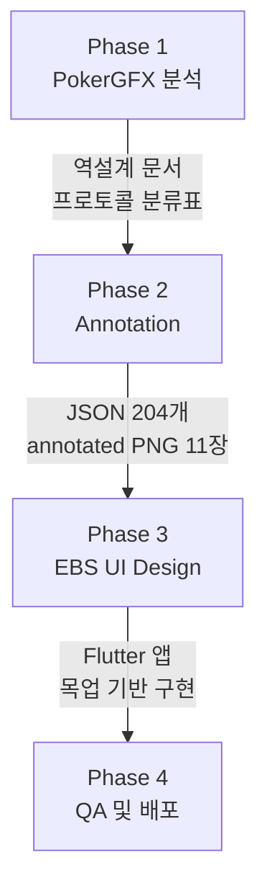

# PRD-AT-003: EBS Action Tracker 워크플로우

## 1. 개요

본 문서는 EBS Action Tracker 개발의 4-Phase 워크플로우(분석 → Annotation → UI 설계 → QA 및 배포)의 입력물·산출물·체크리스트를 체계화하는 프로세스 PRD이다.

**문서 관계**:

| 문서 | doc_id | 역할 |
|------|--------|------|
| [Action Tracker PRD](action-tracker.prd.md) | PRD-AT-001 | 44개 기능 요구사항 (v2.2.0) |
| [UI Design PRD](EBS-AT-UI-Design.prd.md) | PRD-AT-002 | UI 설계 정의 (v4.0.0 — Quasar 기반 전면 신규 설계) |
| **본 문서** | PRD-AT-003 | 4-Phase 워크플로우 + 체크리스트 |
| [HTML Annotation PRD](at-html-annotation.prd.md) | PRD-AT-004 | HTML UI Design + Annotation 설계 기준 |
| [역설계 참조](../design/PokerGFX-UI-Design-ActionTracker.md) | DESIGN-AT-002 | 프로토콜, 필드 매핑 상세 |

## 2. 워크플로우 개요

4-Phase 워크플로우는 PokerGFX 분석에서 시작하여 QA 및 배포로 완성된다.

- **Phase 1**: 기존 PokerGFX Action Tracker의 화면·프로토콜·상태 머신을 완전히 이해
- **Phase 2**: 분석 결과를 구조화된 JSON과 시각적 annotation으로 변환
- **Phase 3**: 분석·annotation 결과를 바탕으로 현대적 EBS Action Tracker UI 설계
- **Phase 4**: 구현된 EBS Action Tracker의 품질 검증 및 배포 준비

## 3. Phase 1: PokerGFX 분석

- **목적**: 기존 PokerGFX Action Tracker의 화면·프로토콜·상태 머신을 완전히 이해
- **입력물**: PokerGFX 실행 파일, 원본 스크린샷 6장
- **산출물**: DESIGN-AT-002 역설계 문서, 프로토콜 메시지 분류표, 상태 머신 다이어그램

**체크리스트**:

| # | 항목 | 상태 | 산출물 경로 |
|---|------|------|------------|
| 1.1 | 6개 화면 스크린샷 캡처 | 완료 | `docs/analysis/at-01~06-*.png` |
| 1.2 | DESIGN-AT-002 역설계 문서 작성 | 완료 | `docs/design/PokerGFX-UI-Design-ActionTracker.md` |
| 1.3 | 68개 프로토콜 메시지 분류 | 완료 | DESIGN-AT-002 §프로토콜 |
| 1.4 | 8단계 상태 머신 정의 | 완료 | DESIGN-AT-002 §상태 머신 |
| 1.5 | Setup Mode 83개 요소 식별 | 완료 | `docs/analysis/analysis/annotation-plan.md` |
| 1.6 | Action Mode 41개 요소 식별 | 완료 | `docs/analysis/analysis/annotation-plan.md` |
| 1.7 | Player Edit Popup JSON 생성 | 완료 | `docs/mockups/v3/ebs-at-player-edit.html` (EBS 재설계) |
| 1.8 | ~~SETTINGS 팝업 분석~~ | ~~완료~~ | ~~폐기~~ — Console ⚙ SETTINGS로 대체 |

## 4. Phase 2: Annotation 작업

- **목적**: Phase 1 분석 결과를 구조화된 JSON과 시각적 annotation으로 변환
- **입력물**: Phase 1 산출물 (스크린샷, 역설계 문서)
- **산출물**: 204개 UI 요소 JSON, annotated PNG 11장, HTML 재현물 6개, AT-Annotation-Reference.md
- **배지 체계**: `COM-XX-NN` (공통), `SNN-NNN` (화면 고유). 총 134개 배지.

**체크리스트**:

| # | 항목 | 상태 | 산출물 경로 |
|---|------|------|------------|
| 2.1 | at-01 Setup Mode JSON 매핑 (83요소) | 완료 | `docs/analysis/analysis/at-01-setup-mode.json` |
| 2.2 | at-02 Pre-Flop Action JSON (41요소) | 완료 | `docs/analysis/analysis/at-02-action-preflop.json` |
| 2.3 | at-03 Card Selector JSON (8요소) | 완료 | `docs/analysis/analysis/at-03-card-selector.json` |
| 2.4 | at-04 Post-Flop Action JSON (41요소) | 완료 | `docs/analysis/analysis/at-04-action-postflop.json` |
| 2.5 | at-05 Statistics JSON (22요소) | 완료 | `docs/analysis/analysis/at-05-statistics-register.json` |
| 2.6 | at-06 RFID Registration JSON (9요소) | 완료 | `docs/analysis/analysis/at-06-rfid-registration.json` |
| 2.7 | annotated PNG 생성 (11장) | 완료 | `docs/analysis/*-annotated.png` + `docs/analysis/annotated/*-annotated.png` |
| 2.8a | Clean UI HTML 생성 (6개) | 완료 | `docs/analysis/html_reproductions/at-*.html` |
| 2.8b | Annotated HTML 생성 (6개) | 완료 | `docs/analysis/html_reproductions/at-*-annotated.html` |
| 2.9 | AT-Annotation-Reference.md 작성 (6화면) | 완료 | `docs/analysis/AT-Annotation-Reference.md` |
| 2.10 | 프로토콜-UI 교차 검증 | 완료 | 8건 보정 완료 |
| 2.11 | 공통 요소 코드 체계 통합 | 완료 | `COM-*` 접두사 체계 |
| 2.12 | 배지 총 134개 할당 완료 | 완료 | annotation-plan.md 참조 |

## 5. Phase 3: EBS UI Design 설계

- **목적**: Phase 1~2 분석 결과를 바탕으로 현대적 EBS Action Tracker UI 설계
- **입력물**: Phase 2 산출물 (JSON, annotation), DESIGN-AT-002
- **산출물**: PRD-AT-001 (요구사항), PRD-AT-002 v4.1.0 (Quasar UI 설계), 목업 v4 (10 HTML + 10 clean PNG + 10 annotated PNG), Flutter 구현

**체크리스트**:

| # | 항목 | 상태 | 산출물 경로 |
|---|------|------|------------|
| 3.1 | PRD-AT-001 요구사항 정의 (44개) | 완료 | `docs/prd/action-tracker.prd.md` |
| 3.2 | PRD-AT-002 UI 설계 정의 (v3.0.0 → v4.0.0) | 완료 | `docs/prd/EBS-AT-UI-Design.prd.md` |
| 3.3 | 5-Zone 레이아웃 설계 | 완료 | PRD-AT-002 §2.1 |
| 3.4 | 키보드 단축키 체계 설계 | 완료 | PRD-AT-002 §6 (v4) |
| 3.5 | 시각 디자인 규칙 정의 (Quasar + Minimal White) | 완료 | PRD-AT-002 §2 (v4) |
| 3.6 | 목업 v3 (B&W) 10화면 | 완료 | `docs/mockups/v3/` (참고용 보존) |
| 3.7 | ~~목업 v5 (Refined) 8화면~~ | 폐기 | v4 Quasar 목업으로 대체 |
| 3.8 | 상태 머신 EBS 버전 설계 | 완료 | PRD-AT-002 §4 (v4) |
| 3.9 | 프로토콜 EBS 버전 설계 | 완료 | PRD-AT-002 §5 (v4) |
| 3.10 | 반응형 레이아웃 규칙 | 완료 | PRD-AT-002 §1.1 (v4) |
| 3.11 | ~~Flutter 프로젝트 초기화~~ | 해당 없음 | 문서 전용 프로젝트 |
| 3.12 | ~~Zone A: 상태 바 위젯~~ | 해당 없음 | 문서 전용 프로젝트 |
| 3.13 | ~~Zone B: 게임 설정 바 위젯~~ | 해당 없음 | 문서 전용 프로젝트 |
| 3.14 | ~~Zone C: 테이블 레이아웃 위젯~~ | 해당 없음 | 문서 전용 프로젝트 |
| 3.15 | ~~Zone D: 보드 영역 위젯~~ | 해당 없음 | 문서 전용 프로젝트 |
| 3.16 | ~~Zone E: 액션 패널 위젯~~ | 해당 없음 | 문서 전용 프로젝트 |
| 3.17 | ~~TCP 통신 모듈~~ | 해당 없음 | 문서 전용 프로젝트 |
| 3.18 | ~~상태 관리 (8단계 상태 머신)~~ | 해당 없음 | 문서 전용 프로젝트 |
| 3.19 | ~~키보드 단축키 바인딩~~ | 해당 없음 | 문서 전용 프로젝트 |
| 3.20 | ~~RFID 카드 인식 연동~~ | 해당 없음 | 문서 전용 프로젝트 |
| 3.21 | AT-07 Login Screen 목업 | 완료 | `docs/mockups/v3/ebs-at-login.html` |
| 3.22 | ~~AT-08 App Settings Popup 목업~~ | ~~완료~~ | ~~폐기~~ — Console ⚙ SETTINGS로 대체 |
| 3.23 | AT-09 Player Edit Popup 목업 | 완료 | `docs/mockups/v3/ebs-at-player-edit.html` |
| 3.24 | HTML 목업 PNG 캡처 (AT-07, AT-09) | 완료 | `docs/mockups/v3/ebs-at-{login,player-edit}.png` |
| 3.25 | AT-Annotation-Reference.md 섹션 추가 (AT-07, AT-09) | 완료 | `docs/analysis/AT-Annotation-Reference.md` |
| 3.26 | 자산 매트릭스 갱신 (AT-07, AT-09) | 완료 | `docs/analysis/AT-Workflow-Screen-Mapping.md §3.7` |
| 3.27 | AT-Annotation-Reference.md 워크플로우 섹션 추가 | 완료 | `docs/analysis/AT-Annotation-Reference.md` |
| 3.28 | AT-Workflow-Screen-Mapping.md 누락 3건 패치 | 완료 | `docs/analysis/AT-Workflow-Screen-Mapping.md` |
| 3.29 | Console→AT 인증 워크플로우 추가 (역설계 기반) | 완료 | AT-Annotation-Reference.md + AT-Workflow-Screen-Mapping.md + PRD-AT-002 |
| 3.30 | AT-01 UI Elements Description 보강 (84개, 역설계 교차검증) | 완료 | `docs/analysis/AT-Annotation-Reference.md` AT-01 섹션 |
| 3.31 | AT-02~06 Description 보강 + AT-01 HTML 동기화 (31행 Reference.md + 8 HTML 파일 tooltip) | 완료 | Reference.md + 6 annotated HTML + 1 clean HTML |
| 3.32 | AT-01 Element 65~74 교정 + 85~94 game_settings 하위 버튼 추가 (84→94개) | 완료 | Reference.md + HTML 3파일 |
| 3.33 | AT-01 blind 섹션 누락 요소 추가: DEALER ◀▶(95/96), SB/BB/3B 칩 입력(97~102). 총 94→102개 | 완료 | Reference.md + HTML 3파일 |
| 3.34 | AT-01 blind 섹션 97~102 설계 교정: 3행→2행 구조, SB/BB 4버튼 가로 배치, BTN BLIND 빈 박스 재할당 | 완료 | Reference.md + HTML 2파일 |
| 3.35 | AT-01 blind 섹션 SB/BB/3B 3버튼 구조 통일: 97~100 제거, 칩 입력 버튼 3개 추가, ◀{칩}▶ 구조. 102→98개 | 완료 | Reference.md + HTML 2파일 |
| 3.36 | PRD-AT-002 v4.0.0 전면 신규 설계 (Quasar Framework 기반) | 완료 | `docs/prd/EBS-AT-UI-Design.prd.md` v4.0.0 |
| 3.37 | 목업 v4 (Quasar) 10화면 HTML 신규 생성 | 완료 | `docs/mockups/v4/ebs-at-*.html` |
| 3.38 | EBS-AT-xx ID 체계 10화면 매핑 (PokerGFX AT-xx → EBS-AT-xx) | 완료 | PRD-AT-002 §1.4 |
| 3.39 | 디자인 시스템 토큰 정의 (컬러/타이포/컴포넌트/상태/애니메이션) | 완료 | PRD-AT-002 §2 |
| 3.40 | Quasar 컴포넌트 매핑표 + CSS Variable 정의 | 완료 | PRD-AT-002 §7 |
| 3.41 | 상태 머신 7단계 + 화면 전이 다이어그램 (EBS-AT-xx 기준) | 완료 | PRD-AT-002 §4 |
| 3.42 | 프로토콜-UI 매핑 (Send 23 / Receive 7 / 반전 3건) | 완료 | PRD-AT-002 §5 |
| 3.43 | 목업 v4 PNG 캡처 (clean 10 + annotated 10) | 완료 | `docs/mockups/v4/*.png`, `docs/mockups/v4/*-annotated.png` |
| 3.44 | PRD-AT-002 v4.1.0 구조 개선 (§0 신설, 3-Layer 화면 흐름, PNG inline) | 완료 | `docs/prd/EBS-AT-UI-Design.prd.md` v4.1.0 |

### 5.1 목업 자산 관리 규칙

HTML 목업/annotation 수정 후 후속 단계:
1. `python scripts/capture-html.py` 실행 → PNG 자동 캡처
   - PostToolUse hook이 HTML 변경 감지 시 `📸` 알림 표시
   - 연속 편집 완료 후 일괄 실행 권장
   - `--dry-run`으로 대상 확인, `--all`로 전체 재캡처, `--file at-01`로 개별 캡처
2. AT-Annotation-Reference.md에 해당 화면 섹션 추가/갱신 (원본 목업 PNG + UI Elements 테이블)
3. AT-Workflow-Screen-Mapping.md §3 자산 매트릭스 갱신

> **삽입 대상 정본**: AT-Annotation-Reference.md. PRD-AT-002에는 링크만 유지.

## 6. Phase 4: QA 및 배포

- **목적**: 구현된 EBS Action Tracker의 품질 검증 및 배포 준비
- **입력물**: Phase 3 산출물 (Flutter 앱)
- **산출물**: 테스트 리포트, 빌드 바이너리, 배포 패키지

**체크리스트**:

| # | 항목 | 상태 | 산출물 경로 |
|---|------|------|------------|
| 4.1 | ~~단위 테스트 작성~~ | 해당 없음 | 문서 전용 프로젝트 |
| 4.2 | ~~위젯 테스트 작성~~ | 해당 없음 | 문서 전용 프로젝트 |
| 4.3 | ~~통합 테스트~~ | 해당 없음 | 문서 전용 프로젝트 |
| 4.4 | ~~E2E 테스트~~ | 해당 없음 | 문서 전용 프로젝트 |
| 4.5 | ~~Windows 빌드 검증~~ | 해당 없음 | 문서 전용 프로젝트 |
| 4.6 | ~~Linux 빌드 검증~~ | 해당 없음 | 문서 전용 프로젝트 |
| 4.7 | ~~EBS Server 연동 테스트~~ | 해당 없음 | 문서 전용 프로젝트 |
| 4.8 | ~~배포 패키지 생성~~ | 해당 없음 | 문서 전용 프로젝트 |

## 7. Phase 간 산출물 흐름

- **Phase 1 → Phase 2**: 원본 스크린샷과 역설계 문서가 annotation의 기반이 됨
- **Phase 2 → Phase 3**: 구조화된 JSON과 배지 체계가 요구사항 정의와 UI 설계의 근거가 됨
- **Phase 3 → Phase 4**: Flutter 앱 구현물이 QA 검증과 배포의 대상이 됨

## 8. Phase Gate 검증 기준

각 Phase 완료 시 다음 Phase 진입을 위한 최소 조건.

| Gate | 진입 조건 | 판정 기준 |
|------|----------|----------|
| Phase 1 → 2 | 6개 화면 스크린샷 완료, 역설계 문서 v1.0+ | DESIGN-AT-002 존재 + 프로토콜 분류 완료 |
| Phase 2 → 3 | 6화면 JSON 매핑 완료, annotation 참조 문서 존재 | AT-Annotation-Reference.md 존재 + 교차 검증 완료 |
| Phase 3 → 4 | PRD-AT-001/002 작성 완료, 목업 v3+ 존재 | 체크리스트 3.1~3.10 전체 완료 |
| Phase 4 완료 | 단위+위젯+통합 테스트 통과, 빌드 성공 | 체크리스트 4.1~4.7 전체 완료 |

## 9. Gap 분석 및 잔여 작업

| # | 항목 | Phase | 우선순위 | 설명 |
|---|------|-------|---------|------|
| G-1 | ~~Player Edit Popup JSON~~ | Phase 1 | ~~Medium~~ | 해결됨 — AT-09 EBS UI Design 목업 완성 (`ebs-at-player-edit.html`) |
| G-2 | ~~SETTINGS 팝업 분석~~ | Phase 1 | ~~Low~~ | 폐기됨 — Console ⚙ SETTINGS가 이미 존재. AT-08 삭제 |
| G-3 | Flutter 구현 | Phase 3 | Critical | 설계 완료, 구현 시작 대기 |
| G-4 | at-02/at-04 diff 요소 정밀 교차 검증 | Phase 2 | Low | Pre-Flop/Post-Flop 간 7개 diff 요소 정밀 비교 미완 |
| G-5 | 프로토콜 EBS 버전 실환경 테스트 | Phase 3 | High | 68개 프로토콜의 EBS Server 실제 송수신 검증 미완 |
| G-6 | 키보드 단축키 충돌 검증 | Phase 3 | Medium | OS/Flutter 기본 단축키와의 충돌 여부 미확인 |
| G-7 | ~~AT-04 annotated PNG 생성~~ | Phase 2 | ~~Low~~ | 해결됨 — `docs/analysis/at-04-action-postflop-annotated.png` 존재 확인 |
| G-8 | PRD-AT-004 설계 기준 적용 검증 | Phase 2 | Medium | HTML UI Design + Annotation이 PRD-AT-004 규격에 부합하는지 교차 검증 |

## 10. Changelog

| 날짜 | 버전 | 변경 내용 | 변경 유형 | 결정 근거 |
|------|------|-----------|----------|----------|
| 2026-03-20 | v1.18.0 | PRD-AT-002 v3.0.0 반영 — PokerGFX 원본 충실 전면 재작성. v1/v2 EBS 창작물(5-Zone/12x8 그리드/4종 템플릿) 전면 제거. 786x553 고정 해상도. AT-07/09 EBS 설계 명시 포함 | PRODUCT | v1/v2는 PokerGFX 원본과 EBS 창작물 혼재하여 신뢰 불가. 정본 기반 재구축 |
| 2026-03-20 | v1.17.0 | 문서 전용 프로젝트 전환: 3.11~3.20(Flutter 구현) + Phase 4(QA/배포) 전체 "해당 없음" 처리. PRD-AT-002 v2.0.0 반영 | PRODUCT | 코드 제거 + 문서 전용 프로젝트 재정의 |
| 2026-03-19 | v1.16.0 | AT-01 blind 섹션 SB/BB/3B 3버튼 구조 통일: 97~100(val◀▶) 제거, 칩 입력 버튼 3개 추가. ◀{칩}▶ 구조 통일. SB/BB pos◀▶ + 중앙 칩, 3B val◀▶ + 중앙 칩. 102→98개 | PRODUCT | 사용자 피드백: 3버튼 구조 통일 |
| 2026-03-19 | v1.15.0 | AT-01 blind 섹션 97~102 설계 교정: 3행→2행 구조 복원 (height 17.5%→13%), 97/98 SB value input, 99/100 BB value input으로 Row 2 이동, 101/102 BTN BLIND 빈 박스로 재할당. 원본 PokerGFX 2행 레이아웃 일치 | PRODUCT | 원본 스크린샷 대비 blind 섹션 구조 불일치 교정 + "빈 버튼도 유의미한 박스" 피드백 반영 |
| 2026-03-19 | v1.14.0 | AT-01 blind 섹션 누락 요소 8개 추가: DEALER ◀▶ 위치 버튼(95/96), SB/BB/3B 칩 금액 입력 버튼(97~102). blind-row 3행 구조 확장. 총 94→102개 | PRODUCT | blind 헤더별 하위 컨트롤 완전성 확보 (DEALER 위치 + 금액 입력 분리) |
| 2026-03-19 | v1.13.0 | AT-01 Element 65~74 description 교정 (증감→값입력/위치설정), 85~94 game_settings 하위 입력 버튼 10개 추가. 총 84→94개 | PRODUCT | blind 섹션 기능 매핑 오류 교정 + game_settings 동일 패턴 누락 보완 |
| 2026-03-19 | v1.12.0 | §5.1 캡처 자동화 규정 업데이트: `capture-html.py` 통합 스크립트 + PostToolUse hook HTML 감지 | TECH | HTML 수정→PNG 캡처 워크플로우 자동화 갭 해소 |
| 2026-03-19 | v1.11.0 | AT-02~06 Description 보강 (31행) + AT-01 HTML 동기화 (data attr chip_input, Element 84 추가, ~30 tooltip). 6개 annotated HTML tooltip Reference.md 일치화 (34개) | PRODUCT | 전체 화면 description 품질 균일화 + HTML/Reference.md 동기화 |
| 2026-03-19 | v1.10.0 | AT-01 Description 보강: Element 7 heartbeat, 28~37 클릭 동작, 48~57 chip_input 재분류, 58~64 헤더 명시, 65~74 버튼 관계, 75~79 설정 헤더, 80 순환 선택, 82~83 보강, 84번 누락 요소 추가. 총 83→84개 | PRODUCT | 역설계 교차검증 기반 description 정확도 향상 |
| 2026-03-19 | v1.9.0 | Console→AT 인증 워크플로우 추가 (역설계 문서 AuthRequest/IPC 기반), PRD-AT-002 §3.6 진입 흐름 보강 | PRODUCT | 앱 초기 진입 흐름 문서화 갭 해소 |
| 2026-03-18 | v1.8.0 | AT-Annotation-Reference 워크플로우 섹션, AT-Workflow-Screen-Mapping 누락 3건 패치, sync-at-reference.py 자동화 스크립트 | PRODUCT | 워크플로우 다이어그램 갭 해소 + 자동화 |
| 2026-03-18 | v1.7.0 | §5.1 목업 자산 관리 규칙, 3.24~3.26 후속 단계 추가 | PRODUCT | 워크플로우 자동화 갭 해소 — AI 자율 삽입 대상 명시 |
| 2026-03-17 | v1.6.0 | 3.21 Login Screen 전환, 3.22 App Settings 폐기, 1.8 폐기 표기, G-2 폐기 반영 | PRODUCT | 사용자 피드백 F-1/F-2/F-3 반영 |
| 2026-03-17 | v1.5.0 | AT-07/08/09 목업 완성 (3.21~3.23), G-1/G-2 해결, Phase 1 1.7/1.8 완료 | PRODUCT | 미구현 3개 화면 EBS UI Design 목업 생성 |
| 2026-03-17 | v1.4.0 | 워크플로우 스크린 매핑 검증, G-7 해결 (AT-04 PNG 존재 확인), 2.7 완료 보정 | TECH | ANALYSIS-AT-001 작성 기반 교차 검증 |
| 2026-03-17 | v1.3.0 | HTML 2-파일 구조 전환 (Clean UI + Annotated), 6화면 12파일 완성 | PRODUCT | annotation HTML 설계 표준화 |
| 2026-03-17 | v1.2.0 | AT-04 annotation 보완 (HTML+Reference), Phase 2 체크리스트 상태 보정, G-7 추가 | PRODUCT | annotation 완전성 검증 |
| 2026-03-17 | v1.1.0 | Phase 3 세분화, Phase 4 추가, Phase Gate 추가, Gap 확장 | PRODUCT | 워크플로우 체크리스트 완전성 강화 |
| 2026-03-17 | v1.0.0 | 최초 작성 | - | 3-Phase 워크플로우 체계화 |
